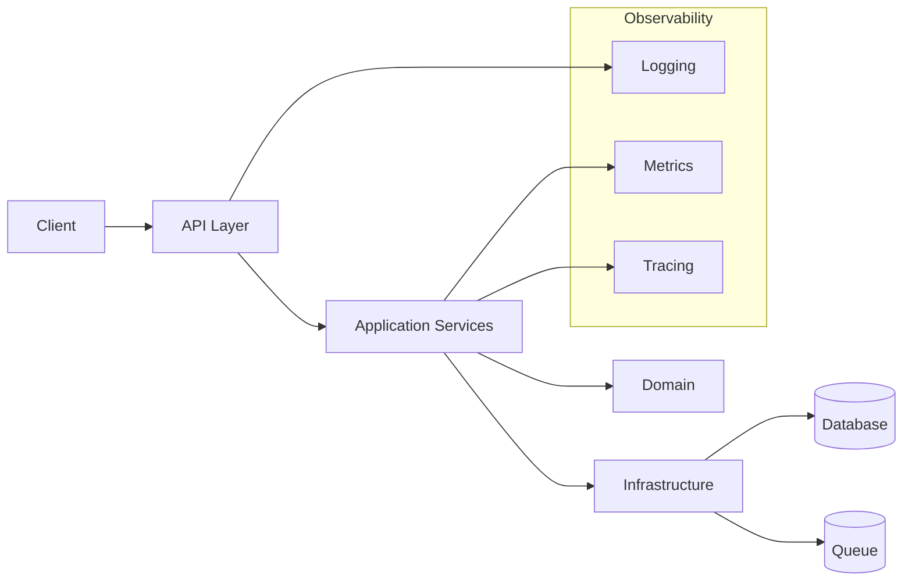
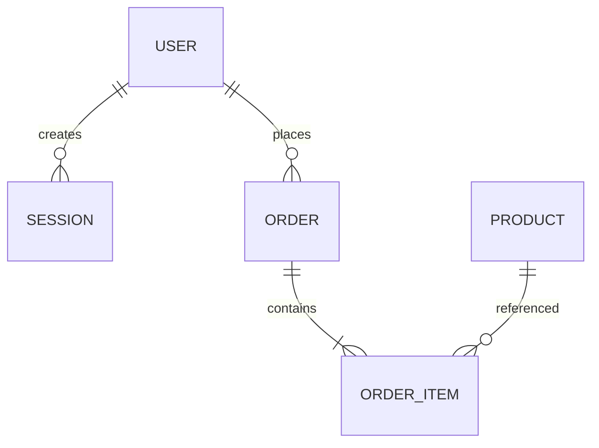
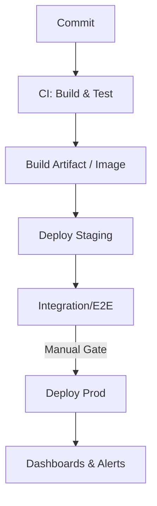

# Title

Copilot: Build a Complete, End‑to‑End Understanding of This Repository — **TechDocs (MkDocs) Structure**

---

## Summary

We want to use GitHub Copilot to construct a **complete, accurate, and navigable mental model of this project**. The goal is to give every contributor—new or seasoned—a single place to learn how the repo is structured, how data flows, what standards we follow, how we deploy, where the dangerous edges are, and how to extend the system safely.

This issue outlines a **repeatable, prompt‑driven workflow** that asks Copilot to crawl the repository, synthesize what it finds, and generate a curated set of docs and assets. It includes prompts, acceptance criteria, file outputs, success metrics, and guardrails (e.g., no secrets). 

---

## Why (Background & Motivation)

* **Onboarding costs** are high. New folks spend days guessing at architecture, coding standards, and hidden conventions.
* **Tribal knowledge** leaks across Slack threads and PRs. Important decisions and context get buried or lost.
* **Inconsistent mental models** lead to fragile changes and accidental regressions.
* **Cross‑cutting concerns** (security, observability, performance) are not consistently discovered early enough.
* **Documentation entropy**: READMEs and ADRs drift; Documentation and diagrams get stale.

Copilot can already read code and produce summaries, but we want to **turn that capability into a repeatable process** that results in a cohesive, browsable repository knowledge base we can maintain over time.

---

## User Story

> As a contributor, I want Copilot to produce an accurate, up‑to‑date map of this repository—covering architecture, dependencies, data, runtime workflows, testing, deployment, and conventions—so that I can ship changes confidently and onboard in hours, not days. Documentation should be easy to find and navigate, and clear enough to serve as a reliable reference.

---

## Goals

1. Create a **single, discoverable overview** of the repository with links to source.
2. Generate **artifact‑level docs** (purpose, architecture, data, exposed surface, CI, testing strategy, quality gates, security posture, observability, responsibility).
3. Provide **navigable diagrams** and cross‑references.
4. If outside knowledge is needed, document assumptions and seek clarification from the user or the relevant experts online.

---

## Non‑Goals

* Implementing refactors directly. This pass is **observational + synthesizing**, not rewriting code.
* Revealing or processing **secrets** or private credentials.

---

## TechDocs Setup (Backstage/MkDocs)

We use **Backstage TechDocs** (MkDocs). Place TechDocs under `docs/techdocs/` with `mkdocs.yml` at `docs/techdocs/mkdocs.yml`. Ensure our Catalog entity points here (e.g. in `catalog-info.yaml`):

* `metadata.annotations.backstage.io/techdocs-ref: dir:./docs/techdocs`
* **Let Copilot design the information architecture (IA) and `nav:`** based on what it discovers in the repo.

---

**ADRs:** Keep Architectural Decision Records under `docs/adrs/` (e.g., MADR format). TechDocs should surface an **ADRs** entry that links to this directory in‑repo, unless Copilot proposes rendering ADRs inside the site as part of the IA.

---

## Deliverables

Copilot should produce the following **outcomes** without us prescribing exact filenames or folders. It must infer structure from the repository and propose a sensible, seam‑based IA:

1. **Information Architecture (IA) Proposal** — A short outline describing sections, subsections, and intended audience for each. It should map sections back to code locations and ownership (if any), and explain why these seams are meaningful here.
2. **Approved `mkdocs.yml` navigation** — After IA approval, generate a `nav:` that mirrors the IA. Copilot decides names and paths. Keep depth ≤ 3 levels unless strongly justified.
3. **Content pages** — Create pages that populate the IA. Copilot chooses page paths and filenames, organizes content logically, and ensures pages are small, link‑rich, and cross‑referenced. Use Mermaid or ASCII diagrams where helpful; keep diagrams in text.
4. **Cross‑links & citations** — Every nontrivial claim links to source (relative paths, plus anchors where appropriate). Where Copilot infers behavior, it marks `> Assumption:` and suggests a validation.
5. **ADRs surfaced** — The IA includes an ADRs section that either links to `docs/adrs/` or renders ADRs inside the site, per the selected IA.
6. **Buildable docs** — TechDocs builds locally and in Backstage; links render; diagrams compile.

> The structure is **repo‑specific**. Copilot should prefer seams that reflect the real system: domain boundaries, architectural layers, runtime workflows, interfaces (APIs/events/CLIs), data/storage, operations (CI/CD, infra), and team ownership.

---

## Guardrails (Important)

* **No secrets**: Do not include values or derived tokens from `.env`, vaults, or CI secrets. Document names/locations, not contents.
* **Stay in repo**: Use only the code, docs, and config committed here. If a file is referenced but missing, log it.
* **Cite your sources**: For each statement, prefer linking to file paths and line ranges; use relative links.
* **Mark uncertainty**: When inference is uncertain, annotate with `> Assumption:` and propose validation steps.
* **Keep it reproducible**: Every prompt and step in this issue should be runnable by anyone with the same tools.

---

## Phase 0 — Kickoff & Indexing

**Goal:** Prime Copilot with expectations, constraints, and an initial file inventory.

**Prompt A — Kickoff**

```
Copilot, you are acting as a repository cartographer. Your job is to build a complete, linked overview of this codebase. Constraints: stay within the repo; do not reveal secrets; cite files for claims; mark assumptions. Deliver Markdown files under docs/techdocs/docs/ as specified. Confirm understanding and list the top‑level folders and important entry points to start scanning.
```

**Prompt B — Inventory**

```
Scan the repository and produce a concise inventory: top‑level folders; key languages and frameworks; primary build files; CI workflows; test directories; configuration files; Docker/K8s manifests; database migrations; helm charts; and any docs. Return the list with relative path links.
```

**Acceptance Check**

* Copilot returns an inventory with clickable repo‑relative links.
* It identifies build tools, CI config, and notable domains.

---

## Phase 1 — Propose the Information Architecture (IA)

**Goal:** Let Copilot propose how TechDocs should be organized for **this** repo.

**Prompt — IA options**

```
Scan the repo and propose 2–3 alternative information architectures for our TechDocs site. Each should:
- Use meaningful seams (domain boundaries, architectural layers, runtime workflows, interfaces/APIs, data/storage, operations/infra, team ownership).
- Include a short rationale and which files/directories feed each section.
- Keep navigation depth ≤ 3 levels and avoid dumping huge pages; prefer small, link‑rich pages.
- Note tradeoffs between alternatives (e.g., domain‑first vs. layer‑first organization).
Return the outlines and recommend one for this codebase.
```

**Acceptance Check**

* Alternatives presented with rationale; chosen IA clearly maps to code; depth and scope look manageable.

---

## Phase 2 — Approve IA & Generate Navigation

**Goal:** Turn the approved IA into `mkdocs.yml` navigation (without prescribing file names upfront in this issue).

**Prompt — Generate nav**

```
Using the approved IA, generate a `nav:` block for docs/techdocs/mkdocs.yml. Choose page paths and filenames that reflect the IA. Keep names concise and consistent. Do not create content yet; first show the proposed nav and explain the mapping to repo locations.
```

**Acceptance Check**

* `nav:` is readable, consistent, and aligns with seams; page names reflect domain/layer/runtime/ops semantics.

---

## Phase 3 — Create Content Seam by Seam

**Goal:** Populate the IA iteratively, focusing on one seam at a time (e.g., Architecture → Runtime → Interfaces → Data → Operations → Onboarding), but allowing Copilot to pick the best order for this repo.

**Prompt — Generate content for a chosen seam**

```
For the <chosen seam>, create the initial set of pages defined in the IA. You choose the exact paths and filenames to match the nav. For each page, include:
- A crisp purpose statement and target audience
- Link‑rich explanations with relative paths to code/configs
- Diagrams where useful (Mermaid/ASCII)
- `> Assumption:` blocks whenever inferring
- Cross‑links to related pages
Return the diff or file list you intend to add, with a short summary of each page.
```

**Acceptance Check**

* Pages are small, precise, and cite sources; diagrams render; cross‑links work.

Repeat this phase across seams until the IA is fully populated.

---

## Phase 4 — Integrate ADRs

**Goal:** Surface architectural decisions in the site without prescribing their storage beyond `docs/adrs/`.

**Prompt — ADR integration**

```
Detect ADRs under docs/adrs/. Propose how to surface them in the IA (link out vs. render inside). Implement the chosen approach and add brief context so contributors can find, create, and update ADRs.
```

**Acceptance Check**

* ADRs discoverable from the nav; contributor guidance present; no duplication unless intentional.

---

## Phase 5 — Quality & Consistency Passes

**Goal:** Ensure navigability, correctness, and consistency across the site.

**Prompts**

* **Link audit:**

```
Check all pages for missing or broken relative links and anchors. Fix them.
```

* **Terminology normalization:**

```
Normalize naming for modules/services; ensure one canonical term per concept across all pages and diagrams.
```

* **Assumptions surfaced:**

```
Find unlinked claims or implicit inferences and add `> Assumption:` with a concrete validation step.
```

* **Diagram audit:**

```
Verify Mermaid/ASCII diagrams render. Where a diagram is wall‑of‑boxes, replace it with a focused view per seam.
```

**Acceptance Check**

* Build succeeds; terms consistent; assumptions visible; navigation feels intuitive.

---

## Phase 6 — Publish & Hand‑Off

**Goal:** Ensure TechDocs publishes cleanly in Backstage and that contributors know how to keep it fresh.

**Prompt**

```
Provide a short "Maintaining TechDocs" page that explains how the IA maps to the repo, how to add new pages within seams, and when to add/update ADRs. Include a PR checklist item.
```

**Acceptance Check**

* Maintainers can extend the IA without guesswork; publishing works locally and in Backstage.

---

## Cross‑Phase Refinement Prompts

Use these prompts between phases to raise quality:

**Refine Links & Citations**

```
Ensure every claim in the docs has a relative path link to the source file(s) and, where helpful, line ranges. Add missing links now.
```

**Mark Assumptions**

```
Scan for places you inferred behavior. Prepend an `> Assumption:` block and propose a quick validation (test to write, file to check, person to ask).
```

**Tighten Summaries**

```
Reduce generic statements. Replace with repo‑specific details (names of modules, functions, files) and examples.
```

**Consistency Pass**

```
Normalize terminology across all docs (e.g., refer to the same component using one canonical name). Update references accordingly.
```

---

## Acceptance Criteria (Definition of Done)

* [ ] Copilot proposes ≥2 IA alternatives, we select one with rationale tied to **this** repo’s seams.
* [ ] `docs/techdocs/mkdocs.yml` exists with `plugins: [techdocs-core]` and a **Copilot‑generated `nav:`** that reflects the approved IA.
* [ ] TechDocs builds locally (e.g., via TechDocs CLI) and renders in Backstage; diagrams compile.
* [ ] Pages are relatively small but information-dense, link‑rich, and stitched with cross‑references; each nontrivial claim cites code/config.
* [ ] Assumptions are explicitly marked with validation suggestions.
* [ ] ADRs are discoverable from the site (link out or rendered), with contributor guidance.
* [ ] Maintainers understand how to extend the IA and keep docs fresh (maintenance page exists).

---

## Success Metrics

* **Time‑to‑first‑PR** for new contributors drops by 50%.
* **Context‑seeking questions** in chat/PRs reduce measurably over 30 days.
* **Defect rate** for changes touching multiple modules declines (proxy for better mental models).
* **Doc freshness**: fewer than 5% of links break in 30 days; we re‑run the playbook quarterly.

---

## Risks & Mitigations

* **Context window limits**: Copilot may miss distant files.

  * *Mitigation*: Work in phases; paste index summaries; ask for link verification; target subtrees.
* **Staleness**: Docs can drift after changes.

  * *Mitigation*: Add a checklist item in PR template: “Updated overview docs?”; schedule a quarterly refresh using this issue.
* **Overconfidence**: AI may state guesses as facts.

  * *Mitigation*: Require `> Assumption:` tags; reviewers validate claims alongside code.
* **Secrets exposure**: Accidentally echoing env values.

  * *Mitigation*: Prompt reminders; grep for suspicious strings before merge.

---

## Illustrative IA Patterns (Non‑Binding Examples)

These are **examples** to inspire Copilot’s IA proposals; they are **not** directives.

**Domain‑first (typical business app)**

* Overview
* Domains (one section per bounded context)
* Interfaces (APIs/Events/CLI)
* Runtime (jobs, schedulers, workflows)
* Data (schemas, migrations, ownership)
* Operations (build, deploy, environments, observability)
* Conventions & Onboarding
* ADRs

**Layer‑first (hex/clean architecture)**

* Overview
* Architecture (presentation, application, domain, infrastructure)
* Cross‑cutting (auth, caching, error handling)
* Interfaces (adapters, ports)
* Data & Storage
* Operations & Observability
* Onboarding
* ADRs

**Service‑first (polyrepo or microservices)**

* Overview
* Services (one per service with subpages)
* Shared Libraries & Contracts
* Platform (CI/CD, infra, templates)
* Observability & SLOs
* Onboarding
* ADRs

## Concrete Prompt Library (Copy/Paste)

**00. Role & Safety**

```
You are a repository cartographer. Constraints: stay within repo; cite files; avoid secrets; mark assumptions. Goal: produce a TechDocs site under docs/techdocs/ with an information architecture tailored to this repo. Ask clarifying questions only when absolutely necessary.
```

**01. Inventory**

```
List top‑level folders and notable files (build configs, CI workflows, Docker/K8s/Terraform, migrations, test dirs, READMEs). Provide a linked table.
```

**02. IA Alternatives**

```
Propose 2–3 TechDocs information architectures using meaningful seams (domain, layers, runtime, interfaces, data, operations, ownership). For each, give a short rationale and map sections to code locations. Recommend one.
```

**03. Generate nav**

```
Turn the approved IA into a mkdocs `nav:` for docs/techdocs/mkdocs.yml. Choose page paths and filenames consistent with the IA. Keep depth ≤ 3. Show the proposed nav and rationale.
```

**04. Populate a seam**

```
Create the pages for <chosen seam> per the IA. Keep pages small and link‑rich; add diagrams; mark assumptions; cross‑link related pages. Return the diff summary.
```

**05. Link & terminology audit**

```
Audit links for completeness; normalize naming for modules/services; fix inconsistencies.
```

**06. ADR integration**

```
Detect ADRs at docs/adrs/. Propose and implement how to surface them (link out vs. render inside) in the IA.
```

**07. Maintenance page**

```
Add a short "Maintaining TechDocs" page explaining how to extend the IA, when to add pages, and how to keep things current.
```

---

## Review Checklist (for Humans)

* [ ] Do diagrams render and reflect reality?
* [ ] Are there ambiguous claims without links?
* [ ] Are any secrets or sensitive paths exposed?
* [ ] Does ONBOARDING actually work on a fresh machine?
* [ ] Are risks actionable and prioritized?
* [ ] Are conventions aligned with tooling configs (linters/formatters/tests)?
* [ ] Can a reviewer jump from any statement to its source file quickly?

---

## Maintenance Plan

* Add a PR template checkbox: “Updated overview docs?”
* Re‑run this issue quarterly or after major architectural changes.
* Treat `docs/techdocs/docs/` as first‑class code: review, test links, and keep diagrams text‑based.

---

## Frequently Asked Questions (FAQ)

**Q: How does Copilot know where to start?**
A: We prime it with the repo inventory and clear goals. We also point it to entry points (main files, app modules, service folders) and CI configs.

**Q: What if parts of the system live in other repos?**
A: Document cross‑repo boundaries and link to those repos by name and purpose. Do not pull their content; note integrations and contracts.

**Q: Can we trust the diagrams?**
A: Treat them as drafts. Require links and code citations; reviewers confirm. Keep diagrams in Mermaid/ASCII for easy fixes.

**Q: Will this slow us down?**
A: The intent is speed: faster onboarding, clearer change impact, and fewer regressions. We’ll measure time‑to‑first‑PR and defect rate.

**Q: What about monorepos or polyglot stacks?**
A: Run the phases per package/workspace. Produce per‑package docs plus a monorepo‑level overview that stitches them together.

**Q: Can Copilot run tests or commands?**
A: It can suggest them; we execute locally and feed results back as context (e.g., paste coverage summaries).

---

## Example Snippets (to Seed the Output)

**TechDocs landing page (`docs/techdocs/docs/index.md`) skeleton:**

```
# Welcome

This site provides an end‑to‑end map of the project. Use the left nav to jump to Architecture, Data Model, APIs, Operations, and Onboarding.

> Heads‑up: ADRs live in `/docs/adrs/` in the repository. This site links to them from the ADRs section.
```

Mermaid component diagram skeleton:

````


ER diagram skeleton:
```



```

Pipeline skeleton:
```



```

---

## Definition of Done (Concise)
- The `docs/techdocs/docs/` directory exists with all specified files and diagrams.
- Each document is link‑rich, assumption‑aware, and accurate to the repository at the time of generation.
- Reviewers have validated key claims and diagrams against code.
- A quarterly refresh cadence is agreed and captured in team rituals.

---

## Next Steps
1. Use the **Phase 0 Kickoff** prompt to start Copilot.
2. Proceed through phases 1–12, committing docs as they solidify.
3. Open follow‑up issues for refactors, test gaps, and dependency upgrades discovered along the way.
4. Add the maintenance tasks to our team’s recurring backlog.

> When complete, this issue should close with a link to the `docs/techdocs/docs/` folder and a short changelog summarizing major insights learned about the codebase.

```
