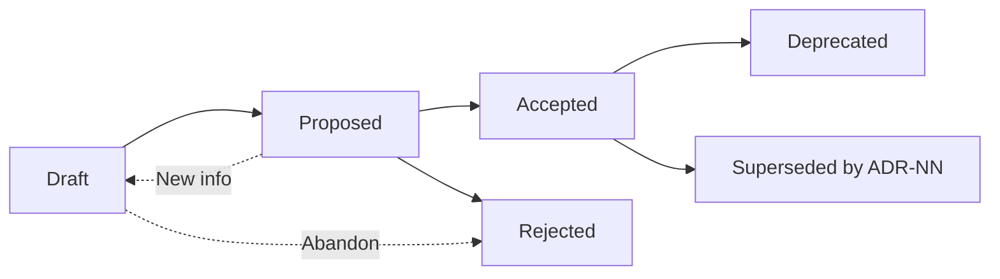

# ADRs Overview

This page provides an overview of Architectural Decision Records (ADRs) and how they are managed within the WebGrip organisation.

## What are ADRs?

Architectural Decision Records (ADRs) document important architectural decisions made during the development and evolution of our platform. They capture the context, rationale, and consequences of decisions to help future contributors understand why certain choices were made.

## ADR Template & Format

We follow the **MADR v3+** (Markdown Architectural Decision Records) format with WebGrip-specific extensions for compliance, security, and lifecycle management.

### Template Structure

Our ADR template includes the following sections:

- **Status**: Proposed | Accepted | Rejected | Deprecated | Superseded
- **Context & Problem Statement**: Background and core problem
- **Decision Drivers**: Key factors influencing the decision
- **Considered Options**: Alternative approaches evaluated
- **Decision Outcome**: Chosen option with rationale
- **Validation**: Proof and ongoing guardrails
- **Compliance & Security Impact**: Regulatory and security considerations
- **Revision Log**: Change history and version tracking

> **Template Source**: [0000-template.md](../../docs/adrs/0000-template.md) - Complete ADR template.

## Current ADRs

### Template ADR

**[ADR-0000: Template](../../docs/adrs/0000-template.md)**
- **Status**: Template
- **Purpose**: Provides the authoritative template for all WebGrip ADRs
- **Key Features**: 
  - MADR v3+ compliance
  - Corporate compliance fields
  - Security and privacy impact assessment
  - Lifecycle management with revision tracking

## ADR Lifecycle

### Creation Process

1. **Identify Decision Need**: Recognize when an architectural decision requires documentation
2. **Copy Template**: Create new ADR from [template](../../docs/adrs/0000-template.md)
3. **Fill Sections**: Complete all required sections with specific details
4. **Review Process**: Team review and stakeholder input
5. **Approval**: Decision approval and status update to "Accepted"
6. **Publication**: Commit to repository and update tracking

### Status Transitions



### Maintenance

**Regular Review**:
- Quarterly review of active ADRs
- Validation of ongoing guardrails
- Update of consequences and impacts
- Status updates (deprecation, supersession)

**Version Control**:
- Revision log for significant changes
- Semantic versioning (1.0.0, 1.1.0, etc.)
- Change history with author attribution

## ADR Categories & Tags

### Common Tags

- **Domain::Operations**: Infrastructure and platform decisions
- **Domain::Telemetry**: Monitoring and observability decisions  
- **Security**: Security-related architectural choices
- **Performance**: Performance and scalability decisions
- **Compliance**: Regulatory and compliance decisions
- **Integration**: External system integration decisions

### Decision Types

**Technology Selection**:
- Framework and library choices
- Infrastructure and platform decisions
- Tool and service selections

**Architecture Patterns**:
- System design patterns
- Integration patterns
- Data flow and processing patterns

**Operational Decisions**:
- Deployment strategies
- Monitoring and alerting approaches
- Security and compliance measures

## Compliance & Governance

### Corporate Requirements

Our ADRs include specific sections for:

**Compliance Impact**:
- Data classification changes
- Regulatory requirements (GDPR, PCI-DSS, etc.)
- Privacy impact assessments
- Audit trail requirements

**Security Assessment**:
- Threat model updates
- Security control changes
- Risk assessment and mitigation
- Security review sign-offs

### Review Requirements

**Technical Review**:
- Architecture team review
- Domain expert consultation
- Cross-team impact assessment
- Performance and scalability review

**Business Review**:
- Stakeholder alignment
- Business impact assessment
- Resource and timeline implications
- Risk and compliance review

## Finding ADRs

### Repository Location

All ADRs are stored in the [`docs/adrs/`](../../docs/adrs/) directory in the repository:

```
docs/adrs/
├── 0000-template.md          # ADR template
├── 0001-example-decision.md  # First example ADR
└── ...                       # Future ADRs
```

### Backstage Integration

ADRs are integrated with Backstage components through annotations:

```yaml
metadata:
  annotations:
    backstage.io/adr-location: docs/adr
```

> **Example**: [ingress-nginx component](../../catalog/components/ingress-nginx.yaml#L12) - ADR location annotation.

### Cross-References

**From TechDocs**:
- Each major architectural decision referenced in relevant documentation
- Links from implementation guides to supporting ADRs
- Decision rationale included in component descriptions

**From Code**:
- Code comments referencing relevant ADRs
- Architecture diagrams linked to decision records
- Configuration files citing decision rationale

## Best Practices

### Writing Effective ADRs

**Be Specific**:
- Focus on architectural decisions, not implementation details
- Include concrete examples and use cases
- Provide clear success criteria and validation methods

**Be Comprehensive**:
- Document all considered options with pros/cons
- Include quantitative analysis where possible
- Address non-functional requirements explicitly

**Be Maintainable**:
- Use clear, jargon-free language
- Include relevant diagrams and examples
- Maintain links to supporting resources

### Decision Drivers

**Common Decision Drivers**:
- Performance requirements (latency, throughput)
- Scalability needs (user load, data volume)
- Security and compliance requirements
- Development team capabilities
- Operational complexity and maintenance burden
- Cost and resource constraints

### Validation Methods

**Immediate Proof**:
- Prototype implementations
- Performance benchmarks
- Security assessments
- Integration tests

**Ongoing Guardrails**:
- Monitoring and alerting
- Automated testing
- Compliance audits
- Performance metrics

## Contributing ADRs

### When to Create an ADR

Create an ADR when:
- Making significant architectural changes
- Selecting between multiple viable technology options
- Establishing patterns for team adoption
- Making decisions with long-term consequences
- Resolving architectural debates or disagreements

### ADR Checklist

- [ ] Problem statement is clear and specific
- [ ] All viable options are documented with analysis
- [ ] Decision rationale includes quantitative justification
- [ ] Consequences (positive and negative) are identified
- [ ] Validation plan includes immediate proof and ongoing monitoring
- [ ] Compliance and security impacts are assessed
- [ ] Related decisions and superseded ADRs are referenced
- [ ] Revision log is initialized with creation entry

## Tools & Resources

### ADR Tools

**Template Management**:
- [ADR Template](../../docs/adrs/0000-template.md) - Copy for new ADRs
- Version control for template evolution
- Automated validation of ADR format

**Documentation Integration**:
- TechDocs cross-references
- Backstage catalog integration
- Automatic linking and validation

### External Resources

**ADR Community**:
- [ADR GitHub Project](https://adr.github.io/) - Community resources
- [MADR Format](https://adr.github.io/madr/) - Template specification
- [ADR Best Practices](https://github.com/joelparkerhenderson/architecture-decision-record) - Community guidelines

## Next Steps

- **Review Template**: [ADR Template](../../docs/adrs/0000-template.md)
- **Browse All ADRs**: [All Decisions](all_decisions.md)
- **Contributing**: [Contributing Guidelines](../development/contributing.md)
- **Platform Decisions**: [Platform Architecture](../platform/infrastructure_overview.md)