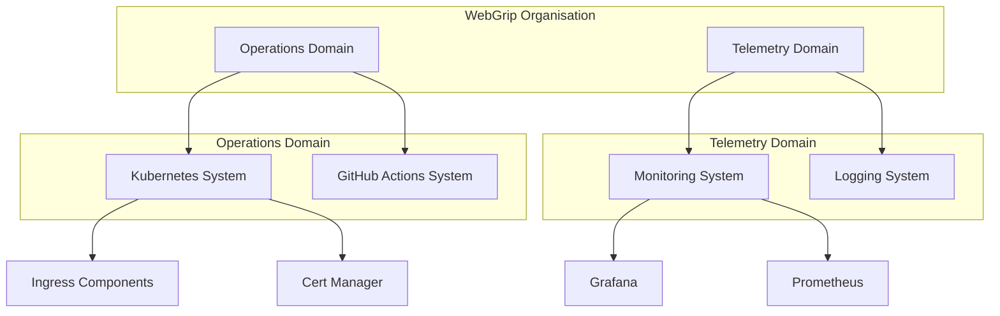
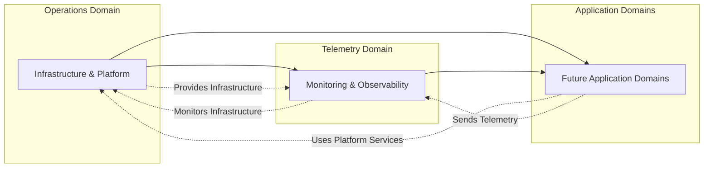

# Domains

This page documents the business domains defined in the WebGrip organisation's Backstage catalog. Domains represent high-level business areas that group related systems and components.

## Domain Overview

Domains provide organizational structure and ownership boundaries for platform services. Each domain encompasses related systems, components, and resources that serve a common business purpose.

## Operations Domain

### Overview

The **Operations Domain** is responsible for all platform infrastructure, tooling, and operational capabilities that enable application development and deployment.

**Domain Definition**: [operations-domain.yaml](../../catalog/domains/operations-domain.yaml)

### Attributes

| Property | Value |
|----------|-------|
| **Name** | `operations-domain` |
| **Namespace** | `webgrip` |
| **Title** | Operations |
| **Owner** | `group:infrastructure` |
| **Type** | `product-area` |
| **Tier** | `2` |

### Description

> The operations domain is responsible for all things having to do with operations

### Responsibilities

**Infrastructure Management**:
- Kubernetes cluster provisioning and management
- Container orchestration and scheduling
- Infrastructure as Code (Helm charts and Terraform)
- Resource provisioning and capacity planning

**Platform Services**:
- Ingress controllers and traffic management
- Certificate management and SSL/TLS automation  
- Service mesh and networking policies
- Container registry and image management

**Operational Tooling**:
- CI/CD pipeline infrastructure
- Monitoring and observability platforms
- Secrets management and security tooling
- Backup and disaster recovery systems

### Associated Systems

- **[Kubernetes System](systems.md#kubernetes-system)**: Primary container orchestration platform
- **[GitHub Actions Runner Controller](systems.md#github-actions-system)**: CI/CD infrastructure

### Key Components

- **[Ingress Nginx](components.md#ingress-nginx)**: Traffic routing and load balancing
- **[Cert Manager](components.md#cert-manager)**: SSL/TLS certificate automation
- **[Metrics Server](components.md#metrics-server)**: Resource usage metrics collection

### External Links

- **[Readme](http://example.com/domain/operations/)**: Domain documentation
- **[Dashboard](http://monitoring-platform.test/dashboard/operations)**: Operations monitoring dashboard

### Ownership & Contacts

- **Primary Owner**: Infrastructure Team (`group:infrastructure`)
- **Tier**: Level 2 (Core Platform Services)
- **Contact**: Via infrastructure team channels

## Telemetry Domain

### Overview  

The **Telemetry Domain** focuses on observability, monitoring, and data collection across the WebGrip platform and applications.

**Domain Definition**: [telemetry-domain.yaml](../../catalog/domains/telemetry-domain.yaml)

### Attributes

| Property | Value |
|----------|-------|
| **Name** | `telemetry-domain` |
| **Namespace** | `webgrip` |
| **Title** | Telemetry |
| **Owner** | `group:infrastructure` |
| **Type** | `product-area` |

### Responsibilities

**Observability Infrastructure**:
- Metrics collection and storage (Prometheus)
- Log aggregation and analysis 
- Distributed tracing and APM
- Dashboard and visualization (Grafana)

**Data Processing**:
- Time-series data processing
- Log parsing and enrichment
- Metrics aggregation and alerting
- Data retention and archiving

**Alerting & Notification**:
- Alert rule configuration and management
- Notification routing and escalation
- Incident response automation
- SLA/SLO monitoring and reporting

### Associated Systems

> **Assumption**: Telemetry domain systems are likely defined in separate system definitions.
> **Validation**: Check for additional system definitions in [catalog/systems/](../../catalog/systems/).

**Potential Systems**:
- Monitoring System (Grafana + Prometheus stack)
- Logging System (Log aggregation and processing)
- Alerting System (Alert management and notifications)

### Integration Points

**Operations Domain Integration**:
- Monitoring of operations infrastructure
- Alerting on platform component health
- Performance metrics for operational tooling
- Capacity planning data collection

**Application Integration**:
- Application performance monitoring (APM)
- Business metrics collection
- User behavior analytics
- Error tracking and debugging

## Domain Relationships

### Cross-Domain Dependencies

### Service Dependencies

**Operations → Telemetry**:
- Operations provides the infrastructure platform
- Telemetry monitors operations infrastructure health
- Shared responsibility for platform observability

**Both Domains → Applications**:
- Operations provides runtime platform
- Telemetry provides observability infrastructure  
- Applications consume both sets of services

## Domain Governance

### Ownership Model

**Infrastructure Team Leadership**:
- Both domains owned by `group:infrastructure`
- Centralized platform engineering approach
- Shared responsibility for platform reliability

### Decision Making

**Architectural Decisions**:
- ADRs documented in [docs/adrs/](../../docs/adrs/)
- Cross-domain impact analysis required
- Infrastructure team approval for major changes

**Technology Selection**:
- Preference for cloud-native, open-source solutions
- Kubernetes-native implementations where possible
- Compatibility with existing platform stack

### Standards & Conventions

**Naming Conventions**:
- Domain names: `<business-area>-domain`
- Component naming: Service-specific descriptive names
- Resource naming: Environment-prefixed identifiers

**Tagging Strategy**:
- Domain tags for grouping and filtering
- Environment tags for lifecycle management
- Owner tags for responsibility tracking

## Future Domain Evolution

### Potential New Domains

**Security Domain**:
- Security tooling and compliance
- Identity and access management
- Vulnerability scanning and remediation
- Policy enforcement and governance

**Data Domain**:
- Data processing and analytics
- Data pipeline orchestration
- Data quality and governance
- Business intelligence and reporting

**Application Domains**:
- Business-specific application groupings
- Product team ownership boundaries
- Service-oriented architecture evolution

### Migration Strategies

**Domain Splitting**:
- Extract specialized capabilities into focused domains
- Maintain clear ownership boundaries
- Preserve existing integrations during transition

**Domain Consolidation**:
- Combine related capabilities for efficiency
- Reduce operational overhead
- Simplify cross-domain dependencies

## Next Steps

- **Explore Systems**: [Systems Overview](systems.md)
- **Review Components**: [Components Overview](components.md)  
- **Understand Resources**: [Resources Overview](resources.md)
- **Platform Architecture**: [Infrastructure Overview](../platform/infrastructure_overview.md)