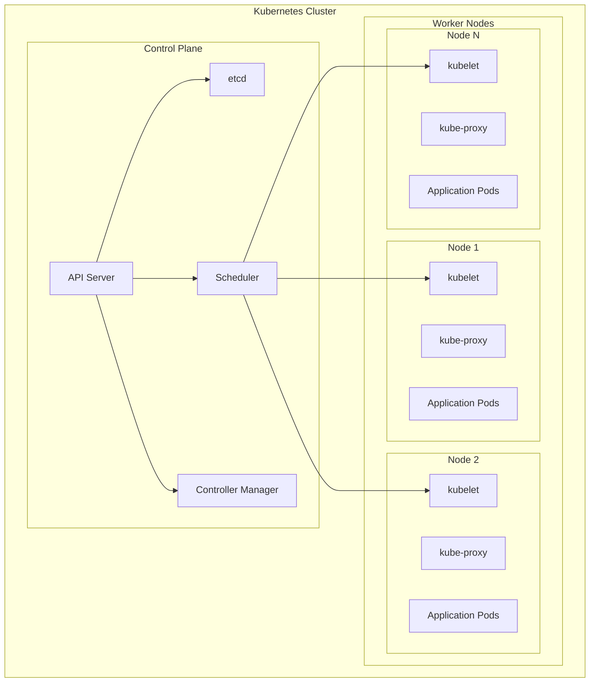
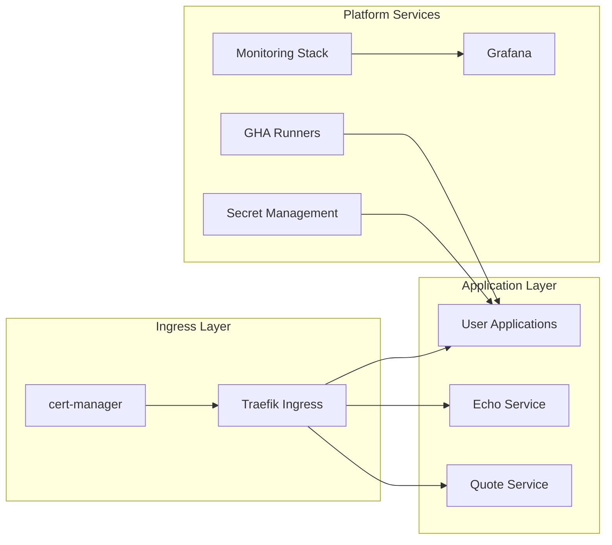
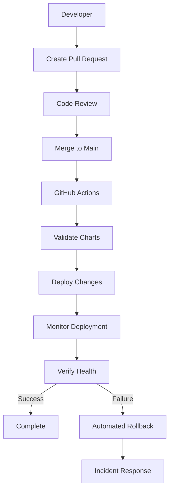

# Infrastructure Overview

The WebGrip platform is built on a **Kubernetes-based infrastructure** that provides a scalable, secure, and observable foundation for application development and deployment.

## Infrastructure Philosophy

Our infrastructure follows these core principles:

- **🏗️ Infrastructure as Code**: All infrastructure defined in version-controlled [Helm charts](../../../ops/helm/)
- **🔒 Security by Default**: Security controls built into every layer of the stack
- **📊 Observable by Design**: Comprehensive monitoring and logging across all components
- **⚡ Self-Service**: Developers can deploy and manage applications independently
- **🔄 GitOps**: All changes flow through Git workflows with proper review and automation

## Platform Stack

### Container Orchestration

**Technology**: [Kubernetes](https://kubernetes.io/)
**Configuration**: [`catalog/systems/kubernetes.yaml`](../../../catalog/systems/kubernetes.yaml)

Kubernetes provides the foundation for container orchestration, offering:

- **Pod Management**: Automated deployment, scaling, and health management
- **Service Discovery**: Built-in DNS and service mesh capabilities
- **Resource Management**: CPU, memory, and storage allocation and limits
- **Security Isolation**: Namespace-based multi-tenancy and network policies



### Package Management

**Technology**: [Helm](https://helm.sh/)
**Configuration**: [`ops/helm/`](../../../ops/helm/)

Helm manages Kubernetes application deployments through templated charts:

| Chart Category | Purpose | Location |
|---------------|---------|----------|
| **005-tainters** | Node tainting and tolerations | [`ops/helm/005-tainters/`](../../../ops/helm/005-tainters/) |
| **007-cluster-monitoring** | Platform monitoring stack | [`ops/helm/007-cluster-monitoring/`](../../../ops/helm/007-cluster-monitoring/) |
| **010-cert-manager** | Certificate automation | [`ops/helm/010-cert-manager/`](../../../ops/helm/010-cert-manager/) |
| **020-cluster-issuers** | Certificate issuers | [`ops/helm/020-cluster-issuers/`](../../../ops/helm/020-cluster-issuers/) |
| **030-ingress-controllers** | Ingress and load balancing | [`ops/helm/030-ingress-controllers/`](../../../ops/helm/030-ingress-controllers/) |
| **040-gha-runners-controller** | CI/CD infrastructure | [`ops/helm/040-gha-runners-controller/`](../../../ops/helm/040-gha-runners-controller/) |
| **045-gha-runners** | Self-hosted runner instances | [`ops/helm/045-gha-runners/`](../../../ops/helm/045-gha-runners/) |
| **060-grafana-stack** | Observability dashboards | [`ops/helm/060-grafana-stack/`](../../../ops/helm/060-grafana-stack/) |
| **950-example-services** | Sample applications | [`ops/helm/950-example-services/`](../../../ops/helm/950-example-services/) |

> **📋 Chart Naming Convention**: Charts are numbered to indicate deployment order and dependencies. Lower numbers deploy first.

### Cloud Infrastructure

**Provider**: AWS (Amazon Web Services)
**Cluster**: DigitalOcean Kubernetes (DOKS)
**Configuration**: [`catalog/resources/staging-doks-cluster.yaml`](../../../catalog/resources/staging-doks-cluster.yaml)

The platform currently runs on a DigitalOcean Kubernetes cluster with AWS integrations for:

- **Identity & Access**: AWS IAM integration for access control
- **Container Registry**: AWS ECR for container image storage  
- **Backup & Recovery**: AWS S3 for persistent volume backups
- **External Services**: AWS services for extended platform capabilities

### Infrastructure Components

#### Core Platform Services



#### Component Details

| Component | Type | Purpose | Configuration |
|-----------|------|---------|---------------|
| **[Traefik](../platform-components/ingress-load-balancing.md)** | Ingress Controller | Load balancing and traffic routing | [`ops/helm/030-ingress-controllers/ingress-traefik/`](../../../ops/helm/030-ingress-controllers/ingress-traefik/) |
| **[cert-manager](../platform-components/certificate-management.md)** | Certificate Automation | TLS certificate provisioning | [`ops/helm/010-cert-manager/`](../../../ops/helm/010-cert-manager/) |
| **[kube-prometheus-stack](../platform-components/monitoring-observability.md)** | Monitoring | Metrics collection and alerting | [`ops/helm/007-cluster-monitoring/kube-prometheus-stack/`](../../../ops/helm/007-cluster-monitoring/kube-prometheus-stack/) |
| **[Grafana](../platform-components/monitoring-observability.md)** | Observability | Dashboard visualization | [`ops/helm/060-grafana-stack/`](../../../ops/helm/060-grafana-stack/) |
| **[GitHub Actions Runners](../platform-components/cicd-infrastructure.md)** | CI/CD | Self-hosted CI/CD execution | [`ops/helm/040-gha-runners-controller/`](../../../ops/helm/040-gha-runners-controller/) |

## Infrastructure Automation

### GitOps Workflow

All infrastructure changes follow a GitOps workflow:



### Deployment Automation

**Workflow**: [`.github/workflows/on_source_change.yml`](../../../.github/workflows/on_source_change.yml)

Infrastructure deployments are automated through GitHub Actions:

1. **Validation**: Helm chart linting and security scanning
2. **Staging**: Deploy to staging environment for validation
3. **Production**: Deploy to production with manual approval gates
4. **Verification**: Automated health checks and rollback on failure

### Secret Management

**Technology**: [SOPS](https://github.com/mozilla/sops) + [Age](https://age-encryption.org/)
**Configuration**: [`ops/secrets/`](../../../ops/secrets/)

Secrets are encrypted at rest and managed through:

- **Encryption**: Age-based encryption with public key distribution
- **Access Control**: Role-based access to decrypt specific secret categories
- **Audit Trail**: All secret changes tracked in Git history
- **Rotation**: Structured processes for secret rotation and distribution

**Secret Categories**:
- **007-kube-prometheus-stack-secrets**: Monitoring credentials
- **010-cert-manager-secrets**: Certificate authority credentials  
- **030-ingress-controllers**: Ingress configuration secrets
- **045-gha-runners-secrets**: CI/CD runner credentials
- **060-grafana-stack**: Dashboard and alerting credentials

## Infrastructure Requirements

### Prerequisites

To work with this infrastructure, you need:

```bash
# Required tools (from README.md)
brew install awscli kubectl helm terraform age sops kubectx derailed/k9s/k9s
```

**Access Requirements**:
- AWS CLI configured with appropriate permissions
- kubectl access to the staging cluster
- Age key for secret decryption (for authorized personnel)
- GitHub repository access for GitOps workflows

### Local Development Setup

```bash
# Configure AWS and cluster access
aws configure
aws eks update-kubeconfig --name staging-eks-cluster --region eu-west-1

# Verify cluster connectivity
kubectl get nodes

# Access platform dashboards
make view-grafana    # Grafana dashboards
make view-traefik    # Traefik dashboard
```

> **🔧 Makefile Commands**: All operational commands are documented in the [`Makefile`](../../../Makefile) with targets for common tasks.

## Infrastructure Monitoring

### Health Indicators

The platform monitors key infrastructure health metrics:

| Metric | Source | Dashboard |
|--------|--------|-----------|
| **Cluster Resource Usage** | kube-state-metrics | [Cluster Overview](../platform-components/monitoring-observability.md#cluster-monitoring) |
| **Pod Health & Restarts** | kubelet | [Pod Status Dashboard](../platform-components/monitoring-observability.md#application-monitoring) |
| **Ingress Traffic & Latency** | Traefik | [Ingress Dashboard](../platform-components/monitoring-observability.md#network-monitoring) |
| **Certificate Expiry** | cert-manager | [Certificate Dashboard](../platform-components/monitoring-observability.md#security-monitoring) |
| **CI/CD Runner Health** | GitHub Actions Controller | [CI/CD Dashboard](../platform-components/monitoring-observability.md#cicd-monitoring) |

### Alerting

Critical infrastructure alerts are configured for:

- **Cluster Resource Exhaustion**: CPU, memory, and storage thresholds
- **Component Health**: Platform service availability and response times  
- **Security Events**: Certificate expiry, authentication failures
- **Performance Degradation**: Latency and error rate thresholds

## Next Steps

Dive deeper into specific infrastructure areas:

<div class="grid cards" markdown>

-   🌐 **[Network Architecture](network-architecture.md)**
    
    Understand pod networking, service discovery, and ingress configuration

-   🔒 **[Security Model](security-model.md)**
    
    Review security controls, access management, and compliance

-   📊 **[Resource Management](resource-management.md)**
    
    Learn about resource allocation, scaling, and capacity planning

-   🔧 **[Platform Components](../platform-components/ingress-load-balancing.md)**
    
    Explore individual platform services and their configurations

</div>

---

> **🏗️ Infrastructure Evolution**: Infrastructure changes follow our [Architecture Decision Records (ADRs)](../governance-standards/architecture-decisions.md). Significant infrastructure modifications require an ADR and stakeholder review.