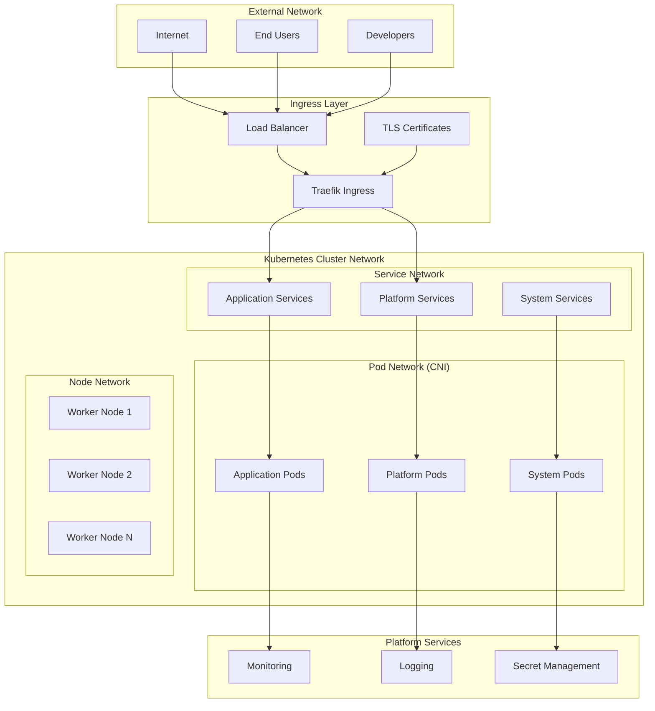
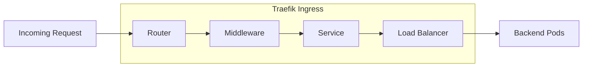
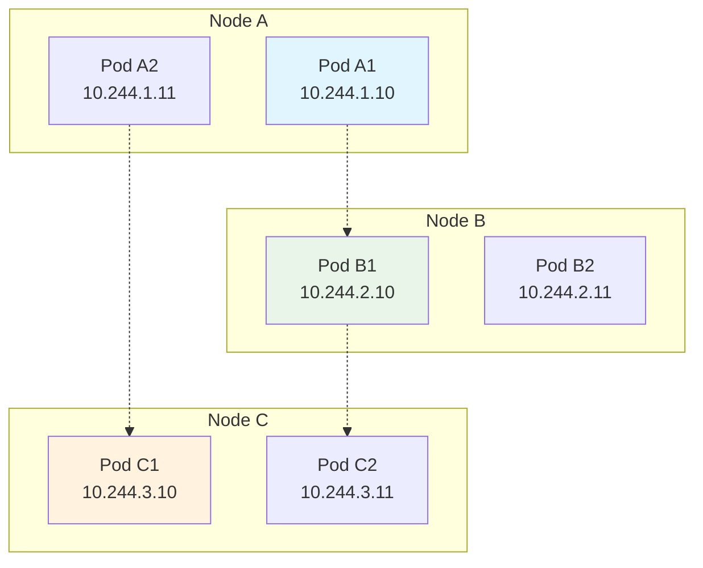
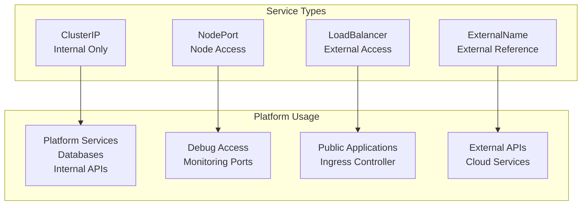
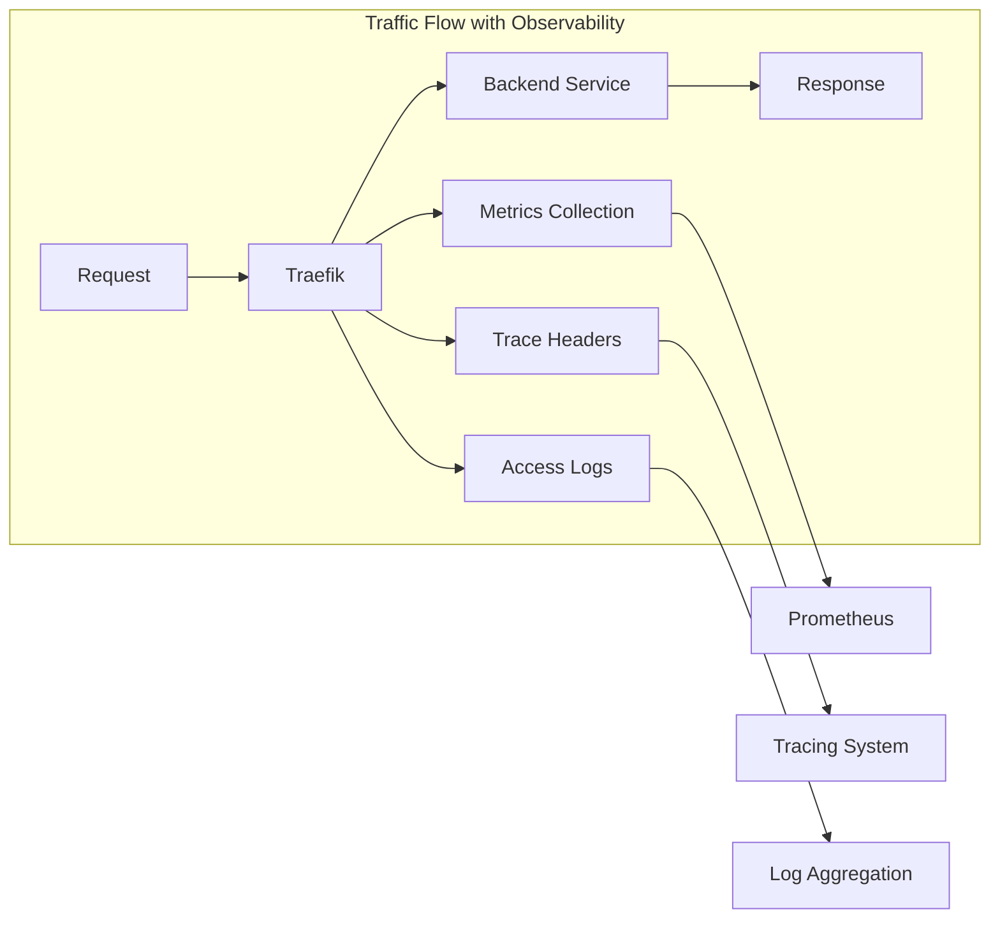
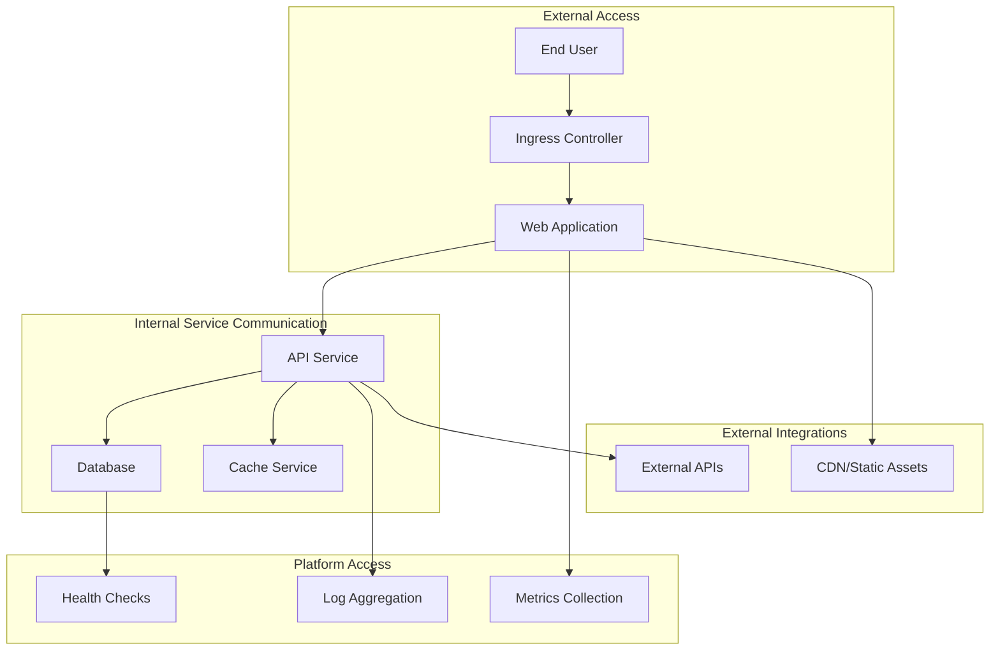

# Network Architecture

The WebGrip platform implements a **multi-layered network architecture** that provides secure, scalable, and observable connectivity for applications and platform services.

## Network Overview

The platform network architecture follows Kubernetes networking principles with additional layers for ingress, service mesh capabilities, and security enforcement.



## Network Layers

### 1. External Network Layer

**Purpose**: Handles external traffic routing and global load balancing

**Components**:
- **Internet Gateway**: Public internet access point
- **DNS**: Domain name resolution and traffic distribution
- **CDN**: Content delivery network for static assets (if configured)

**Traffic Flow**:
```
External Users → DNS Resolution → Load Balancer → Ingress Controller
```

### 2. Ingress Layer

**Technology**: [Traefik](https://traefik.io/)
**Configuration**: [`ops/helm/030-ingress-controllers/ingress-traefik/`](../../../../ops/helm/030-ingress-controllers/ingress-traefik/)

The ingress layer provides:

- **HTTP/HTTPS Termination**: TLS certificate management and SSL termination
- **Request Routing**: Path and host-based routing to backend services
- **Load Balancing**: Traffic distribution across healthy service instances
- **Middleware**: Authentication, rate limiting, and traffic modification

**Traefik Configuration**:


**Key Features**:
- **Automatic Service Discovery**: Kubernetes provider for dynamic configuration
- **Certificate Automation**: Integration with [cert-manager](../platform-components/certificate-management.md)
- **Observability**: Built-in metrics and tracing capabilities
- **Custom Middleware**: [`ops/helm/030-ingress-controllers/ingress-traefik-custom-middlewares/`](../../../../ops/helm/030-ingress-controllers/ingress-traefik-custom-middlewares/)

### 3. Pod Network (CNI)

**Technology**: Kubernetes Container Network Interface (CNI)
**Implementation**: Cloud provider managed (DigitalOcean)

Pod networking provides:

- **Pod-to-Pod Communication**: Direct IP connectivity between pods across nodes
- **IP Address Management**: Automatic IP allocation from cluster CIDR
- **Network Isolation**: Namespace-based network segmentation
- **Network Policies**: Fine-grained traffic control rules

**Pod Communication Patterns**:


**Network Address Ranges**:
| Network Type | CIDR Range | Purpose |
|-------------|------------|---------|
| **Cluster CIDR** | `10.244.0.0/16` | Pod IP addresses |
| **Service CIDR** | `10.96.0.0/12` | Service virtual IPs |
| **Node CIDR** | `10.0.0.0/16` | Node infrastructure IPs |

> **Assumption**: CIDR ranges are typical Kubernetes defaults. Actual ranges should be verified in cluster configuration with `kubectl cluster-info dump | grep -i cidr` or by checking cluster provider settings.

> **📝 Assumption**: CIDR ranges are typical defaults. Actual ranges should be verified in cluster configuration.

### 4. Service Network

**Technology**: Kubernetes Services
**Types**: ClusterIP, NodePort, LoadBalancer, ExternalName

Service networking provides:

- **Service Discovery**: DNS-based service name resolution
- **Load Balancing**: Traffic distribution across healthy endpoints
- **Session Affinity**: Sticky sessions when required
- **Health Checking**: Endpoint health monitoring and removal

**Service Types in Platform**:



**Service Discovery Example**:
```bash
# DNS resolution within cluster
curl http://grafana.grafana-stack.svc.cluster.local:80

# Short name resolution (same namespace)
curl http://grafana:80

# Cross-namespace resolution  
curl http://traefik.ingress-traefik.svc.cluster.local:80
```

## Network Security

### Network Policies

**Purpose**: Implement microsegmentation and zero-trust networking

**Default Policy**: Deny all traffic, allow specific flows

Example Network Policy Structure:
```yaml
# Allow ingress traffic to web tier from ingress controller
apiVersion: networking.k8s.io/v1
kind: NetworkPolicy
metadata:
  name: web-tier-ingress
spec:
  podSelector:
    matchLabels:
      tier: web
  policyTypes:
  - Ingress
  ingress:
  - from:
    - namespaceSelector:
        matchLabels:
          name: ingress-traefik
    ports:
    - protocol: TCP
      port: 8080
```

**Network Policy Categories**:
- **Ingress Policies**: Control incoming traffic to pods
- **Egress Policies**: Control outgoing traffic from pods  
- **Namespace Isolation**: Restrict cross-namespace communication
- **Platform Service Access**: Allow access to monitoring and logging

### TLS and Certificate Management

**Technology**: [cert-manager](https://cert-manager.io/)
**Configuration**: [`ops/helm/010-cert-manager/`](../../../../ops/helm/010-cert-manager/)

Certificate management provides:

- **Automatic Certificate Provisioning**: Let's Encrypt integration
- **Certificate Rotation**: Automatic renewal before expiry
- **Wildcard Certificates**: Domain and subdomain coverage
- **Certificate Distribution**: Automatic distribution to ingress controllers

**Certificate Issuers**:
- **Cluster Issuers**: [`ops/helm/020-cluster-issuers/certificate-cluster-issuer-traefik/`](../../../../ops/helm/020-cluster-issuers/certificate-cluster-issuer-traefik/)
- **Let's Encrypt Production**: For production workloads
- **Let's Encrypt Staging**: For testing and validation

## Service Mesh Capabilities

While not implementing a full service mesh, the platform provides service mesh-like capabilities through:

### Traffic Management

**Traefik Middleware**: [`ops/helm/030-ingress-controllers/ingress-traefik-custom-middlewares/`](../../../../ops/helm/030-ingress-controllers/ingress-traefik-custom-middlewares/)

- **Request Routing**: Path and header-based routing
- **Traffic Splitting**: A/B testing and canary deployments
- **Circuit Breaking**: Automatic failure handling
- **Rate Limiting**: Request throttling and DDoS protection

### Observability

**Integration Points**:
- **Metrics**: Prometheus metrics from network components
- **Tracing**: Distributed tracing headers and propagation
- **Logging**: Access logs and audit trails
- **Health Checks**: Endpoint health monitoring



## Network Monitoring

### Monitoring Components

**Traffic Monitoring**:
- **Ingress Metrics**: Request rates, response times, error rates
- **Service Metrics**: Endpoint health, connection counts
- **Pod Network Metrics**: Bandwidth utilization, packet loss
- **DNS Metrics**: Resolution times, failure rates

**Key Metrics Collected**:
| Metric Category | Examples | Dashboard |
|----------------|----------|-----------|
| **Ingress Traffic** | Request rate, latency, error rate | [Traefik Dashboard](../platform-components/monitoring-observability.md#ingress-monitoring) |
| **Service Health** | Endpoint availability, response time | [Service Dashboard](../platform-components/monitoring-observability.md#service-monitoring) |
| **Network Performance** | Bandwidth, packet loss, connection counts | [Network Dashboard](../platform-components/monitoring-observability.md#network-monitoring) |
| **Security Events** | Failed connections, certificate issues | [Security Dashboard](../platform-components/monitoring-observability.md#security-monitoring) |

### Network Troubleshooting

**Common Tools and Commands**:

```bash
# Check service endpoints
kubectl get endpoints -A

# Test service connectivity
kubectl run -it --rm debug --image=busybox --restart=Never -- sh
# Inside pod: nslookup service-name

# Check network policies
kubectl get networkpolicies -A

# View ingress status
kubectl get ingress -A

# Check certificate status
kubectl get certificates -A
```

**Troubleshooting Workflows**:
1. **Service Discovery Issues**: Check DNS resolution and service endpoints
2. **Connectivity Problems**: Verify network policies and security groups
3. **Certificate Issues**: Check cert-manager logs and certificate status
4. **Performance Issues**: Review traffic patterns and resource utilization

## Network Access Patterns

### Application Access Patterns



### Administrative Access

**Management Interfaces**:
- **Kubernetes API**: `kubectl` and dashboard access
- **Grafana**: [`make view-grafana`](../../../../Makefile) - Monitoring dashboards
- **Traefik Dashboard**: [`make view-traefik`](../../../../Makefile) - Ingress status
- **Prometheus**: Direct metrics access for troubleshooting

**Access Control**:
- **RBAC**: Role-based access control for cluster resources
- **Network Policies**: Restrict administrative interface access
- **VPN/Bastion**: Secure access for administrative operations

## Performance Optimization

### Network Performance Tuning

**Optimization Strategies**:
- **Connection Pooling**: Reuse connections for backend services
- **HTTP/2**: Enable HTTP/2 for improved multiplexing
- **Compression**: Gzip/Brotli compression for responses
- **Caching**: Edge caching and CDN integration

**Resource Limits**:
```yaml
# Example resource limits for network components
resources:
  requests:
    memory: "256Mi"
    cpu: "100m"
  limits:
    memory: "512Mi" 
    cpu: "500m"
```

### Capacity Planning

**Network Capacity Metrics**:
- **Bandwidth Utilization**: Monitor node and pod network usage
- **Connection Limits**: Track concurrent connections per service
- **Latency Targets**: Maintain acceptable response times
- **Throughput Requirements**: Plan for peak traffic scenarios

## Next Steps

Explore related network and infrastructure topics:

<div class="grid cards" markdown>

-   🔒 **[Security Model](security-model.md)**
    
    Understand security controls, access management, and network security policies

-   📊 **[Resource Management](resource-management.md)**
    
    Learn about resource allocation, scaling, and capacity planning

-   🔧 **[Ingress & Load Balancing](../platform-components/ingress-load-balancing.md)**
    
    Deep dive into Traefik configuration and traffic management

-   📈 **[Monitoring & Observability](../platform-components/monitoring-observability.md)**
    
    Explore network monitoring, metrics, and troubleshooting tools

</div>

---

> **🌐 Network Evolution**: Network architecture changes should be documented in [Architecture Decision Records (ADRs)](../governance-standards/architecture-decisions.md) due to their impact on security and performance.