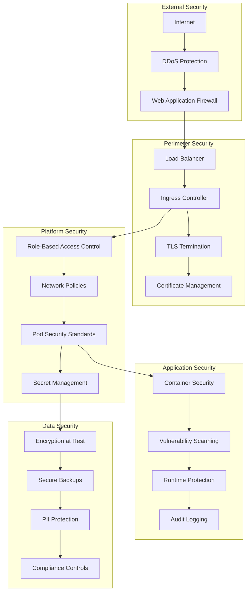
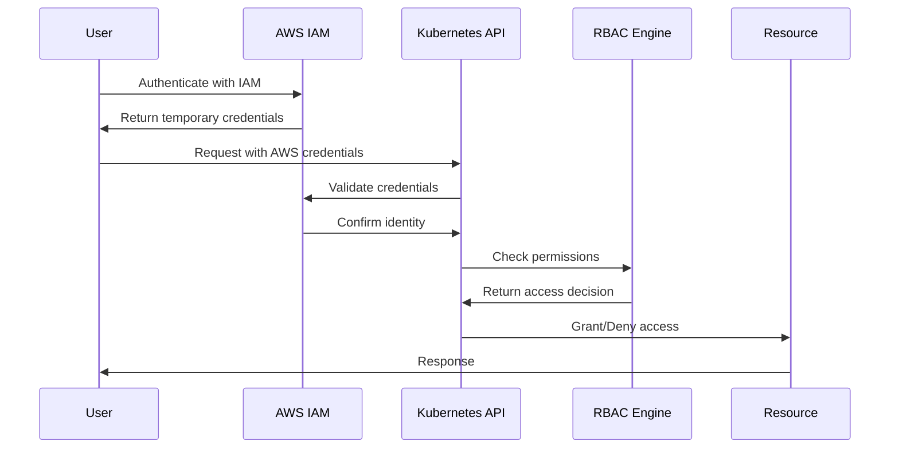
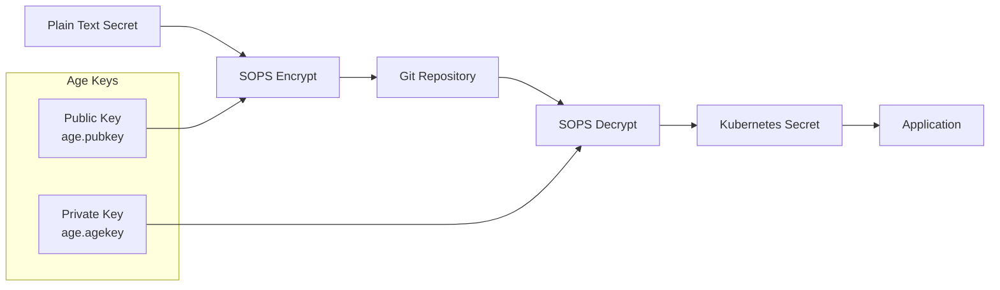
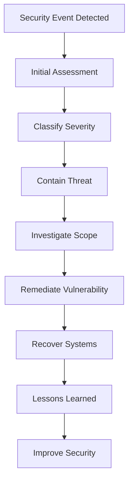

# Security Model

The WebGrip platform implements a **defense-in-depth security model** with multiple layers of protection, following zero-trust principles and security-by-default practices.

## Security Philosophy

Our security approach is built on these core principles:

- **🛡️ Zero Trust**: Never trust, always verify - validate every request and access
- **🔒 Security by Default**: Secure configurations and practices built into the platform
- **🎯 Least Privilege**: Grant minimum necessary permissions for operations
- **📊 Defense in Depth**: Multiple overlapping security controls and monitoring
- **🔄 Continuous Validation**: Ongoing security scanning and compliance verification

## Security Architecture

### Security Layers



## Access Control

### Role-Based Access Control (RBAC)

**Kubernetes RBAC Implementation**:
The platform uses Kubernetes RBAC to control access to cluster resources:

```yaml
# Example RBAC configuration
apiVersion: rbac.authorization.k8s.io/v1
kind: ClusterRole
metadata:
  name: platform-engineer
rules:
  - apiGroups: ["apps", "extensions"]
    resources: ["deployments", "replicasets", "pods"]
    verbs: ["get", "list", "watch", "create", "update", "patch", "delete"]
  - apiGroups: [""]
    resources: ["services", "configmaps", "secrets"]
    verbs: ["get", "list", "watch", "create", "update", "patch"]
---
apiVersion: rbac.authorization.k8s.io/v1
kind: ClusterRoleBinding
metadata:
  name: platform-engineers
subjects:
  - kind: User
    name: platform-engineer@webgrip.nl
    apiGroup: rbac.authorization.k8s.io
roleRef:
  kind: ClusterRole
  name: platform-engineer
  apiGroup: rbac.authorization.k8s.io
```

**Role Hierarchy**:
| Role | Permissions | Use Case |
|------|-------------|----------|
| **Cluster Admin** | Full cluster access | Emergency operations, cluster maintenance |
| **Platform Engineer** | Platform component management | Infrastructure deployment and operations |
| **Developer** | Application namespace access | Application deployment and debugging |
| **Read-Only** | View access only | Monitoring, auditing, troubleshooting |
| **Service Account** | Automated operations | CI/CD, monitoring, backup operations |

### Authentication Methods

**Authentication Sources**:
- **AWS IAM**: Primary authentication via AWS IAM roles and users
- **Service Accounts**: Kubernetes-native authentication for automated processes
- **GitHub Integration**: GitHub Actions authentication for CI/CD workflows
- **Certificate-based**: Client certificate authentication for admin access

**Authentication Flow**:


### Service Accounts

**Platform Service Accounts**:
```yaml
# CI/CD Service Account
apiVersion: v1
kind: ServiceAccount
metadata:
  name: github-actions-runner
  namespace: github-actions
---
apiVersion: rbac.authorization.k8s.io/v1
kind: Role
metadata:
  name: deployment-manager
  namespace: applications
rules:
  - apiGroups: ["apps"]
    resources: ["deployments"]
    verbs: ["get", "list", "create", "update", "patch"]
  - apiGroups: [""]
    resources: ["services", "configmaps"]
    verbs: ["get", "list", "create", "update"]
```

**Service Account Categories**:
- **github-actions-runner**: CI/CD deployment operations
- **monitoring-collector**: Metrics and log collection
- **cert-manager**: Certificate provisioning and management
- **backup-operator**: Backup and restore operations

## Secret Management

### SOPS + Age Encryption

**Technology Stack**: [SOPS](https://github.com/mozilla/sops) + [Age](https://age-encryption.org/)
**Configuration**: [`ops/secrets/`](../../../../ops/secrets/)

**Encryption Workflow**:


**Secret Categories and Access Control**:
| Secret Category | Purpose | Access Level | Rotation Schedule |
|----------------|---------|--------------|-------------------|
| **007-kube-prometheus-stack-secrets** | Monitoring credentials | Platform Engineers | Quarterly |
| **010-cert-manager-secrets** | Certificate authority keys | Infrastructure Team | Annually |
| **030-ingress-controllers** | Ingress configuration secrets | Platform Engineers | As needed |
| **045-gha-runners-secrets** | CI/CD runner credentials | DevOps Team | Monthly |
| **060-grafana-stack** | Dashboard credentials | Infrastructure Team | Quarterly |

**Secret Management Commands**:
```bash
# Encrypt secrets (authorized personnel only)
make encrypt-secrets SECRETS_DIR=./ops/secrets/component-name

# Decrypt for deployment (authorized personnel only)
make decrypt-secrets SECRETS_DIR=./ops/secrets/component-name

# Age key management
age-keygen -o age.agekey  # Generate private key
age-keygen -y age.agekey > age.pubkey  # Extract public key
```

> **Assumption**: Age key rotation procedures should be documented in a separate security runbook. Current process appears to be manual key distribution to authorized personnel.

### Kubernetes Secret Management

**Secret Types**:
- **Generic**: Database passwords, API keys
- **TLS**: Certificate and private key pairs
- **Docker Registry**: Container registry credentials
- **Service Account**: Authentication tokens for service accounts

**Secret Best Practices**:
```yaml
# Example secure secret configuration
apiVersion: v1
kind: Secret
metadata:
  name: app-secrets
  namespace: applications
type: Opaque
data:
  # Base64 encoded values
  api-key: <base64-encoded-value>
  database-password: <base64-encoded-value>
---
# Pod configuration with secret consumption
apiVersion: v1
kind: Pod
metadata:
  name: secure-app
spec:
  containers:
  - name: app
    image: myapp:latest
    env:
    - name: API_KEY
      valueFrom:
        secretKeyRef:
          name: app-secrets
          key: api-key
    volumeMounts:
    - name: secret-volume
      mountPath: /etc/secrets
      readOnly: true
  volumes:
  - name: secret-volume
    secret:
      secretName: app-secrets
      defaultMode: 0400  # Read-only for owner
```

## Network Security

### Network Policies

**Default Deny Policy**:
```yaml
# Default deny all traffic
apiVersion: networking.k8s.io/v1
kind: NetworkPolicy
metadata:
  name: default-deny-all
  namespace: applications
spec:
  podSelector: {}
  policyTypes:
  - Ingress
  - Egress
```

**Application-Specific Policies**:
```yaml
# Allow traffic from ingress to web tier
apiVersion: networking.k8s.io/v1
kind: NetworkPolicy
metadata:
  name: web-tier-ingress
  namespace: applications
spec:
  podSelector:
    matchLabels:
      tier: web
  policyTypes:
  - Ingress
  ingress:
  - from:
    - namespaceSelector:
        matchLabels:
          name: ingress-traefik
    ports:
    - protocol: TCP
      port: 8080
---
# Allow web tier to communicate with API tier
apiVersion: networking.k8s.io/v1
kind: NetworkPolicy
metadata:
  name: web-to-api
  namespace: applications
spec:
  podSelector:
    matchLabels:
      tier: web
  policyTypes:
  - Egress
  egress:
  - to:
    - podSelector:
        matchLabels:
          tier: api
    ports:
    - protocol: TCP
      port: 8080
```

### TLS and Certificate Security

**Certificate Management**: [cert-manager](../platform-components/certificate-management.md)
**Configuration**: [`ops/helm/010-cert-manager/`](../../../../ops/helm/010-cert-manager/)

**Certificate Security Features**:
- **Automatic Provisioning**: Let's Encrypt integration for domain validation
- **Automatic Renewal**: Certificates renewed before expiration
- **Secure Storage**: Private keys stored in Kubernetes secrets
- **Certificate Transparency**: All certificates logged in CT logs

**TLS Configuration**:
```yaml
# Secure TLS configuration
apiVersion: traefik.containo.us/v1alpha1
kind: TLSOption
metadata:
  name: secure-tls
  namespace: ingress-traefik
spec:
  minVersion: "VersionTLS12"
  maxVersion: "VersionTLS13"
  cipherSuites:
    - TLS_ECDHE_RSA_WITH_AES_256_GCM_SHA384
    - TLS_ECDHE_RSA_WITH_CHACHA20_POLY1305
    - TLS_ECDHE_RSA_WITH_AES_128_GCM_SHA256
  curvePreferences:
    - secp521r1
    - secp384r1
  sniStrict: true
  clientAuth:
    secretNames:
      - client-ca-cert
    clientAuthType: VerifyClientCertIfGiven
```

## Container Security

### Pod Security Standards

**Pod Security Configuration**:
```yaml
# Secure pod security context
apiVersion: v1
kind: Pod
metadata:
  name: secure-app
spec:
  securityContext:
    runAsNonRoot: true
    runAsUser: 1000
    runAsGroup: 1000
    fsGroup: 1000
    seccompProfile:
      type: RuntimeDefault
  containers:
  - name: app
    image: myapp:latest
    securityContext:
      allowPrivilegeEscalation: false
      readOnlyRootFilesystem: true
      capabilities:
        drop:
        - ALL
      runAsNonRoot: true
      runAsUser: 1000
    resources:
      requests:
        memory: "128Mi"
        cpu: "100m"
      limits:
        memory: "256Mi"
        cpu: "200m"
```

### Image Security

**Container Image Security Practices**:
- **Minimal Base Images**: Use distroless or Alpine base images
- **Vulnerability Scanning**: Regular scanning with Trivy or similar tools
- **Image Signing**: Verify image authenticity and integrity
- **Registry Security**: Private registry with access controls

**Image Scanning Integration**:
```yaml
# GitHub Actions security scanning
- name: Scan container image
  uses: aquasecurity/trivy-action@master
  with:
    image-ref: 'myregistry/myapp:${{ github.sha }}'
    format: 'sarif'
    output: 'trivy-results.sarif'
    
- name: Upload Trivy scan results
  uses: github/codeql-action/upload-sarif@v2
  with:
    sarif_file: 'trivy-results.sarif'
```

### Runtime Security

**Runtime Protection**:
- **Resource Limits**: CPU and memory limits prevent resource exhaustion
- **Network Policies**: Restrict network communication between pods
- **Security Contexts**: Non-root execution and capability dropping
- **Admission Controllers**: Validate security policies at admission time

## Monitoring and Auditing

### Security Monitoring

**Security Metrics Collected**:
| Metric | Purpose | Alert Threshold |
|--------|---------|-----------------|
| **Failed Authentication Attempts** | Detect brute force attacks | >10/minute |
| **Certificate Expiry** | Prevent service disruption | <30 days |
| **Pod Security Policy Violations** | Detect security misconfigurations | Any violation |
| **Network Policy Drops** | Monitor blocked traffic | Baseline deviation |
| **Secret Access Patterns** | Detect abnormal secret usage | Pattern deviation |

**Security Dashboards**:
- **[Authentication Dashboard](../platform-components/monitoring-observability.md#security-monitoring)**: Login attempts, failures, patterns
- **[Certificate Dashboard](../platform-components/monitoring-observability.md#certificate-monitoring)**: Certificate status, expiry tracking
- **[Network Security Dashboard](../platform-components/monitoring-observability.md#network-security)**: Traffic patterns, policy violations

### Audit Logging

**Kubernetes Audit Configuration**:
```yaml
# Audit policy for security events
apiVersion: audit.k8s.io/v1
kind: Policy
rules:
  # Log authentication events
  - level: Request
    users: ["system:anonymous"]
    verbs: ["get", "list", "watch"]
    
  # Log secret access
  - level: RequestResponse
    resources:
    - group: ""
      resources: ["secrets"]
    verbs: ["get", "list", "create", "update", "patch", "delete"]
    
  # Log RBAC changes
  - level: RequestResponse
    resources:
    - group: "rbac.authorization.k8s.io"
      resources: ["roles", "rolebindings", "clusterroles", "clusterrolebindings"]
    verbs: ["create", "update", "patch", "delete"]
```

**Log Retention and Analysis**:
- **Retention Period**: 1 year for security logs, 90 days for operational logs
- **Log Analysis**: Automated analysis for security patterns and anomalies
- **SIEM Integration**: Forward security logs to Security Information and Event Management system

## Compliance and Governance

### Security Standards

**Compliance Frameworks**:
- **ISO 27001**: Information security management
- **SOC 2**: Security and availability controls
- **GDPR**: Data protection and privacy requirements
- **NIST Cybersecurity Framework**: Cybersecurity best practices

### Security Policies

**Security Policy Categories**:
| Policy Area | Description | Review Schedule |
|-------------|-------------|-----------------|
| **Access Control** | User access and privilege management | Quarterly |
| **Data Protection** | Data classification and handling | Annually |
| **Incident Response** | Security incident procedures | Semi-annually |
| **Vulnerability Management** | Security scanning and patching | Monthly |
| **Change Management** | Security review of changes | Ongoing |

### Security Training

**Security Awareness Program**:
- **Developer Security Training**: Secure coding practices, OWASP Top 10
- **Platform Security Training**: Kubernetes security, container security
- **Incident Response Training**: Security incident handling procedures
- **Compliance Training**: Regulatory requirements and compliance procedures

## Incident Response

### Security Incident Classification

**Incident Severity Levels**:
- **Critical (P0)**: Active security breach, data exfiltration
- **High (P1)**: Security vulnerability with potential for exploitation
- **Medium (P2)**: Security misconfiguration or policy violation
- **Low (P3)**: Minor security concern or informational alert

### Incident Response Procedures

**Security Incident Response Flow**:


**Incident Response Team**:
- **Incident Commander**: Overall incident response coordination
- **Security Engineer**: Technical security analysis and remediation
- **Platform Engineer**: Infrastructure and platform expertise
- **Communications Lead**: Stakeholder communication and reporting

## Security Best Practices

### Development Security

**Secure Development Practices**:
- **Threat Modeling**: Identify and analyze potential threats
- **Secure Code Review**: Security-focused code review process
- **Dependency Scanning**: Regular scanning of third-party dependencies
- **Security Testing**: Integration of security tests in CI/CD pipeline

### Operational Security

**Security Operations Practices**:
- **Principle of Least Privilege**: Grant minimum necessary permissions
- **Regular Security Reviews**: Periodic assessment of security controls
- **Vulnerability Management**: Regular patching and security updates
- **Backup Security**: Secure backup storage and recovery procedures

### Emergency Procedures

**Security Emergency Response**:
```bash
# Emergency security commands (authorized personnel only)

# Immediately revoke compromised credentials
kubectl delete secret compromised-secret -n namespace

# Emergency network isolation
kubectl apply -f emergency-network-policy.yaml

# Emergency pod termination
kubectl delete pod compromised-pod -n namespace --force --grace-period=0

# Emergency certificate revocation
kubectl delete certificate compromised-cert -n namespace
```

## Next Steps

Explore related security topics:

<div class="grid cards" markdown>

-   🔐 **[Secret Management](../platform-components/secret-management.md)**
    
    Deep dive into SOPS-based secret management and rotation procedures

-   🌐 **[Network Architecture](network-architecture.md)**
    
    Understand network security controls and traffic flow

-   📊 **[Monitoring & Observability](../platform-components/monitoring-observability.md)**
    
    Review security monitoring, metrics, and alerting

-   📋 **[Security Policies](../governance-standards/security-policies.md)**
    
    Review detailed security policies and compliance requirements

</div>

---

> **🛡️ Security First**: Security is everyone's responsibility. When in doubt about security implications, escalate to the security team for guidance and review.