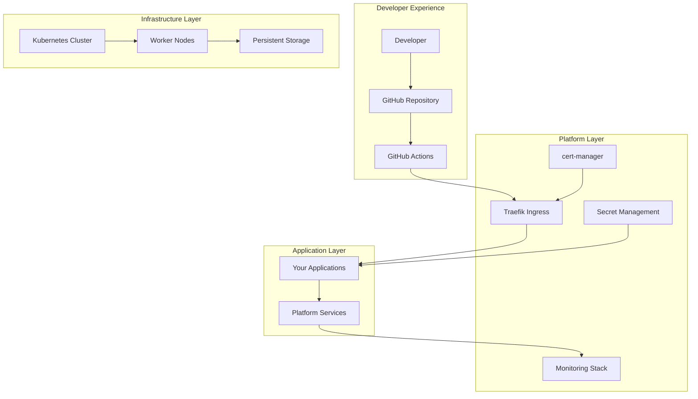

# Onboarding Guide

Welcome to the **WebGrip Platform**! This guide will help you set up your development environment, understand the platform architecture, and deploy your first application.

## Platform Overview

The WebGrip platform is a **Kubernetes-based infrastructure platform** that provides:

- **🚀 Self-Service Deployment**: Automated application templates and CI/CD
- **📊 Built-in Observability**: Monitoring, logging, and alerting out of the box
- **🔐 Security by Default**: Integrated secret management and security scanning
- **📚 Comprehensive Documentation**: Complete platform documentation and runbooks

## Prerequisites

Before you begin, ensure you have the required tools and access permissions.

### Required Tools

Install the following tools on your development machine:

```bash
# macOS installation (using Homebrew)
brew install awscli kubectl helm terraform age sops kubectx derailed/k9s/k9s

# Verify installations
aws --version        # AWS CLI v2.x
kubectl version      # Kubernetes CLI v1.28+
helm version         # Helm v3.12+
terraform --version  # Terraform v1.5+
age --version        # Age encryption v1.1+
sops --version       # SOPS v3.7+
kubectx --version    # kubectx/kubens
k9s version          # k9s cluster manager
```

#### Tool Purposes

| Tool | Purpose | Usage |
|------|---------|-------|
| **AWS CLI** | Cloud authentication and access | `aws configure` |
| **kubectl** | Kubernetes cluster management | `kubectl get pods` |
| **Helm** | Kubernetes package management | `helm list` |
| **Terraform** | Infrastructure as Code | `terraform plan` |
| **Age** | Encryption key management | Key generation and storage |
| **SOPS** | Secret encryption/decryption | `sops -d secrets.yaml` |
| **kubectx** | Kubernetes context switching | `kubectx staging` |
| **k9s** | Interactive cluster management | `k9s` |

### Access Requirements

Ensure you have appropriate access to:

- **GitHub Organization**: Access to WebGrip repositories
- **AWS Account**: IAM permissions for cluster access
- **Kubernetes Cluster**: RBAC permissions for development
- **Secret Decryption**: Age key for authorized secret access (if needed)

### Development Environment

**Recommended Setup**:
- **Operating System**: macOS or Linux (Windows with WSL2)
- **IDE**: VS Code with Kubernetes and Helm extensions
- **Terminal**: iTerm2 (macOS) or equivalent with shell customization
- **Git**: Configured with SSH keys for GitHub

## Platform Setup

### Step 1: Configure AWS Access

```bash
# Configure AWS CLI with your credentials
aws configure

# Test AWS connectivity
aws sts get-caller-identity

# Expected output should show your user identity
{
    "UserId": "AIDACKCEVSQ6C2EXAMPLE",
    "Account": "123456789012",
    "Arn": "arn:aws:iam::123456789012:user/your-username"
}
```

### Step 2: Connect to Kubernetes Cluster

```bash
# Connect to the staging cluster
aws eks update-kubeconfig --name staging-eks-cluster --region eu-west-1

# Verify cluster connectivity
kubectl get nodes

# Expected output: List of cluster nodes
NAME                                       STATUS   ROLES    AGE   VERSION
ip-10-0-1-100.eu-west-1.compute.internal   Ready    <none>   1d    v1.28.0
ip-10-0-2-200.eu-west-1.compute.internal   Ready    <none>   1d    v1.28.0
```

### Step 3: Verify Platform Components

```bash
# Check platform components status
kubectl get pods -A

# Check specific platform services
kubectl get pods -n ingress-traefik     # Ingress controller
kubectl get pods -n cert-manager        # Certificate management
kubectl get pods -n kube-prometheus-stack  # Monitoring
kubectl get pods -n grafana-stack       # Dashboards
```

### Step 4: Access Platform Dashboards

```bash
# Access Grafana monitoring dashboards
make view-grafana
# Opens browser to http://localhost:3001

# Access Traefik ingress dashboard  
make view-traefik
# Opens browser to http://localhost:9000

# Access cluster monitoring (if available)
make view-cluster-grafana
# Opens browser to http://localhost:3000
```

## Understanding the Platform

### Architecture Overview



### Key Platform Components

| Component | Purpose | Access |
|-----------|---------|--------|
| **[Traefik Ingress](../platform-components/ingress-load-balancing.md)** | Load balancing and traffic routing | [`make view-traefik`](../../../../Makefile) |
| **[cert-manager](../platform-components/certificate-management.md)** | Automatic TLS certificate provisioning | `kubectl get certificates -A` |
| **[Monitoring Stack](../platform-components/monitoring-observability.md)** | Prometheus metrics and alerting | [`make view-cluster-grafana`](../../../../Makefile) |
| **[Grafana](../platform-components/monitoring-observability.md)** | Observability dashboards | [`make view-grafana`](../../../../Makefile) |
| **[GitHub Actions Runners](../platform-components/cicd-infrastructure.md)** | Self-hosted CI/CD execution | View in GitHub Actions |
| **[Secret Management](../platform-components/secret-management.md)** | SOPS-encrypted configuration | Authorized access only |

### Repository Structure

Understanding the repository organization:

```
organisation-public/
├── catalog/                    # Backstage service catalog
│   ├── domains/               # Business domains
│   ├── systems/               # Technical systems
│   ├── components/            # Service components
│   └── groups/                # Team definitions
├── ops/                       # Operations configuration
│   ├── helm/                  # Platform Helm charts
│   └── secrets/               # Encrypted secrets (SOPS)
├── docs/                      # Documentation
│   ├── techdocs/              # This documentation site
│   └── adrs/                  # Architecture decisions
├── .github/workflows/         # CI/CD automation
└── grafana-dashboards/        # Monitoring dashboards
```

## First Deployment

Let's deploy your first application to understand the platform workflow.

### Option 1: Deploy Example Service

```bash
# 1. Check example services
kubectl get pods -n example-services

# 2. View example service configuration
ls ops/helm/950-example-services/

# 3. Access echo service (if deployed)
kubectl get ingress -n example-services

# 4. Test the service
curl -k https://echo.staging.example.com/
```

### Option 2: Create New Application

Use the automated application creation workflow:

1. **Navigate to GitHub Actions** in the WebGrip organization
2. **Find "Create New Application" workflow**
3. **Run workflow** with your application name
4. **Wait for automation** to complete repository setup
5. **Clone your new repository** and start development

**Automated Setup Includes**:
- Repository creation from template
- CI/CD pipeline configuration
- Secret management setup
- Copilot integration for development assistance
- Documentation generation

### Option 3: Manual Application Deployment

For learning purposes, deploy a simple application manually:

```yaml
# Create a simple deployment
cat > my-first-app.yaml << EOF
apiVersion: apps/v1
kind: Deployment
metadata:
  name: my-first-app
  namespace: default
spec:
  replicas: 2
  selector:
    matchLabels:
      app: my-first-app
  template:
    metadata:
      labels:
        app: my-first-app
    spec:
      containers:
      - name: app
        image: nginx:alpine
        ports:
        - containerPort: 80
        resources:
          requests:
            memory: "64Mi"
            cpu: "50m"
          limits:
            memory: "128Mi"
            cpu: "100m"
---
apiVersion: v1
kind: Service
metadata:
  name: my-first-app
  namespace: default
spec:
  selector:
    app: my-first-app
  ports:
    - port: 80
      targetPort: 80
---
apiVersion: traefik.containo.us/v1alpha1
kind: IngressRoute
metadata:
  name: my-first-app
  namespace: default
spec:
  entryPoints:
    - web
  routes:
    - match: Host(\`my-app.staging.example.com\`)
      kind: Rule
      services:
        - name: my-first-app
          port: 80
EOF

# Deploy the application
kubectl apply -f my-first-app.yaml

# Verify deployment
kubectl get pods -l app=my-first-app
kubectl get svc my-first-app
kubectl get ingressroute my-first-app

# Test the application
curl http://my-app.staging.example.com/
```

## Development Workflows

### Git Workflow

**Branching Strategy**:
```mermaid
gitgraph
    commit id: "main"
    branch feature/new-feature
    checkout feature/new-feature
    commit id: "feat: add feature"
    commit id: "test: add tests"
    checkout main
    merge feature/new-feature
    commit id: "deploy: staging"
    branch release/v1.0.0
    checkout release/v1.0.0
    commit id: "release: v1.0.0"
    checkout main
    merge release/v1.0.0
    commit id: "deploy: production"
```

**Standard Workflow**:
1. **Create Feature Branch**: `git checkout -b feature/your-feature`
2. **Develop and Test**: Make changes, add tests, verify locally
3. **Create Pull Request**: Open PR with clear description
4. **Code Review**: Address feedback and iterate
5. **Merge to Main**: Automatic deployment to staging
6. **Production Deployment**: Manual promotion after validation

### CI/CD Integration

**GitHub Actions Workflow** (automatically configured):

```yaml
# Example application CI/CD pipeline
name: Build and Deploy
on:
  push:
    branches: [main]
  pull_request:
    branches: [main]

jobs:
  test:
    runs-on: ubuntu-latest
    steps:
      - uses: actions/checkout@v4
      - name: Run tests
        run: npm test
        
  build:
    needs: test
    runs-on: ubuntu-latest
    steps:
      - uses: actions/checkout@v4
      - name: Build and push image
        run: |
          docker build -t myapp:${{ github.sha }} .
          docker push myregistry/myapp:${{ github.sha }}
          
  deploy-staging:
    needs: build
    if: github.ref == 'refs/heads/main'
    runs-on: self-hosted
    steps:
      - name: Deploy to staging
        run: |
          helm upgrade myapp ./helm-chart \
            --set image.tag=${{ github.sha }} \
            --namespace staging
```

### Local Development

**Development Loop**:
1. **Code Changes**: Make application changes locally
2. **Local Testing**: Run tests and verify functionality
3. **Container Build**: Build and test container locally
4. **Push Changes**: Commit and push to feature branch
5. **CI Validation**: GitHub Actions validates changes
6. **Review Process**: Code review and approval
7. **Deployment**: Automatic staging deployment

**Local Testing Commands**:
```bash
# Run application locally
npm start  # or equivalent for your technology

# Build container locally
docker build -t myapp:local .
docker run -p 8080:8080 myapp:local

# Test against staging cluster
kubectl port-forward svc/myapp 8080:80 -n staging
curl http://localhost:8080/health
```

## Monitoring and Debugging

### Application Monitoring

**Key Metrics to Monitor**:
- **Request Rate**: Requests per second
- **Response Time**: Average and 95th percentile latency
- **Error Rate**: Percentage of failed requests
- **Resource Usage**: CPU and memory utilization

**Accessing Metrics**:
```bash
# View application logs
kubectl logs -n <namespace> deployment/<app-name> -f

# Check application metrics
kubectl top pods -n <namespace>

# Access application shell for debugging
kubectl exec -it -n <namespace> deployment/<app-name> -- sh
```

### Grafana Dashboards

**Application Monitoring Dashboards**:
1. **Open Grafana**: [`make view-grafana`](../../../../Makefile)
2. **Navigate to Dashboards**: Browse → Dashboards
3. **Find Application Dashboard**: Look for your application name
4. **Monitor Key Metrics**: Request rate, latency, errors, resource usage

**Key Dashboard Sections**:
- **Overview**: High-level application health
- **Performance**: Response times and throughput
- **Errors**: Error rates and error details
- **Infrastructure**: Pod status and resource usage

### Troubleshooting Common Issues

**Application Won't Start**:
```bash
# Check pod status
kubectl get pods -n <namespace>

# View pod events
kubectl describe pod -n <namespace> <pod-name>

# Check application logs
kubectl logs -n <namespace> <pod-name>
```

**Service Not Accessible**:
```bash
# Check service endpoints
kubectl get endpoints -n <namespace> <service-name>

# Verify ingress configuration
kubectl get ingressroute -n <namespace>

# Test service connectivity
kubectl run debug --image=busybox -it --rm -- sh
# Inside pod: wget -qO- http://<service-name>.<namespace>.svc.cluster.local
```

**Certificate Issues**:
```bash
# Check certificate status
kubectl get certificates -A

# View certificate details
kubectl describe certificate -n <namespace> <cert-name>

# Check cert-manager logs
kubectl logs -n cert-manager deployment/cert-manager
```

## Security and Best Practices

### Security Guidelines

**Container Security**:
- Use minimal base images (Alpine, distroless)
- Run containers as non-root user
- Implement health checks and resource limits
- Scan images for vulnerabilities

**Secret Management**:
- Never commit secrets to Git
- Use Kubernetes secrets for runtime configuration
- Leverage SOPS for encrypted configuration files
- Rotate secrets regularly

**Network Security**:
- Implement network policies where needed
- Use TLS for all external communication
- Validate and sanitize all input data
- Follow principle of least privilege

### Development Best Practices

**Code Quality**:
- Write comprehensive tests (unit, integration, e2e)
- Use linting and formatting tools
- Follow language-specific best practices
- Document complex logic and APIs

**Operational Excellence**:
- Implement proper logging and metrics
- Design for failure and recovery
- Monitor application health continuously
- Plan for scaling and capacity

**Documentation**:
- Maintain up-to-date README files
- Document API endpoints and contracts
- Create runbooks for operational procedures
- Update documentation with code changes

## Getting Help

### Support Channels

**Internal Support**:
- **Slack**: `#platform-help` for general questions
- **Slack**: `#incidents` for urgent issues
- **Email**: infrastructure@webgrip.nl for formal requests

**Self-Service Resources**:
- **[Platform Documentation](../overview.md)**: Complete platform documentation
- **[Operations Runbooks](../operations-runbooks/deployment-procedures.md)**: Operational procedures
- **[Architecture Decisions](../governance-standards/architecture-decisions.md)**: Technical decision context
- **[Component Catalog](../service-catalog/backstage-integration.md)**: Service discovery and documentation

### Escalation Process

**Issue Severity Levels**:
- **P0 (Critical)**: Production outage, immediate response required
- **P1 (High)**: Major functionality impacted, response within 4 hours
- **P2 (Medium)**: Minor issues, response within 24 hours
- **P3 (Low)**: Enhancement requests, response within 1 week

**Escalation Path**:
1. Platform Support Slack channels
2. Platform Engineering team
3. Infrastructure team lead
4. Engineering manager

### Common Questions

**Q: How do I deploy a new version of my application?**
A: Push changes to main branch. GitHub Actions will automatically deploy to staging. Production deployments require manual approval.

**Q: How do I access application logs?**
A: Use `kubectl logs` command or access Grafana dashboards for centralized logging.

**Q: How do I set up monitoring for my application?**
A: Monitoring is automatically configured. Expose metrics on `/metrics` endpoint and they'll be collected by Prometheus.

**Q: How do I manage application secrets?**
A: Use Kubernetes secrets for runtime configuration. For repository secrets, use SOPS encryption with platform keys.

**Q: How do I scale my application?**
A: Update `replicas` in your Helm chart values or use Horizontal Pod Autoscaler for automatic scaling.

## Next Steps

Ready to dive deeper? Explore these areas:

<div class="grid cards" markdown>

-   🎯 **[Application Templates](application-templates.md)**
    
    Learn about standardized application scaffolding and patterns

-   🔄 **[CI/CD Patterns](cicd-patterns.md)**
    
    Understand advanced CI/CD workflows and deployment strategies

-   💻 **[Local Development](local-development.md)**
    
    Set up efficient local development workflows and debugging

-   📊 **[Platform Components](../platform-components/ingress-load-balancing.md)**
    
    Deep dive into individual platform services and capabilities

</div>

### Advanced Topics

Once you're comfortable with the basics, explore:

- **[Cluster Architecture](../cluster-architecture/infrastructure-overview.md)**: Understanding the underlying infrastructure
- **[Security Model](../cluster-architecture/security-model.md)**: Platform security controls and best practices
- **[Operations Runbooks](../operations-runbooks/deployment-procedures.md)**: Operational procedures and incident response
- **[Governance Standards](../governance-standards/architecture-decisions.md)**: Architectural decisions and standards

---

> **🚀 Welcome to the Platform**: You're now ready to start building and deploying applications on the WebGrip platform. Remember, the platform team is here to help you succeed!