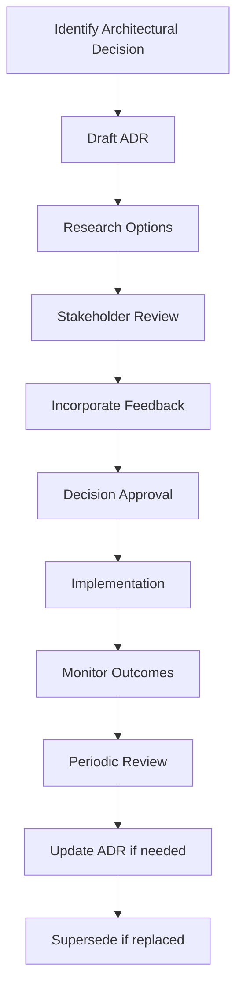
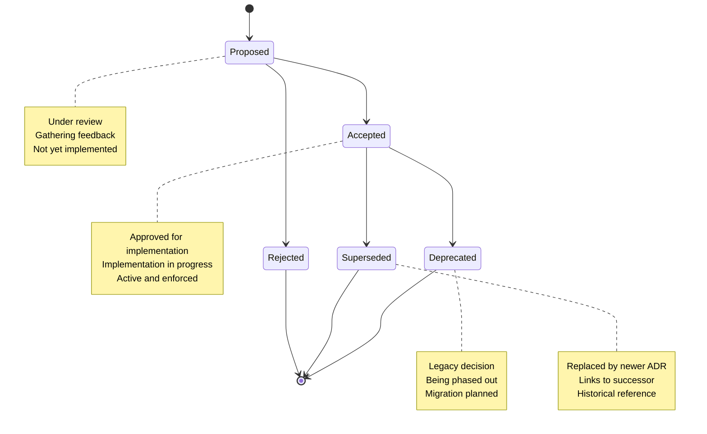

# Architecture Decisions (ADRs)

This page provides access to all **Architecture Decision Records (ADRs)** for the WebGrip platform, documenting significant architectural choices, their rationale, and evolution over time.

## What are ADRs?

**Architecture Decision Records (ADRs)** document important architectural decisions made during the development and evolution of the platform. They capture:

- **Context**: The situation that led to the decision
- **Decision**: What was decided and why
- **Consequences**: The positive and negative impacts of the decision
- **Status**: Whether the decision is proposed, accepted, rejected, or superseded

## ADR Repository

**Location**: [`docs/adrs/`](../../../../docs/adrs/)
**Format**: [MADR (Markdown Architecture Decision Records)](https://adr.github.io/madr/)
**Template**: [`docs/adrs/0000-template.md`](../../../../docs/adrs/0000-template.md)

### ADR Template Structure

Our ADRs follow the **MADR v3+** format with WebGrip-specific enhancements:

```markdown
# ADR NN – Concise Title

* **Status**: Proposed │ Accepted │ Rejected │ Deprecated │ Superseded by ADR‑NN
* **Deciders**: Names of people who give formal approval
* **Date**: YYYY‑MM‑DD
* **Tags**: Domain::Subdomain, Security, Performance, etc.
* **Version**: 1.0.0

## Context and Problem Statement
[Background, constraints, and core problem]

## Decision Drivers
[Why this matters - performance targets, compliance requirements, etc.]

## Considered Options
1. Option A – summary
2. Option B – summary  
3. Option C – summary

## Decision Outcome
### Chosen Option
[Selected option]

### Rationale
[Why this option was superior]

### Positive Consequences
* [Benefits]

### Negative Consequences / Trade‑offs
* [Costs and limitations]

### Risks & Mitigations
* [Identified risks and mitigation strategies]

## Validation
* **Immediate proof** – links to tests, PoCs, benchmarks
* **Ongoing guardrails** – monitoring, alerts, KPIs

## Compliance, Security & Privacy Impact
[Data classification, threat model updates, regulatory compliance]

## Notes
* **Related Decisions**: ADR‑NN, ADR‑MM
* **Supersedes / Amends**: ADR‑KK if any
* **Follow‑ups / TODOs**: JIRA‑123, etc.

### Revision Log
| Version | Date | Author | Change |
|---------|------|--------|--------|
| 1.0.0   | YYYY‑MM‑DD | Name | Initial creation |
```

## Current ADRs

### ADR Index

> **📝 Note**: As of the current repository state, only the ADR template exists. This section will be populated as architectural decisions are documented.

| ADR | Title | Status | Date | Tags |
|-----|-------|--------|------|------|
| [0000](../../../../docs/adrs/0000-template.md) | ADR Template | Template | - | Documentation |
| *Future ADRs will be listed here as they are created* | | | | |

### ADR Categories

As the platform evolves, ADRs should be categorized by domain:

#### Infrastructure Decisions
- **Kubernetes Platform Choices**: Why DOKS over other providers
- **Container Runtime**: OCI runtime selection and configuration
- **Network Architecture**: CNI selection and network policies
- **Storage Solutions**: Persistent volume and backup strategies

#### Security Decisions  
- **Secret Management**: SOPS + Age vs. other secret solutions
- **Access Control**: RBAC configuration and authorization patterns
- **Certificate Management**: cert-manager vs. manual certificate handling
- **Network Security**: Network policies and security boundaries

#### Observability Decisions
- **Monitoring Stack**: Prometheus + Grafana selection rationale
- **Logging Strategy**: Log aggregation and retention policies
- **Alerting Policies**: Alert fatigue prevention and escalation
- **Metrics Collection**: Which metrics to collect and store

#### Development Experience Decisions
- **CI/CD Platform**: GitHub Actions vs. other CI/CD solutions
- **Application Templates**: Standardized application bootstrapping
- **Documentation Platform**: Backstage TechDocs selection
- **Development Workflows**: Git workflows and review processes

#### Technology Choices
- **Ingress Controller**: Traefik vs. NGINX vs. other options
- **Service Mesh**: Whether to adopt a service mesh and which one
- **Database Platform**: Database technology choices and patterns
- **Message Queuing**: Event streaming and message queue solutions

## Creating ADRs

### When to Create an ADR

Create an ADR when making decisions that:

- **Affect Multiple Teams**: Cross-cutting concerns that impact multiple components
- **Have Long-term Impact**: Decisions that are difficult or expensive to reverse
- **Involve Trade-offs**: Choices between competing technical approaches
- **Establish Patterns**: Decisions that set precedents for future development
- **Impact Security/Compliance**: Changes affecting security posture or compliance
- **Require Stakeholder Buy-in**: Decisions needing broader organizational approval

### ADR Creation Process



### Step-by-Step ADR Creation

1. **Copy Template**:
   ```bash
   # Copy the template to create a new ADR
   cp docs/adrs/0000-template.md docs/adrs/NNNN-descriptive-title.md
   ```

2. **Number Assignment**:
   - Use sequential numbering (0001, 0002, etc.)
   - Check existing ADRs to determine next number
   - Reserve numbers for in-progress ADRs

3. **Fill Out Sections**:
   - **Context**: Describe the problem and constraints
   - **Options**: Research and document 3-5 viable alternatives
   - **Decision**: Clearly state what was decided
   - **Rationale**: Explain why this option was chosen
   - **Consequences**: Document both positive and negative impacts

4. **Stakeholder Review**:
   - Share with relevant technical leads
   - Include security and compliance review if applicable
   - Incorporate feedback and update draft

5. **Approval Process**:
   - Technical approval from domain experts
   - Management approval for significant decisions
   - Security sign-off for security-impacting decisions

6. **Implementation Tracking**:
   - Link to implementation tasks or tickets
   - Define success metrics and monitoring
   - Schedule follow-up reviews

### ADR Review Guidelines

**Review Criteria**:
- [ ] Problem statement is clear and specific
- [ ] Multiple options were considered
- [ ] Decision rationale is well-documented
- [ ] Consequences (both positive and negative) are identified
- [ ] Validation approach is defined
- [ ] Security and compliance impact assessed
- [ ] Implementation plan is clear

**Review Participants**:
- **Technical Lead**: Domain expertise and technical feasibility
- **Security Engineer**: Security implications and compliance
- **Platform Engineer**: Infrastructure and operational impact
- **Product Owner**: Business alignment and priority

## ADR Lifecycle Management

### ADR Status Transitions



### Maintenance Procedures

**Quarterly ADR Review**:
- Review all "Accepted" ADRs for continued relevance
- Update status to "Deprecated" for outdated decisions
- Create new ADRs for evolved approaches
- Update implementation links and validation results

**ADR Updates**:
- Minor updates: Update version number and revision log
- Major changes: Consider creating a new ADR that supersedes the original
- Status changes: Update status and add superseding ADR references

### ADR Archive Management

**File Organization**:
```
docs/adrs/
├── 0000-template.md              # Template for new ADRs
├── 0001-kubernetes-platform.md   # Platform choice
├── 0002-secret-management.md     # Secret management approach
├── 0003-monitoring-stack.md      # Observability decisions
├── 0004-ingress-controller.md    # Ingress solution choice
└── superseded/                   # Archived superseded ADRs
    └── 0002-old-secret-mgmt.md
```

**Archival Process**:
- Move superseded ADRs to `superseded/` directory
- Update references in superseding ADRs
- Maintain redirect or reference in main ADR list

## Integration with Development Process

### ADR Requirements in Development

**For Infrastructure Changes**:
- New platform component adoptions require ADR
- Major configuration changes need ADR review
- Security model changes must have ADR approval

**For Application Patterns**:
- New application architecture patterns
- Development toolchain changes
- CI/CD workflow modifications

### ADR Review in Pull Requests

**Pull Request Template** should include:
```markdown
## Architecture Decision Record
- [ ] This change requires an ADR (significant architectural decision)
- [ ] ADR has been created and approved: [Link to ADR]
- [ ] This change implements an existing ADR: [Link to ADR]
- [ ] No ADR required (minor change with no architectural impact)
```

### ADR Impact Assessment

**Before Implementation**:
- Review existing ADRs for conflicts or dependencies
- Assess whether new ADR supersedes existing decisions
- Identify stakeholders who need to be informed

**During Implementation**:
- Reference ADR in code comments for context
- Include ADR links in configuration documentation
- Update ADR with implementation lessons learned

**After Implementation**:
- Validate ADR predictions against actual outcomes
- Update ADR with real-world results and metrics
- Schedule periodic review based on validation plan

## Tooling and Automation

### ADR Generation Tools

**ADR CLI Tools** (Optional enhancements):
```bash
# Install ADR tools (if team decides to adopt)
npm install -g adr-log adr-viewer

# Generate ADR index
adr-log -d docs/adrs/ > adr-index.md

# Create interactive ADR browser
adr-viewer -d docs/adrs/ -o adr-browser/
```

### Integration with Documentation

**TechDocs Integration**: This page automatically links to ADRs in the repository:
- **Direct Links**: Links point to ADR files in the repository
- **Status Tracking**: ADR status is maintained in the individual files
- **Search Integration**: ADRs are searchable through TechDocs search

**Backstage Integration**: ADRs can be linked from component entities:
```yaml
# In component definitions
annotations:
  backstage.io/adr-location: docs/adrs
```

## Contributing to ADRs

### ADR Contribution Guidelines

**Who Can Create ADRs**:
- Technical leads and architects
- Senior engineers making significant architectural decisions
- Product managers for cross-cutting business decisions
- Security engineers for security-related architectural choices

**ADR Quality Standards**:
- Clear problem statement with business context
- At least 3 alternative options considered
- Explicit trade-offs and consequences documented
- Validation approach with measurable outcomes
- Regular review and update schedule defined

### ADR Communication

**Notification Process**:
- New ADRs shared in team channels and all-hands meetings
- Status changes communicated to affected teams
- Quarterly ADR summary in engineering updates

**Training and Onboarding**:
- New team members review key ADRs during onboarding
- ADR writing workshops for technical leads
- Regular "ADR retrospectives" to review decision outcomes

## Related Resources

### Architecture Documentation

<div class="grid cards" markdown>

-   🏗️ **[Infrastructure Overview](../cluster-architecture/infrastructure-overview.md)**
    
    Review the technical architecture that ADRs help shape

-   🔧 **[Platform Components](../platform-components/ingress-load-balancing.md)**
    
    Understand the components governed by architectural decisions

-   📋 **[Operational Standards](operational-standards.md)**
    
    See how ADRs integrate with operational procedures

-   🛡️ **[Security Policies](security-policies.md)**
    
    Review security-related architectural decisions and policies

</div>

### External References

- **[MADR Template](https://adr.github.io/madr/)**: Markdown Architecture Decision Records format
- **[ADR GitHub Organization](https://github.com/adr)**: Tools and resources for ADRs
- **[Architecture Decision Records](https://cognitect.com/blog/2011/11/15/documenting-architecture-decisions)**: Original ADR concept by Michael Nygard

---

> **📋 ADR Maintenance**: ADRs are living documents that should evolve with the platform. Schedule regular reviews and updates to ensure they remain accurate and valuable.