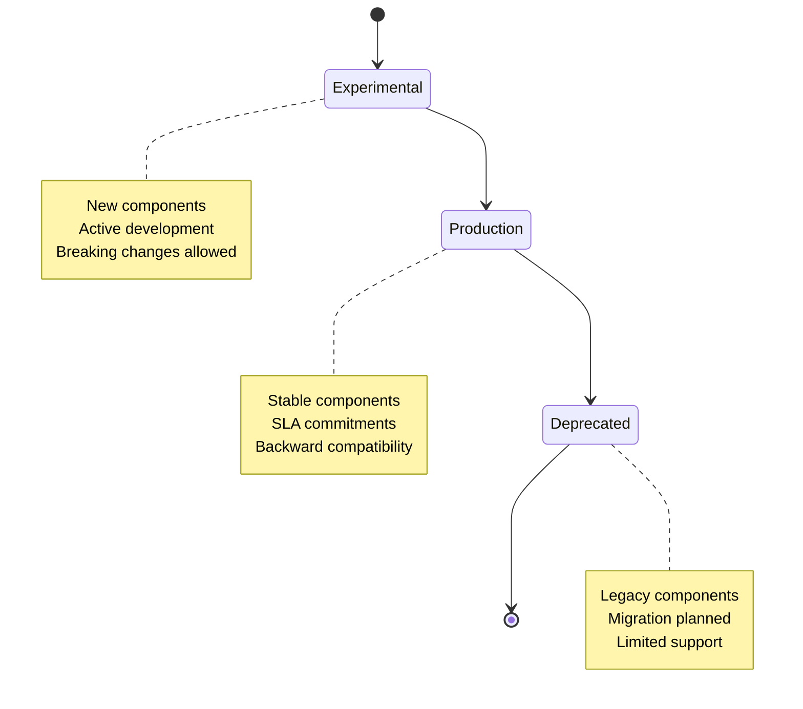
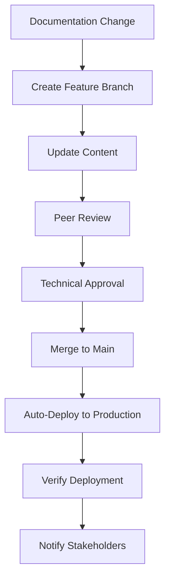
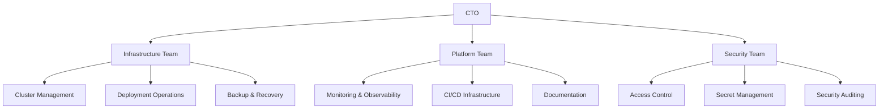

# Operational Standards

This page documents the operational standards, maintenance procedures, and governance processes for the WebGrip platform and its documentation.

## Documentation Maintenance

### TechDocs Maintenance

**Responsibility**: Infrastructure Team
**Review Schedule**: Quarterly or after major platform changes
**Update Triggers**: Infrastructure changes, new component deployments, architectural decisions

#### Maintenance Process

**1. Content Review**:
```bash
# Review all documentation links
find docs/techdocs/docs -name "*.md" -exec grep -l "https\|http\|\./" {} \;

# Check for broken internal links
# Use markdown link checker or manual verification

# Validate external references
# Ensure all repository links point to existing files
```

**2. Information Architecture Updates**:
- Review IA for new platform components
- Add new sections for major architectural changes
- Update navigation in `mkdocs.yml` for new content
- Ensure cross-references remain accurate

**3. Content Accuracy Validation**:
- Verify configuration examples against actual repository files
- Update version numbers and tool versions
- Validate command examples and procedures
- Test deployment procedures in staging environment

**4. Repository Alignment**:
- Ensure documentation structure mirrors repository organization
- Update file paths when repository structure changes
- Maintain assumption blocks for inferred behavior
- Add new ADRs for significant architectural decisions

#### TechDocs Publishing Process

**Automated Publishing**: [`.github/workflows/on_docs_change.yml`](../../../../.github/workflows/on_docs_change.yml)

```yaml
# Automatic publishing workflow
name: '[Workflow] On Documentation Change'
on:
  push:
    branches: ['main']
    paths: ['docs/techdocs/**']
  workflow_dispatch:

jobs:
  generate-documentation:
    name: 'Generate'
    uses: webgrip/workflows/.github/workflows/techdocs-generate.yml@main
    with:
      source-dir: 'docs/techdocs'

  deploy-documentation:
    name: 'Deploy'
    uses: webgrip/workflows/.github/workflows/techdocs-deploy-gh-pages.yml@main
    needs: generate-documentation
```

**Manual Publishing** (if needed):
```bash
# Local TechDocs generation and testing
cd docs/techdocs
mkdocs serve

# Build for production
mkdocs build

# Verify build output
ls -la site/
```

#### Content Update Guidelines

**Adding New Platform Components**:
1. **Create Component Page**: Add page in `platform-components/` directory
2. **Update Navigation**: Add entry to `mkdocs.yml` navigation
3. **Cross-Reference**: Link from related pages (architecture, runbooks)
4. **Backstage Integration**: Update component catalog entries
5. **Review Process**: Technical review before publishing

**Updating Existing Content**:
1. **Identify Impact**: Assess which pages need updates
2. **Maintain Links**: Ensure all links remain valid
3. **Update Assumptions**: Review and update assumption blocks
4. **Version Tracking**: Note significant changes in commit messages

### Backstage Maintenance

**Entity Definition Updates**:
- **Quarterly Review**: Verify all entity definitions are accurate
- **Ownership Updates**: Update component ownership when teams change
- **Lifecycle Management**: Promote experimental → production, mark deprecated
- **Relationship Mapping**: Ensure component dependencies are current

**Catalog Hygiene**:
```bash
# Validate catalog entities
cd catalog/
find . -name "*.yaml" -exec yamllint {} \;

# Check for orphaned entities
# Verify all referenced entities exist

# Update entity metadata
# Ensure annotations and links are current
```

## Platform Maintenance

### Infrastructure Maintenance

**Regular Maintenance Tasks**:
| Task | Frequency | Responsibility | Documentation |
|------|-----------|----------------|---------------|
| **Cluster Updates** | Monthly | Infrastructure Team | [Infrastructure Overview](../cluster-architecture/infrastructure-overview.md) |
| **Certificate Monitoring** | Weekly | Platform Team | [Certificate Management](../platform-components/certificate-management.md) |
| **Secret Rotation** | Quarterly | Security Team | [Security Model](../cluster-architecture/security-model.md) |
| **Backup Verification** | Monthly | Infrastructure Team | [Backup Procedures](../operations-runbooks/backup-recovery.md) |
| **Monitoring Review** | Bi-weekly | Platform Team | [Monitoring & Observability](../platform-components/monitoring-observability.md) |

### Component Lifecycle Management

**Component Status Tracking**:


**Lifecycle Management Process**:
1. **Component Assessment**: Regular review of component status and health
2. **Promotion Criteria**: Define criteria for experimental → production
3. **Deprecation Planning**: Plan migration path for deprecated components
4. **Documentation Updates**: Update component status in documentation and catalog

### Security Maintenance

**Security Review Schedule**:
- **Monthly**: Vulnerability scanning and patching
- **Quarterly**: Access review and privilege audit
- **Annually**: Security policy review and updates
- **As Needed**: Incident response and security updates

**Security Maintenance Tasks**:
```bash
# Regular security tasks
kubectl get pods -A --field-selector=status.phase!=Running
kubectl get certificates -A --field-selector=spec.issuerRef.name=expired

# Audit RBAC permissions
kubectl auth can-i --list --as=user@example.com

# Review network policies
kubectl get networkpolicies -A
```

## Change Management

### Documentation Change Process

**Change Types**:
| Change Type | Approval Required | Review Process |
|-------------|------------------|----------------|
| **Content Updates** | Technical Review | Peer review + platform team |
| **Structure Changes** | Architecture Review | Technical lead + stakeholder review |
| **Navigation Changes** | UX Review | User experience validation |
| **Tool Updates** | Platform Review | Infrastructure team approval |

**Change Workflow**:


### Platform Change Management

**Change Categories**:
- **Emergency Changes**: Critical security or availability fixes
- **Standard Changes**: Regular updates and improvements
- **Major Changes**: Architectural changes requiring ADR

**Change Approval Matrix**:
| Change Impact | Approver | Documentation Required |
|---------------|----------|----------------------|
| **Low Impact** | Platform Engineer | Update existing docs |
| **Medium Impact** | Technical Lead | ADR + documentation update |
| **High Impact** | Architecture Review Board | ADR + stakeholder review |
| **Emergency** | On-call Engineer | Post-change documentation |

## Quality Assurance

### Documentation Quality Standards

**Content Quality Checklist**:
- [ ] Clear purpose statement for each page
- [ ] Target audience identified
- [ ] Step-by-step procedures where applicable
- [ ] Links to source files and configurations
- [ ] Assumption blocks for inferred behavior
- [ ] Cross-references to related content
- [ ] Diagrams for complex relationships
- [ ] Examples and code snippets
- [ ] Troubleshooting guidance
- [ ] Next steps and related resources

**Technical Accuracy Validation**:
- [ ] All links resolve correctly
- [ ] Command examples tested and verified
- [ ] Configuration snippets accurate
- [ ] Version numbers current
- [ ] Repository paths correct
- [ ] Assumptions validated where possible

### Platform Quality Standards

**Infrastructure Quality Gates**:
- [ ] All components have health checks
- [ ] Resource limits defined
- [ ] Security contexts applied
- [ ] Monitoring configured
- [ ] Backup procedures tested
- [ ] Disaster recovery validated
- [ ] Documentation current
- [ ] ADRs documented for major decisions

## Team Structure and Responsibilities

### Team Organization



### Responsibility Matrix

| Area | Primary Owner | Secondary | Responsibilities |
|------|---------------|-----------|------------------|
| **Cluster Infrastructure** | Infrastructure Team | Platform Team | K8s cluster, nodes, networking |
| **Platform Components** | Platform Team | Infrastructure Team | Ingress, monitoring, CI/CD |
| **Security** | Security Team | All Teams | Access control, secrets, policies |
| **Documentation** | Platform Team | All Teams | TechDocs, runbooks, ADRs |
| **Backup & Recovery** | Infrastructure Team | Platform Team | Data protection, disaster recovery |
| **Monitoring** | Platform Team | Infrastructure Team | Observability, alerting, dashboards |

### On-Call Responsibilities

**On-Call Rotation**:
- **Primary**: Platform Engineer (24/7 coverage)
- **Secondary**: Infrastructure Team Lead
- **Escalation**: Engineering Manager → CTO

**On-Call Duties**:
- Respond to critical platform alerts
- Perform emergency maintenance
- Coordinate incident response
- Document incidents and resolutions
- Update runbooks based on incidents

## Compliance and Governance

### Governance Framework

**Decision Making**:
- **Technical Decisions**: Technical leads with peer review
- **Architectural Decisions**: Architecture Review Board
- **Security Decisions**: Security team with compliance review
- **Business Decisions**: Engineering management with stakeholder input

**Architecture Review Board**:
- **Members**: Senior engineers, technical leads, security representative
- **Meeting Schedule**: Bi-weekly or as needed for major decisions
- **Scope**: Platform architecture, technology choices, major changes
- **Output**: ADRs documenting decisions and rationale

### Compliance Requirements

**Documentation Compliance**:
- [ ] All architectural decisions documented in ADRs
- [ ] Security procedures documented and reviewed
- [ ] Access controls documented and audited
- [ ] Change management processes followed
- [ ] Incident response procedures current

**Platform Compliance**:
- [ ] Security scanning integrated in CI/CD
- [ ] Access controls regularly audited
- [ ] Data protection measures implemented
- [ ] Backup and recovery procedures tested
- [ ] Vulnerability management process active

## Metrics and Monitoring

### Documentation Metrics

**Usage Metrics**:
- Page views and engagement analytics
- Search queries and results
- User feedback and satisfaction scores
- Link click-through rates

**Quality Metrics**:
- Documentation freshness (last updated)
- Link health (broken link detection)
- Content completeness scores
- User journey completion rates

### Platform Metrics

**Operational Metrics**:
- Platform uptime and availability
- Deployment frequency and success rate
- Mean time to recovery (MTTR)
- Change failure rate

**Usage Metrics**:
- Active users and applications
- Resource utilization trends
- Cost per application
- Developer productivity metrics

## Continuous Improvement

### Improvement Process

**Quarterly Reviews**:
1. **Metrics Analysis**: Review platform and documentation metrics
2. **User Feedback**: Collect and analyze user feedback
3. **Gap Analysis**: Identify documentation and platform gaps
4. **Improvement Planning**: Plan improvements for next quarter
5. **Process Updates**: Update procedures based on lessons learned

**Feedback Channels**:
- **Documentation**: GitHub issues and pull requests
- **Platform**: Slack channels and team meetings
- **Formal**: Quarterly surveys and reviews
- **Incident-Driven**: Post-incident reviews and improvements

### Innovation and Experimentation

**Technology Evaluation**:
- Regular assessment of new tools and technologies
- Proof-of-concept development for promising solutions
- Community engagement and open source contributions
- Knowledge sharing through documentation and presentations

**Continuous Learning**:
- Team training and certification programs
- Conference attendance and knowledge sharing
- Internal lunch-and-learns and tech talks
- Documentation of lessons learned and best practices

## Next Steps

### Immediate Actions

**For New Team Members**:
1. **Review Documentation**: Read through platform documentation
2. **Access Setup**: Ensure appropriate access and permissions
3. **Tool Installation**: Install required development tools
4. **First Deployment**: Complete onboarding guide exercises
5. **Team Integration**: Join relevant Slack channels and meetings

**For Platform Updates**:
1. **Documentation Review**: Assess impact on documentation
2. **ADR Creation**: Document significant architectural decisions
3. **Stakeholder Communication**: Notify affected teams
4. **Monitoring Setup**: Ensure appropriate monitoring and alerting
5. **Rollback Planning**: Prepare rollback procedures

### Long-term Planning

**Platform Evolution**:
- Roadmap for major platform enhancements
- Technology refresh and modernization plans
- Capacity planning and scaling strategies
- Security enhancement initiatives

**Documentation Evolution**:
- Information architecture improvements
- User experience enhancements
- Automation and tooling improvements
- Community contribution processes

---

> **📋 Operational Excellence**: These standards ensure the platform remains reliable, secure, and well-documented. Regular review and updates keep our operations aligned with best practices and organizational needs.