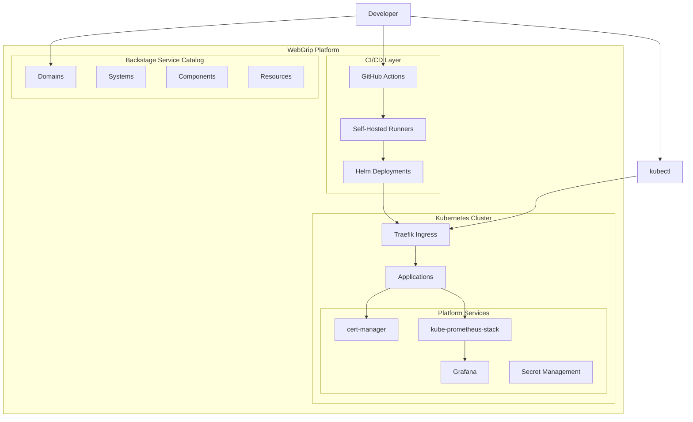

# WebGrip Organisation Public Platform

Welcome to the complete documentation for the **WebGrip Organisation Public Platform** - the foundational infrastructure repository that powers our Kubernetes-based development and operations platform.

## What is This Repository?

This repository serves as the **single source of truth** for:

- **🏗️ Infrastructure Configuration**: Kubernetes cluster setup via [Helm charts](ops/helm/)
- **📋 Service Catalog**: [Backstage](https://backstage.io/) entity definitions for domains, systems, and components
- **⚙️ CI/CD Automation**: [GitHub Actions workflows](.github/workflows/) for platform operations
- **🔐 Secret Management**: [SOPS](https://github.com/mozilla/sops)-encrypted configuration via [Age](https://age-encryption.org/)
- **📊 Observability**: [Grafana dashboards](grafana-dashboards/) and monitoring configuration
- **📚 Architecture Decisions**: [ADRs](governance-standards/architecture-decisions.md) documenting platform choices

## Quick Navigation

<div class="grid cards" markdown>

-   🏗️ **[Cluster Architecture](cluster-architecture/infrastructure-overview.md)**
    
    Core infrastructure, networking, security model, and resource management

-   🔧 **[Platform Components](platform-components/ingress-load-balancing.md)**
    
    Ingress, certificates, monitoring, CI/CD infrastructure, and secrets

-   📋 **[Service Catalog](service-catalog/backstage-integration.md)**
    
    Backstage integration, domains, systems, and component registry

-   📖 **[Operations Runbooks](operations-runbooks/deployment-procedures.md)**
    
    Deployment procedures, monitoring, incident response, and maintenance

-   👨‍💻 **[Developer Workflows](developer-workflows/onboarding-guide.md)**
    
    Onboarding guide, application templates, CI/CD patterns, and local development

-   ⚖️ **[Governance & Standards](governance-standards/architecture-decisions.md)**
    
    Architecture decisions, security policies, and operational standards

</div>

## Platform Overview



## Key Technologies

| Technology | Purpose | Configuration |
|------------|---------|---------------|
| **[Kubernetes](https://kubernetes.io/)** | Container orchestration | [System definition](catalog/systems/kubernetes.yaml) |
| **[Helm](https://helm.sh/)** | Package management | [Charts directory](ops/helm/) |
| **[Traefik](https://traefik.io/)** | Ingress controller | [Traefik charts](ops/helm/030-ingress-controllers/) |
| **[cert-manager](https://cert-manager.io/)** | Certificate automation | [cert-manager chart](ops/helm/010-cert-manager/) |
| **[Prometheus](https://prometheus.io/)** | Monitoring & metrics | [Monitoring stack](ops/helm/007-cluster-monitoring/) |
| **[Grafana](https://grafana.com/)** | Observability dashboards | [Dashboard configs](grafana-dashboards/) |
| **[GitHub Actions](https://github.com/features/actions)** | CI/CD automation | [Workflow definitions](.github/workflows/) |
| **[Backstage](https://backstage.io/)** | Service catalog | [Entity definitions](catalog/) |
| **[SOPS](https://github.com/mozilla/sops)** | Secret encryption | [Secret management](platform-components/secret-management.md) |

## Repository Structure

```
organisation-public/
├── catalog/                    # Backstage entity definitions
│   ├── domains/               # Business domains
│   ├── systems/               # Technical systems  
│   ├── components/            # Service components
│   ├── groups/                # Team definitions
│   └── resources/             # Infrastructure resources
├── ops/                       # Operations configuration
│   ├── helm/                  # Kubernetes Helm charts
│   └── secrets/               # Encrypted secrets (SOPS)
├── docs/                      # Documentation
│   ├── techdocs/              # This documentation site
│   └── adrs/                  # Architecture Decision Records
├── .github/workflows/         # CI/CD automation
└── grafana-dashboards/        # Monitoring dashboards
```

## Getting Started

New to the platform? Start here:

1. **[📋 Prerequisites](developer-workflows/onboarding-guide.md#prerequisites)** - Required tools and access
2. **[🔧 Platform Setup](developer-workflows/onboarding-guide.md#platform-setup)** - Connect to the cluster
3. **[🚀 First Deployment](developer-workflows/onboarding-guide.md#first-deployment)** - Deploy your first application
4. **[📊 Monitoring](platform-components/monitoring-observability.md)** - Access dashboards and metrics

## Quick Commands

Essential commands for platform operations:

```bash
# Connect to cluster
aws eks update-kubeconfig --name staging-eks-cluster --region eu-west-1

# View platform status
kubectl get pods -A

# Access Grafana dashboards
make view-grafana

# View Traefik dashboard  
make view-traefik

# Decrypt secrets for development
make decrypt-secrets SECRETS_DIR=./ops/secrets/[component-name]
```

> **💡 Pro Tip**: All Makefile targets are documented in the [Maintenance Tasks](operations-runbooks/maintenance-tasks.md) section.

## Support & Contributing

- **🐛 Issues**: [Report bugs or request features](https://github.com/webgrip/organisation-public/issues)
- **💬 Questions**: Contact the [infrastructure team](mailto:infrastructure@webgrip.nl) 
- **📖 ADRs**: Review [Architecture Decisions](governance-standards/architecture-decisions.md) before major changes
- **🔄 Updates**: Follow the [deployment procedures](operations-runbooks/deployment-procedures.md)

## Architecture Decisions

Recent architectural decisions that shape this platform:

- View all [Architecture Decision Records (ADRs)](governance-standards/architecture-decisions.md)
- Understand our [Security Model](cluster-architecture/security-model.md)
- Review [Operational Standards](governance-standards/operational-standards.md)

---

> 📚 **Documentation Maintenance**: This documentation is automatically generated and maintained. To update, see [TechDocs maintenance guide](governance-standards/operational-standards.md#techdocs-maintenance).
