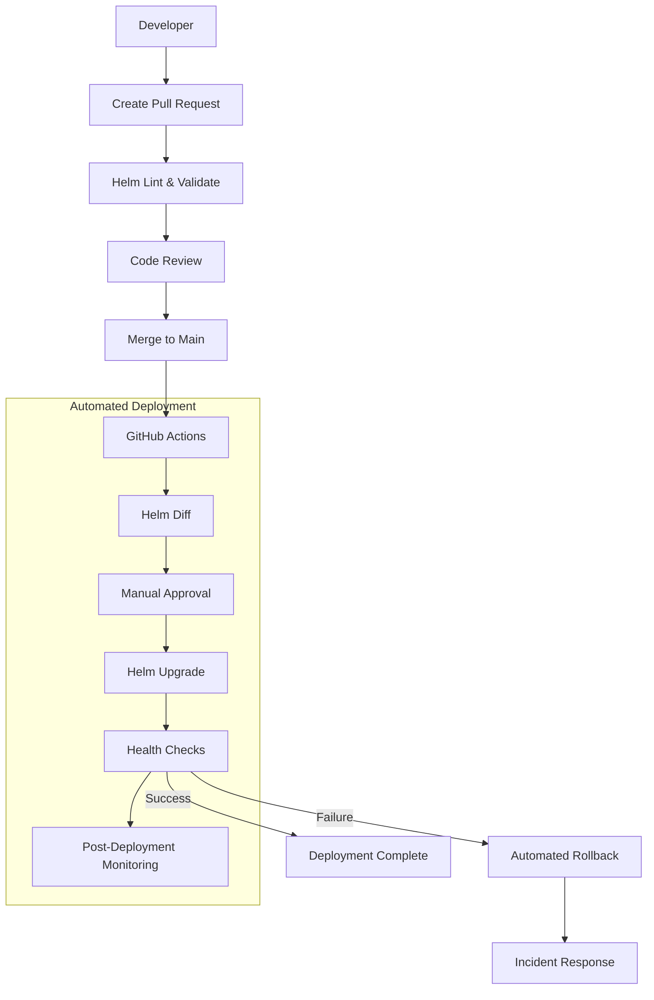
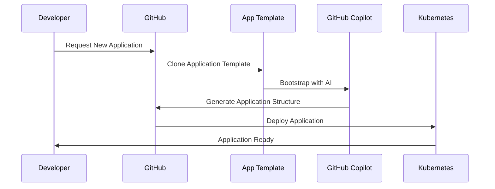
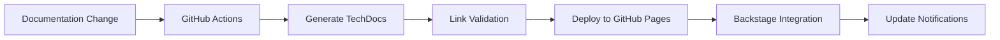
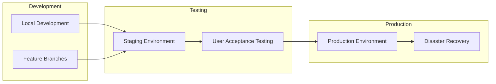

# Deployment Procedures

This page documents the **standardized deployment procedures** for the WebGrip platform, covering infrastructure updates, application deployments, and emergency procedures.

## Deployment Philosophy

Our deployment strategy follows these core principles:

- **🔄 GitOps**: All deployments flow through Git with proper review
- **🚀 Automation First**: Minimize manual intervention and human error
- **🛡️ Safety by Default**: Comprehensive validation and rollback capabilities
- **📊 Observable**: Full visibility into deployment status and health
- **⚡ Fast Recovery**: Quick rollback and incident response procedures

## Deployment Types

### Infrastructure Deployments

**Purpose**: Deploy platform components and cluster infrastructure
**Technology**: Helm + GitHub Actions
**Configuration**: [`ops/helm/`](../../../../ops/helm/)

#### Infrastructure Deployment Flow



#### Infrastructure Chart Deployment Order

Charts are numbered to ensure proper deployment order:

| Order | Chart | Purpose | Dependencies |
|-------|-------|---------|--------------|
| **005** | [`tainters`](../../../../ops/helm/005-tainters/) | Node taints and tolerations | None |
| **007** | [`cluster-monitoring`](../../../../ops/helm/007-cluster-monitoring/) | Platform monitoring stack | Node configuration |
| **010** | [`cert-manager`](../../../../ops/helm/010-cert-manager/) | Certificate automation | Cluster monitoring |
| **020** | [`cluster-issuers`](../../../../ops/helm/020-cluster-issuers/) | Certificate issuers | cert-manager |
| **030** | [`ingress-controllers`](../../../../ops/helm/030-ingress-controllers/) | Ingress and load balancing | Certificate issuers |
| **040** | [`gha-runners-controller`](../../../../ops/helm/040-gha-runners-controller/) | CI/CD infrastructure | Ingress controllers |
| **045** | [`gha-runners`](../../../../ops/helm/045-gha-runners/) | Runner instances | Controller |
| **060** | [`grafana-stack`](../../../../ops/helm/060-grafana-stack/) | Observability dashboards | Monitoring stack |
| **950** | [`example-services`](../../../../ops/helm/950-example-services/) | Demo applications | All platform services |

#### Infrastructure Deployment Commands

```bash
# Manual deployment (for authorized personnel)
# Note: Prefer GitHub Actions for production deployments

# 1. Connect to cluster
aws eks update-kubeconfig --name staging-eks-cluster --region eu-west-1

# 2. Deploy specific chart
helm upgrade --install <chart-name> ./ops/helm/<chart-directory>/ \
  --namespace <namespace> \
  --create-namespace \
  --values ./ops/helm/<chart-directory>/values.yaml

# 3. Verify deployment
kubectl get pods -n <namespace>
kubectl get services -n <namespace>

# 4. Check component health
kubectl describe deployment -n <namespace> <deployment-name>
```

### Application Deployments

**Purpose**: Deploy business applications and services
**Technology**: GitHub Actions + Application Templates
**Workflows**: [`.github/workflows/create_new_application.yml`](../../../../.github/workflows/create_new_application.yml)

#### Application Lifecycle Automation



#### Application Deployment Workflow

**Workflow**: [`create_new_application.yml`](../../../../.github/workflows/create_new_application.yml)

The automated application creation process:

1. **Template Creation**: Clone from `application-template` repository
2. **Repository Setup**: Configure repository settings and permissions
3. **Copilot Bootstrap**: AI-powered application setup and customization
4. **Secret Management**: Configure encrypted secrets for application
5. **CI/CD Setup**: Enable automated deployment pipelines
6. **Documentation**: Generate application documentation

**Required Secrets**:
- `WEBGRIP_CI_CLIENT_ID`: GitHub App ID for automation
- `WEBGRIP_CI_APP_PRIVATE_KEY`: GitHub App private key
- `OPENAI_API_KEY`: OpenAI API key for Copilot features
- `OPENAI_ORG_ID`: OpenAI Organization ID

#### Application Deployment Example

```yaml
# Application deployment template
apiVersion: apps/v1
kind: Deployment
metadata:
  name: my-application
  namespace: applications
spec:
  replicas: 2
  selector:
    matchLabels:
      app: my-application
  template:
    metadata:
      labels:
        app: my-application
    spec:
      containers:
      - name: app
        image: myregistry/my-application:latest
        ports:
        - containerPort: 8080
        env:
        - name: NODE_ENV
          value: "production"
        resources:
          requests:
            memory: "256Mi"
            cpu: "100m"
          limits:
            memory: "512Mi"
            cpu: "500m"
        livenessProbe:
          httpGet:
            path: /health
            port: 8080
          initialDelaySeconds: 30
          periodSeconds: 10
        readinessProbe:
          httpGet:
            path: /ready
            port: 8080
          initialDelaySeconds: 5
          periodSeconds: 5
```

### Documentation Deployments

**Purpose**: Publish TechDocs and documentation updates
**Technology**: MkDocs + GitHub Actions
**Workflow**: [`.github/workflows/on_docs_change.yml`](../../../../.github/workflows/on_docs_change.yml)

#### Documentation Deployment Flow



**Automatic Triggers**:
- Changes to `docs/techdocs/**`
- Manual workflow dispatch
- Scheduled documentation updates

## Secret Management Deployment

### SOPS-Encrypted Secrets

**Technology**: [SOPS](https://github.com/mozilla/sops) + [Age](https://age-encryption.org/)
**Configuration**: [`ops/secrets/`](../../../../ops/secrets/)

#### Secret Deployment Process

```bash
# 1. Decrypt secrets for deployment (authorized personnel only)
make decrypt-secrets SECRETS_DIR=./ops/secrets/<component-name>

# 2. Verify secret values (do not log or expose)
cat ./ops/secrets/<component-name>/values.dec.yaml

# 3. Deploy chart with decrypted secrets
helm upgrade --install <component> ./ops/helm/<chart>/ \
  --values ./ops/secrets/<component-name>/values.dec.yaml

# 4. Clean up decrypted files
rm ./ops/secrets/<component-name>/values.dec.yaml
```

#### Secret Categories

| Secret Category | Purpose | Components |
|----------------|---------|------------|
| **007-kube-prometheus-stack-secrets** | Monitoring credentials | Prometheus, AlertManager |
| **010-cert-manager-secrets** | Certificate authority keys | cert-manager, ACME |
| **030-ingress-controllers** | Ingress configuration | Traefik middleware |
| **045-gha-runners-secrets** | CI/CD runner credentials | GitHub Actions runners |
| **060-grafana-stack** | Dashboard credentials | Grafana, data sources |

#### Secret Rotation Procedure

```bash
# 1. Generate new secret values
# 2. Update decrypted values file
vim ./ops/secrets/<component>/values.dec.yaml

# 3. Re-encrypt with SOPS
make encrypt-secrets SECRETS_DIR=./ops/secrets/<component>

# 4. Commit encrypted changes
git add ./ops/secrets/<component>/values.sops.yaml
git commit -m "feat: rotate secrets for <component>"

# 5. Deploy updated secrets
# (Follow standard deployment process)
```

## Deployment Validation

### Pre-Deployment Checks

**Automated Validation** (GitHub Actions):
```yaml
# Example validation steps
- name: Validate Helm Charts
  run: |
    helm lint ./ops/helm/*/
    helm template ./ops/helm/*/ --validate

- name: Security Scanning
  run: |
    # Scan for secrets in code
    truffleHog --regex --entropy=False .
    
    # Scan container images
    trivy image <image-name>

- name: YAML Validation
  run: |
    yamllint ./ops/helm/*/values.yaml
    kubeval ./ops/helm/*/templates/*.yaml
```

**Manual Validation Checklist**:
- [ ] Chart version updated appropriately
- [ ] Resource limits and requests defined
- [ ] Health checks configured
- [ ] Security context applied
- [ ] Network policies reviewed
- [ ] Secret management verified
- [ ] Monitoring and logging enabled
- [ ] Documentation updated

### Post-Deployment Verification

**Automated Health Checks**:
```bash
# Check deployment status
kubectl get deployments -A
kubectl get pods -A --field-selector=status.phase!=Running

# Verify service endpoints
kubectl get endpoints -A

# Check certificate status  
kubectl get certificates -A

# Monitor resource usage
kubectl top nodes
kubectl top pods -A
```

**Health Check Endpoints**:
- **Platform Health**: `/health` endpoints on all services
- **Traefik Dashboard**: [`make view-traefik`](../../../../Makefile)
- **Grafana Dashboards**: [`make view-grafana`](../../../../Makefile)
- **Prometheus Metrics**: Check platform metrics and alerts

## Rollback Procedures

### Automatic Rollback

**Trigger Conditions**:
- Health check failures after deployment
- Critical error rate thresholds exceeded
- Resource exhaustion or crashes
- Security vulnerability detection

**Rollback Process**:
```bash
# Helm rollback (automatic via monitoring)
helm rollback <release-name> <previous-revision> --namespace <namespace>

# Verify rollback success
kubectl get deployments -n <namespace>
kubectl describe deployment -n <namespace> <deployment-name>

# Check application health
curl -f http://<service-endpoint>/health
```

### Manual Rollback

**Emergency Rollback Procedure**:
```bash
# 1. Identify current and previous revisions
helm history <release-name> --namespace <namespace>

# 2. Rollback to previous working version
helm rollback <release-name> <working-revision> --namespace <namespace>

# 3. Verify rollback
kubectl get pods -n <namespace> -l app=<app-name>

# 4. Update monitoring and alerts
# Notify team of rollback via incident response

# 5. Investigate root cause
kubectl logs -n <namespace> deployment/<deployment-name> --previous
```

### Rollback Testing

**Rollback Validation**:
- Test rollback procedures in staging environment
- Verify data consistency after rollback
- Validate external integrations still function
- Confirm monitoring and alerting operational

## Deployment Environments

### Environment Strategy



### Environment Configuration

| Environment | Purpose | Access | Auto-Deploy |
|-------------|---------|---------|-------------|
| **Development** | Local testing and development | Developers | Manual |
| **Staging** | Integration testing and validation | Internal teams | Auto from `main` |
| **Production** | Live user traffic | Restricted | Manual approval |

### Environment Variables

```yaml
# Environment-specific configuration
environments:
  staging:
    replicas: 1
    resources:
      requests:
        memory: "128Mi"
        cpu: "50m"
    ingress:
      host: "staging.example.com"
      
  production:
    replicas: 3
    resources:
      requests:
        memory: "256Mi"
        cpu: "100m"
    ingress:
      host: "api.example.com"
```

## Monitoring and Observability

### Deployment Monitoring

**Deployment Metrics**:
- **Deployment Frequency**: Tracked via GitHub Actions
- **Lead Time**: Time from commit to production
- **Change Failure Rate**: Failed deployments requiring rollback
- **Mean Time to Recovery**: Time to resolve deployment issues

**Monitoring Dashboards**:
- **[Deployment Overview](../platform-components/monitoring-observability.md#deployment-monitoring)**: Deployment status and history
- **[Resource Utilization](../platform-components/monitoring-observability.md#resource-monitoring)**: CPU, memory, and storage usage
- **[Application Health](../platform-components/monitoring-observability.md#application-monitoring)**: Service health and performance

### Alerting

**Critical Deployment Alerts**:
- Failed deployment or rollback
- Resource exhaustion after deployment
- Service unavailability
- Certificate expiration
- Security vulnerability detection

**Alert Channels**:
- Slack notifications for deployment status
- Email alerts for critical failures
- PagerDuty integration for production incidents

## Emergency Procedures

### Critical Issue Response

**Severity Levels**:
- **P0 (Critical)**: Production outage affecting all users
- **P1 (High)**: Major functionality degraded
- **P2 (Medium)**: Minor issues with workarounds
- **P3 (Low)**: Cosmetic or documentation issues

**Emergency Response Steps**:
1. **Immediate Assessment**: Determine scope and impact
2. **Emergency Rollback**: Rollback if deployment-related
3. **Incident Communication**: Notify stakeholders and teams
4. **Root Cause Analysis**: Investigate and document findings
5. **Prevention Measures**: Implement safeguards to prevent recurrence

### Emergency Contacts

**Escalation Path**:
1. Platform Engineer (on-call)
2. Infrastructure Team Lead
3. Engineering Manager
4. CTO (for critical business impact)

**Communication Channels**:
- **Slack**: `#incidents` channel for real-time coordination
- **Email**: Incident distribution list
- **Phone**: For critical outages requiring immediate response

## Best Practices

### Deployment Safety

**Pre-Deployment**:
- [ ] Test deployments in staging environment
- [ ] Verify resource requirements and limits
- [ ] Review security configurations
- [ ] Update documentation and runbooks
- [ ] Notify stakeholders of planned changes

**During Deployment**:
- [ ] Monitor deployment progress actively
- [ ] Watch application and infrastructure metrics
- [ ] Be prepared to rollback quickly
- [ ] Communicate status to relevant teams

**Post-Deployment**:
- [ ] Verify all services are healthy
- [ ] Monitor error rates and performance metrics
- [ ] Update deployment documentation
- [ ] Conduct brief retrospective for major changes

### Performance Optimization

**Deployment Performance**:
- Use parallel Helm deployments where possible
- Optimize container image sizes
- Implement proper resource requests and limits
- Use rolling updates with appropriate surge settings

**Monitoring Performance**:
- Track deployment duration and success rates
- Monitor resource utilization trends
- Identify and address deployment bottlenecks

## Next Steps

Explore related operational topics:

<div class="grid cards" markdown>

-   📊 **[Monitoring & Alerting](monitoring-alerting.md)**
    
    Learn about platform monitoring, metrics, and alerting procedures

-   🚨 **[Incident Response](incident-response.md)**
    
    Understand incident response procedures and escalation paths

-   🔧 **[Maintenance Tasks](maintenance-tasks.md)**
    
    Review routine maintenance procedures and schedules

-   🔐 **[Secret Management](../platform-components/secret-management.md)**
    
    Deep dive into SOPS-based secret management and rotation

</div>

---

> **🚀 Deployment Safety**: Always test deployment procedures in staging before applying to production. When in doubt, favor manual verification over automated deployment.