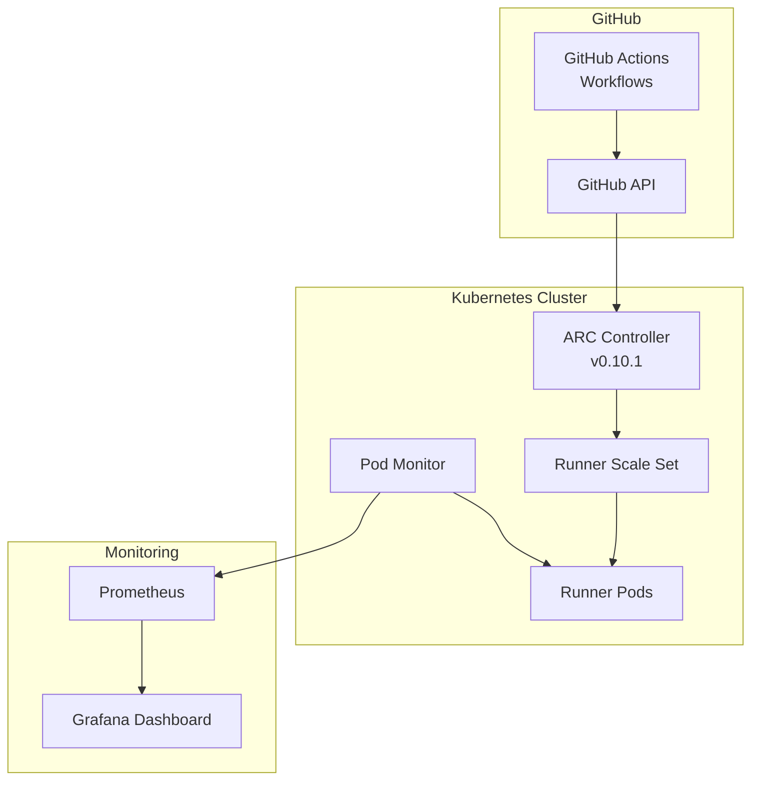
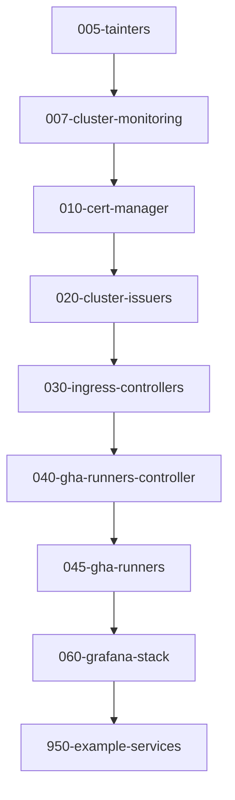

# CI/CD Workflows

This page documents the automated workflows that power the WebGrip platform's continuous integration and deployment processes.

## GitHub Actions Workflows

All CI/CD automation is handled through GitHub Actions workflows located in [`.github/workflows/`](../../.github/workflows/).

### Documentation Workflows

#### `on_docs_change.yml` - TechDocs Deployment

**Trigger Conditions**:
- Push to `main` branch with changes in `docs/techdocs/**`
- Changes to the workflow file itself
- Manual dispatch with configurable source directory

**Workflow Steps**:
1. **Generate Documentation**: Uses `webgrip/workflows/.github/workflows/techdocs-generate.yml@main`
2. **Deploy Documentation**: Uses `webgrip/workflows/.github/workflows/techdocs-deploy-gh-pages.yml@main`

**Configuration**:
```yaml
with:
  source-dir: ${{ github.event.inputs.source-dir || 'docs/techdocs' }}
```

> **Source**: [on_docs_change.yml](../../.github/workflows/on_docs_change.yml) - Complete workflow definition.

**Manual Trigger**:
```bash
# Trigger via GitHub CLI
gh workflow run "on_docs_change.yml" \
  --field source-dir="docs/techdocs"
```

#### `on_source_change.yml` - Source Code Validation

**Purpose**: Validates source code changes and infrastructure configurations.

> **Assumption**: This workflow handles linting, testing, and validation of infrastructure code.
> **Validation**: Review workflow contents for specific steps and validations.

### Application & Action Creation Workflows

#### `create_new_application.yml` & `create_new_application_workflow.yml`

**Purpose**: Automated scaffolding for new applications and their associated CI/CD workflows.

**Features**:
- Application template generation
- CI/CD pipeline setup
- Backstage catalog entity creation
- Helm chart scaffolding

#### `create_new_action.yml` & `create_new_action_workflow.yml`

**Purpose**: Automated creation of reusable GitHub Actions and their workflows.

**Features**:
- Action template generation
- Workflow template creation
- Documentation scaffolding
- Testing framework setup

> **Source**: [.github/workflows/](../../.github/workflows/) directory for all workflow definitions.

## Self-Hosted Runners (ARC)

### GitHub Actions Runner Controller

The platform uses **Actions Runner Controller (ARC)** for self-hosted GitHub Actions runners in Kubernetes.

**Key Components**:
- **Controller**: [gha-runner-scale-set-controller](../../ops/helm/040-gha-runners-controller/) (v0.10.1)
- **Scale Sets**: [gha-runners](../../ops/helm/045-gha-runners/) for dynamic scaling
- **Monitoring**: [PodMonitor](../../ops/helm/040-gha-runners-controller/gha-runner-scale-set-controller-podmonitor/) for metrics collection

### Architecture



### Scaling Behavior

**Auto-scaling Features**:
- **Demand-based scaling**: Runners scale up when workflows are queued
- **Cost optimization**: Runners scale down during idle periods
- **Resource isolation**: Each runner pod provides clean environment
- **Multi-architecture support**: ARM and x86 runner nodes

**Performance Monitoring**:
- [ARC Autoscaling Dashboard](../../grafana-dashboards/arc-autoscaling-runner-scale-set-monitoring.json)
- [ARC Performance Dashboard](../../grafana-dashboards/arc-performance.json)

## Deployment Pipelines

### Infrastructure Deployment

**Helm-based Deployment Process**:

1. **Chart Packaging**:
   ```bash
   helm package ops/helm/<component-name>
   ```

2. **Template Validation**:
   ```bash
   helm template <release-name> <chart-path> --namespace <namespace>
   ```

3. **Deployment**:
   ```bash
   helm upgrade <release-name> <chart-path> \
     --namespace <namespace> \
     --create-namespace
   ```

**Example - Traefik Deployment**:
```bash
# Download CRDs
wget https://raw.githubusercontent.com/traefik/traefik/v3.1/docs/content/reference/dynamic-configuration/kubernetes-crd-definition-v1.yml

# Deploy Traefik
helm package ops/helm/traefik-chart
helm upgrade traefik ops/helm/traefik-chart/traefik-chart-1.0.0.tgz \
  --namespace traefik --create-namespace
```

> **Source**: [README.md](../../README.md#L20-L25) - Traefik deployment example.

### Deployment Sequence

Platform components must be deployed in order due to dependencies:



> **Rationale**: Dependencies flow from infrastructure → security → networking → CI/CD → monitoring → applications.

## Secrets Management in CI/CD

### Age/SOPS Integration

**Encryption Process**:
```bash
# Encrypt secrets before commit
make encrypt-secrets SECRETS_DIR=./ops/helm/010-cert-manager
```

**Decryption in CI/CD**:
```bash
# Decrypt in pipeline (requires SOPS_AGE_KEY environment variable)
make decrypt-secrets SECRETS_DIR=./ops/helm/010-cert-manager
```

**Workflow Integration**:
```yaml
env:
  SOPS_AGE_KEY: ${{ secrets.SOPS_AGE_KEY }}
steps:
  - name: Decrypt secrets
    run: make decrypt-secrets SECRETS_DIR=./ops/helm/010-cert-manager
```

> **Security Note**: Private age keys are stored as GitHub secrets, never in the repository.

### Secret Lifecycle

1. **Creation**: Secrets created in `values.dec.yaml` files
2. **Encryption**: Encrypted using `make encrypt-secrets` 
3. **Storage**: Encrypted `values.sops.yaml` committed to Git
4. **Deployment**: Decrypted in CI/CD pipeline with age private key
5. **Application**: Applied to Kubernetes via Helm values

## Workflow Patterns

### Reusable Workflows

The platform leverages reusable workflows from the `webgrip/workflows` repository:

- **TechDocs Generation**: `techdocs-generate.yml`
- **TechDocs Deployment**: `techdocs-deploy-gh-pages.yml`
- **Application Scaffolding**: Custom application creation workflows
- **Action Creation**: Automated GitHub Action generation

### Workflow Triggers

**Automatic Triggers**:
- **Push to main**: Documentation and source changes
- **Pull Requests**: Validation and testing
- **Schedule**: Maintenance and cleanup tasks

**Manual Triggers**:
- **workflow_dispatch**: Manual deployment control
- **repository_dispatch**: External system integration
- **API calls**: Programmatic workflow triggering

## Quality Gates

### Pre-deployment Validation

**Infrastructure Validation**:
- Helm chart linting and validation
- Kubernetes manifest validation
- Security scanning of container images
- Secret encryption verification

**Documentation Validation**:
- MkDocs build validation
- Link checking and validation
- Markdown linting
- TechDocs compatibility testing

### Post-deployment Verification

**Health Checks**:
- Application readiness probes
- Service endpoint validation
- Dashboard accessibility
- Metrics collection verification

**Monitoring Integration**:
- Prometheus metrics validation
- Grafana dashboard functionality
- Alert rule testing
- Log aggregation verification

## Troubleshooting CI/CD Issues

### Common Workflow Failures

**Secret Decryption Failures**:
```bash
# Verify age key format
echo $SOPS_AGE_KEY | wc -c  # Should be 74 characters

# Test decryption locally
SOPS_AGE_KEY="$(cat ./age.agekey)" \
  sops --decrypt ops/helm/010-cert-manager/values.sops.yaml
```

**Helm Deployment Failures**:
```bash
# Debug template generation
helm template traefik ops/helm/traefik-chart --debug

# Check current deployments
helm list --all-namespaces

# View deployment status
helm status <release-name> -n <namespace>
```

**Runner Scale Set Issues**:
```bash
# Check controller logs
kubectl logs -n arc-system deployment/gha-runner-scale-set-controller

# View runner status
kubectl get runners -A

# Check scale set configuration
kubectl describe runnerscaleset -A
```

### Performance Optimization

**Runner Performance**:
- Monitor runner startup times
- Optimize container images for faster pulls
- Use node affinity for consistent performance
- Implement runner warm-up strategies

**Workflow Optimization**:
- Use workflow caching for dependencies
- Parallelize independent jobs
- Optimize artifact usage and storage
- Implement efficient secret management

## Next Steps

- **Deployment Procedures**: [Deployment Guide](deployment_guide.md)
- **Secrets Management**: [Secrets Management](secrets_management.md)
- **Tools Reference**: [Tools & Commands](tools_commands.md)
- **Platform Monitoring**: [Monitoring & Observability](../platform/monitoring_observability.md)