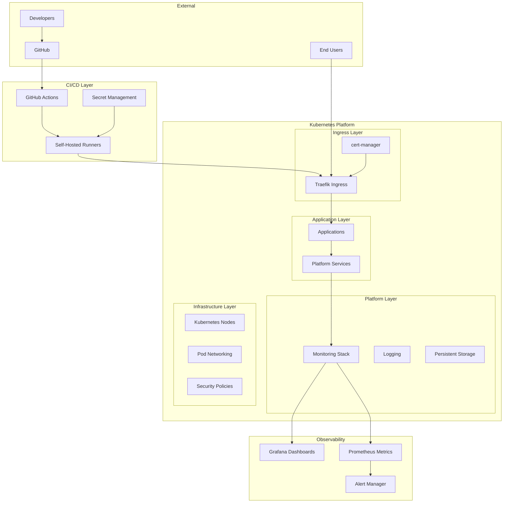

# Platform Overview

The **WebGrip Organisation Public Platform** is a comprehensive Kubernetes-based infrastructure platform that provides the foundation for application development, deployment, and operations across the WebGrip organization.

## Platform Purpose

This platform serves as the **organizational backbone** for:

- **Development Teams**: Providing self-service application deployment and management
- **Infrastructure Teams**: Centralizing platform operations and maintenance  
- **Security Teams**: Enforcing security policies and compliance requirements
- **Operations Teams**: Monitoring, alerting, and incident response capabilities

## Platform Architecture

### High-Level Architecture

### Platform Layers

| Layer | Components | Purpose |
|-------|------------|---------|
| **Ingress** | [Traefik](../platform-components/ingress-load-balancing.md), [cert-manager](../platform-components/certificate-management.md) | External traffic routing, TLS termination |
| **Application** | User applications, [Platform services](../service-catalog/component-registry.md) | Business logic and platform capabilities |
| **Platform** | [Monitoring](../platform-components/monitoring-observability.md), Logging, Storage | Cross-cutting platform services |
| **Infrastructure** | Kubernetes nodes, Networking, [Security](../cluster-architecture/security-model.md) | Foundation compute and network |

## Core Capabilities

### Infrastructure as Code

> **Repository Location**: [`ops/helm/`](../../ops/helm/)

All infrastructure is defined as code using Helm charts, providing:

- **Reproducible Deployments**: Consistent environments across development, staging, and production
- **Version Control**: All infrastructure changes tracked in Git
- **Rollback Capability**: Easy rollback to previous working configurations
- **Documentation**: Self-documenting infrastructure through code

**Key Infrastructure Components**:
- **Cluster Monitoring**: [`ops/helm/007-cluster-monitoring/`](../../ops/helm/007-cluster-monitoring/)
- **Certificate Management**: [`ops/helm/010-cert-manager/`](../../ops/helm/010-cert-manager/)
- **Ingress Controllers**: [`ops/helm/030-ingress-controllers/`](../../ops/helm/030-ingress-controllers/)
- **CI/CD Infrastructure**: [`ops/helm/040-gha-runners-controller/`](../../ops/helm/040-gha-runners-controller/)

### Service Discovery & Catalog

> **Repository Location**: [`catalog/`](../../catalog/)

Backstage-powered service catalog providing:

- **[Domain Organization](../service-catalog/domains-systems.md)**: Business domain boundaries and ownership
- **[System Mapping](../service-catalog/domains-systems.md)**: Technical system relationships and dependencies  
- **[Component Registry](../service-catalog/component-registry.md)**: Service inventory with metadata and documentation
- **[API Documentation](../service-catalog/api-contracts.md)**: Centralized API discovery and specifications

### CI/CD Automation

> **Repository Location**: [`.github/workflows/`](../../.github/workflows/)

GitHub Actions-based automation providing:

- **[Application Lifecycle](../developer-workflows/application-templates.md)**: Automated repo creation and bootstrapping
- **[Deployment Automation](../operations-runbooks/deployment-procedures.md)**: Standardized deployment procedures
- **[Documentation Publishing](../governance-standards/operational-standards.md#techdocs-maintenance)**: Automatic TechDocs updates
- **[Security Scanning](../governance-standards/security-policies.md)**: Integrated security and compliance checks

### Secret Management

> **Repository Location**: [`ops/secrets/`](../../ops/secrets/)

SOPS and Age-based secret management providing:

- **Encrypted at Rest**: All secrets encrypted in repository
- **Fine-grained Access**: Role-based access to secret categories  
- **Audit Trail**: All secret changes tracked in Git history
- **Rotation Support**: Structured approach to secret rotation

### Observability

> **Repository Location**: [`grafana-dashboards/`](../../grafana-dashboards/)

Comprehensive monitoring and observability:

- **[Metrics Collection](../platform-components/monitoring-observability.md)**: Prometheus-based metrics
- **[Dashboard Visualization](../platform-components/monitoring-observability.md#grafana-dashboards)**: Pre-built Grafana dashboards  
- **[Alerting](../operations-runbooks/monitoring-alerting.md)**: Proactive monitoring and incident response
- **[Log Aggregation](../platform-components/monitoring-observability.md#logging)**: Centralized application and platform logs

## Platform Benefits

### For Developers

- **🚀 Fast Time-to-Market**: Standardized templates and deployment pipelines
- **📊 Built-in Observability**: Monitoring and alerting included by default
- **🔐 Security by Default**: Security policies and secret management built-in
- **📚 Self-Service Documentation**: Complete platform documentation and runbooks

### For Operations

- **⚙️ Standardized Operations**: Consistent deployment and management procedures
- **🔍 Full Visibility**: Comprehensive monitoring across all platform components
- **🛡️ Security Compliance**: Built-in security scanning and policy enforcement
- **📈 Scalability**: Auto-scaling and resource management capabilities

### For Organization

- **💰 Cost Efficiency**: Shared infrastructure and standardized tooling
- **⚡ Developer Productivity**: Reduced operational overhead for development teams
- **🎯 Consistency**: Standardized approaches across all projects and teams
- **📋 Governance**: Clear ownership, documentation, and decision tracking

## Getting Started

Ready to start using the platform? Choose your path:

-   👨‍💻 **I'm a Developer**
    
    Start with the [Onboarding Guide](../developer-workflows/onboarding-guide.md) to set up your local environment and deploy your first application.

-   ⚙️ **I'm a Platform Engineer**
    
    Review the [Cluster Architecture](../cluster-architecture/infrastructure-overview.md) and [Platform Components](../platform-components/ingress-load-balancing.md) to understand the technical implementation.

-   📋 **I'm a Product Manager**
    
    Explore the [Service Catalog](../service-catalog/backstage-integration.md) to understand the organizational structure and service ownership.

-   🛡️ **I'm a Security Engineer**
    
    Review the [Security Model](../cluster-architecture/security-model.md) and [Security Policies](../governance-standards/security-policies.md) to understand the platform's security posture.

## Platform Metrics

Key platform health indicators:

| Metric | Current Status | Target |
|--------|---------------|--------|
| **Platform Uptime** | 99.9% | >99.5% |
| **Application Deployment Time** | <5 minutes | <10 minutes |
| **Mean Time to Recovery (MTTR)** | <15 minutes | <30 minutes |
| **Developer Onboarding Time** | <2 hours | <4 hours |
| **Security Scan Coverage** | 100% | 100% |

> **📊 Live Metrics**: View real-time platform metrics in [Grafana dashboards](../platform-components/monitoring-observability.md#grafana-dashboards)

## Next Steps

1. **[📋 Prerequisites](../developer-workflows/onboarding-guide.md#prerequisites)** - Ensure you have required tools and access
2. **[🏗️ Cluster Architecture](../cluster-architecture/infrastructure-overview.md)** - Understand the underlying infrastructure
3. **[🔧 Platform Components](../platform-components/ingress-load-balancing.md)** - Learn about core platform services
4. **[📖 Operations Runbooks](../operations-runbooks/deployment-procedures.md)** - Master platform operations procedures

---

> 💡 **Platform Evolution**: This platform follows our [Architecture Decision Records (ADRs)](../governance-standards/architecture-decisions.md). Proposed changes should include an ADR for significant architectural decisions.