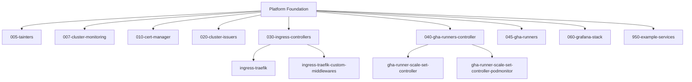

# Getting Started

This guide helps you get up and running with the WebGrip Organisation Public platform infrastructure.

## Prerequisites

Before working with this repository, ensure you have the following tools installed:

### Required Tools

```bash
# Package managers
brew install age sops kubectx derailed/k9s/k9s  # macOS
# or use your platform's package manager

# Core tools
- AWS CLI
- kubectl  
- Helm
- Terraform
```

> **Links to source**: See [Makefile](../../Makefile#L7) for complete installation commands.

### Account Access

You'll need access to:

- **GitHub**: Repository access and Actions workflows
- **AWS**: EKS cluster and resource management  
- **DigitalOcean**: DOKS cluster access (staging environment)

## Quick Setup

### 1. Clone the Repository

```bash
git clone https://github.com/webgrip/organisation-public.git
cd organisation-public
```

### 2. Configure AWS Access

```bash
aws configure
aws eks update-kubeconfig --name staging-eks-cluster --region eu-west-1
```

> **Source**: [README.md](../../README.md#L17-L18) - AWS configuration commands.

### 3. Install Platform Tools

```bash
make install-tools
```

This installs: `age`, `sops`, `kubectx`, and `k9s` for cluster management.

> **Source**: [Makefile](../../Makefile#L6-L7) - Tool installation target.

### 4. Verify Cluster Access

```bash
kubectl get nodes
kubectl get namespaces
```

## Common Workflows

### Deploying Traefik Ingress

```bash
# Download Traefik CRDs
wget https://raw.githubusercontent.com/traefik/traefik/v3.1/docs/content/reference/dynamic-configuration/kubernetes-crd-definition-v1.yml

# Package and deploy Helm chart
helm package ops/helm/traefik-chart
helm template traefik ops/helm/traefik-chart --namespace traefik
helm upgrade traefik ops/helm/traefik-chart/traefik-chart-1.0.0.tgz --namespace traefik --create-namespace
```

> **Source**: [README.md](../../README.md#L20-L25) - Traefik deployment commands.

### Managing Secrets

```bash
# Encrypt secrets (example with cert-manager directory)
make encrypt-secrets SECRETS_DIR=./ops/helm/010-cert-manager

# Decrypt secrets for local use
make decrypt-secrets SECRETS_DIR=./ops/helm/010-cert-manager
```

> **Source**: [Makefile](../../Makefile#L10-L23) - Secrets management targets.

### Accessing Dashboards

```bash
# Grafana (cluster monitoring)
make view-cluster-grafana  # http://localhost:3000

# Grafana (application monitoring)  
make view-grafana         # http://localhost:3001

# Traefik dashboard
make view-traefik         # http://localhost:9000

# Akeyless gateway
make view-akeyless-gateway # http://localhost:8000
```

> **Source**: [Makefile](../../Makefile#L26-L42) - Dashboard access targets.

## Understanding the Platform

### Platform Components

The platform consists of several key components deployed via Helm:



> **Source**: [ops/helm/](../../ops/helm/) directory structure.

### Catalog Structure

The platform uses Backstage for service discovery:

- **Domains**: [Operations](../catalog/domains.md#operations-domain), [Telemetry](../catalog/domains.md#telemetry-domain)
- **Systems**: [Kubernetes](../catalog/systems.md#kubernetes-system)
- **Components**: [ingress-nginx](../catalog/components.md#ingress-nginx), [cert-manager](../catalog/components.md#cert-manager), [echo](../catalog/components.md#echo), [quote](../catalog/components.md#quote)
- **Resources**: [staging-doks-cluster](../catalog/resources.md#staging-cluster)

## Next Steps

1. **Explore Platform Architecture**: [Infrastructure Overview](../platform/infrastructure_overview.md)
2. **Review Operations Guide**: [Deployment Guide](../operations/deployment_guide.md)  
3. **Understand Catalog Structure**: [Domains Overview](../catalog/domains.md)
4. **Set Up Local Development**: [Local Setup](../development/local_setup.md)

## Common Issues & Solutions

### kubectl Connection Issues

If you can't connect to the cluster:

```bash
# Verify AWS credentials
aws sts get-caller-identity

# Update kubeconfig
aws eks update-kubeconfig --name staging-eks-cluster --region eu-west-1

# Test connection
kubectl cluster-info
```

### Helm Deployment Failures

For Helm chart issues:

```bash
# Check current releases
helm list --all-namespaces

# Debug a specific release
helm status <release-name> -n <namespace>

# View template output before deploy
helm template <release-name> <chart-path> --namespace <namespace>
```

> **Troubleshooting**: See [Troubleshooting Guide](../reference/troubleshooting.md) for more solutions.

## Additional Resources

- [Tools & Commands](../operations/tools_commands.md) - Comprehensive command reference
- [Contributing Guidelines](../development/contributing.md) - How to contribute changes
- [Maintenance Guide](../reference/maintenance.md) - Keeping the platform updated