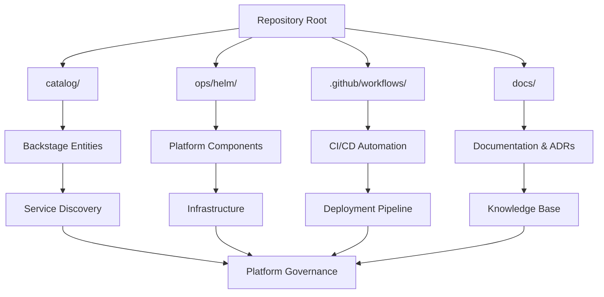

# Repository Structure

This page provides a detailed breakdown of the repository's file organization and the purpose of each directory.

## Top-Level Structure

```
organisation-public/
├── .editorconfig         # Editor configuration standards
├── .github/              # GitHub workflows and automation
├── .gitignore           # Git ignore patterns
├── .vscode/             # VS Code workspace settings
├── LICENSE              # Repository license
├── Makefile             # Operational commands and shortcuts
├── README.md            # Repository introduction
├── age.pubkey           # Public key for age encryption
├── catalog/             # Backstage catalog entities
├── catalog-info.yaml    # Main Backstage entity definitions
├── copilot-issues/      # Copilot-generated issue templates
├── docs/                # Documentation and TechDocs
├── grafana-dashboards/  # Grafana dashboard definitions
└── ops/                 # Operational tooling and charts
```

## Detailed Directory Breakdown

### `.github/` - Automation & Workflows

Contains GitHub-specific automation, templates, and CI/CD workflows.

```
.github/
├── chatmodes/           # GitHub Copilot chat configurations  
├── instructions/        # Development and coding instructions
├── issue-templates/     # GitHub issue templates
├── organication-mcp.json # Organization MCP configuration
├── prompts/             # Reusable prompt templates
└── workflows/           # GitHub Actions CI/CD workflows
    ├── create_new_action.yml
    ├── create_new_action_workflow.yml  
    ├── create_new_application.yml
    ├── create_new_application_workflow.yml
    ├── on_docs_change.yml    # TechDocs deployment workflow
    └── on_source_change.yml  # Source code change workflow
```

> **Key Files**: 
> - [on_docs_change.yml](../../.github/workflows/on_docs_change.yml) - Automatically deploys TechDocs on documentation changes
> - [on_source_change.yml](../../.github/workflows/on_source_change.yml) - Handles source code changes and validations

### `catalog/` - Service Catalog Entities

Backstage catalog entities that define the organizational structure.

```
catalog/
├── components/          # Individual service components
│   ├── cert-manager.yaml
│   ├── echo.yaml
│   ├── ingress-nginx.yaml
│   ├── metrics-server.yaml
│   └── quote.yaml
├── domains/             # Business domain definitions  
│   ├── operations-domain.yaml
│   └── telemetry-domain.yaml
├── groups/              # Team and group definitions
├── resources/           # Infrastructure resources
│   └── staging-doks-cluster.yaml
└── systems/             # System architecture components
    ├── github-actions-runner-controller.yaml
    └── kubernetes.yaml
```

> **Purpose**: These YAML files define entities in the Backstage service catalog, creating a complete picture of domains, systems, components, and resources.

> **Source Links**: 
> - [Operations Domain](../../catalog/domains/operations-domain.yaml) - Core operations domain definition
> - [Kubernetes System](../../catalog/systems/kubernetes.yaml) - Primary container orchestration system

### `docs/` - Documentation

All documentation including ADRs and this TechDocs site.

```
docs/
├── adrs/                # Architectural Decision Records
│   └── 0000-template.md # ADR template following MADR format
└── techdocs/            # This documentation site
    ├── mkdocs.yml       # MkDocs configuration
    ├── docs/            # Documentation pages
    └── overrides/       # Theme customizations
```

> **ADR Location**: [docs/adrs/](../../docs/adrs/) contains architectural decisions using the [MADR template](../../docs/adrs/0000-template.md).

### `ops/` - Operations & Infrastructure

Operational tooling, Helm charts, and encrypted configurations.

```
ops/
├── helm/                # Helm chart deployments
│   ├── 005-tainters/             # Node tainting configurations
│   ├── 007-cluster-monitoring/   # Monitoring stack
│   ├── 010-cert-manager/         # Certificate management
│   ├── 020-cluster-issuers/      # Certificate issuers
│   ├── 030-ingress-controllers/  # Traefik ingress setup
│   ├── 040-gha-runners-controller/ # GitHub Actions runners
│   ├── 045-gha-runners/          # Runner scale sets
│   ├── 060-grafana-stack/        # Grafana monitoring
│   └── 950-example-services/     # Example applications
├── helm-experimental/   # Experimental Helm charts
└── secrets/             # Encrypted configuration files
```

> **Deployment Order**: The numeric prefixes (005, 010, 020, etc.) indicate the recommended deployment sequence for platform components.

> **Key Charts**:
> - [030-ingress-controllers](../../ops/helm/030-ingress-controllers/) - Traefik v3.3.4 ingress controller
> - [040-gha-runners-controller](../../ops/helm/040-gha-runners-controller/) - GitHub Actions runner infrastructure

### `grafana-dashboards/` - Monitoring Dashboards

Pre-configured Grafana dashboards for platform monitoring.

```
grafana-dashboards/
├── arc-autoscaling-runner-scale-set-monitoring.json
└── arc-performance.json
```

> **Purpose**: These dashboards provide monitoring for GitHub Actions Runner Controller (ARC) performance and autoscaling behavior.

## Key Configuration Files

### `Makefile` - Operational Commands

Central location for common operational tasks:

```makefile
install-tools          # Install age, sops, kubectx, k9s
encrypt-secrets        # Encrypt values.yaml with age/sops  
decrypt-secrets        # Decrypt encrypted values
view-cluster-grafana   # Access cluster Grafana dashboard
view-grafana          # Access application Grafana dashboard  
view-traefik          # Access Traefik dashboard
view-akeyless-gateway # Access Akeyless gateway
```

> **Source**: [Makefile](../../Makefile) - Complete operational command reference.

### `catalog-info.yaml` - Backstage Entry Point

Defines the main Backstage entities and catalog locations:

- **Component**: `webgrip-organisation-public` (this repository)
- **Locations**: References to domains, systems, components, and resources
- **TechDocs Reference**: Points to `./docs/techdocs` for this documentation

> **Source**: [catalog-info.yaml](../../catalog-info.yaml) - Main Backstage entity definitions.

### `age.pubkey` - Encryption Public Key

Public key used for encrypting secrets with the age encryption tool.

> **Security Note**: This is a public key - private keys are stored securely outside the repository.

## File Naming Conventions

### Helm Charts
- **Prefix Numbers**: Indicate deployment order (005, 010, 020, etc.)
- **Descriptive Names**: Clear indication of component purpose
- **Hyphen Separation**: Consistent kebab-case naming

### Catalog Entities  
- **Domain Suffix**: `-domain.yaml` for business domains
- **Component Names**: Service-specific descriptive names
- **System Names**: Infrastructure system identifiers

### Documentation
- **Snake Case**: Use underscores for documentation files (`project_overview.md`)
- **Hierarchical**: Nested in logical directory structures
- **Cross-References**: Liberal use of relative links between pages

## Dependencies & Relationships



## Next Steps

- **Explore Platform Components**: [Kubernetes Components](../platform/kubernetes_components.md)
- **Understand Operations**: [Deployment Guide](../operations/deployment_guide.md)
- **Review Catalog Structure**: [Domains Overview](../catalog/domains.md)
- **Set Up Development**: [Local Setup](../development/local_setup.md)