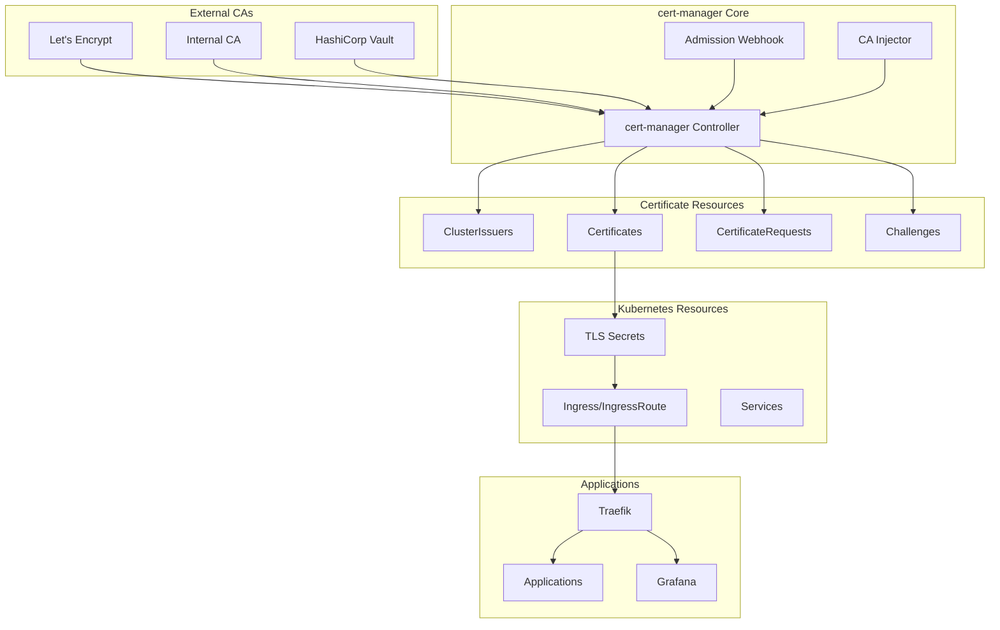
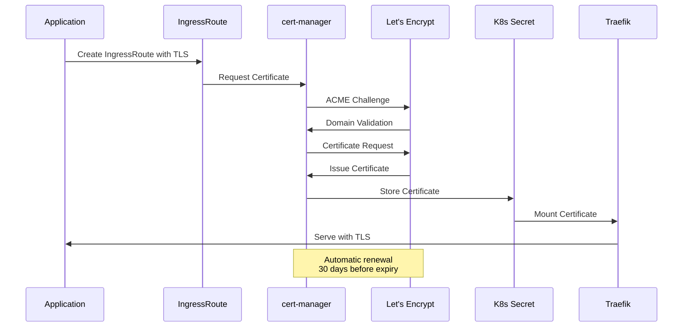
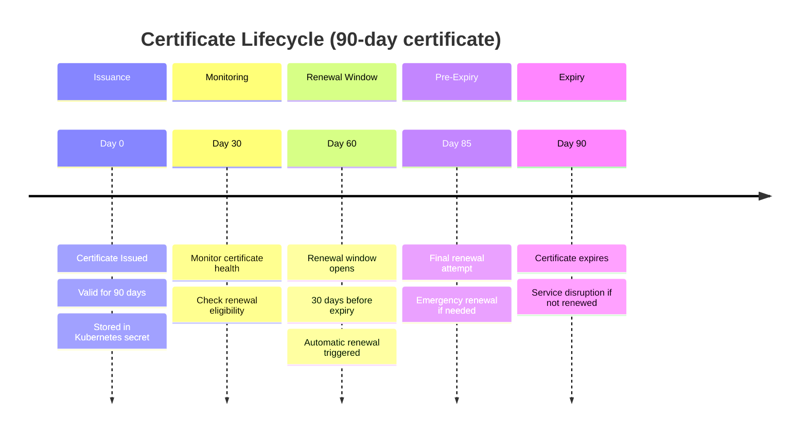

# Certificate Management

The WebGrip platform uses **[cert-manager](https://cert-manager.io/)** to provide automated TLS certificate provisioning, management, and renewal for all platform services and applications.

## cert-manager Overview

**Technology**: cert-manager v1.13+
**Configuration**: [`ops/helm/010-cert-manager/`](../../../../ops/helm/010-cert-manager/)
**Cluster Issuers**: [`ops/helm/020-cluster-issuers/`](../../../../ops/helm/020-cluster-issuers/)

cert-manager provides:

- **🔄 Automatic Provisioning**: Automatic certificate issuance for new services
- **♻️ Automatic Renewal**: Certificates renewed 30 days before expiration
- **🔒 Secure Storage**: Private keys stored securely in Kubernetes secrets
- **📊 Monitoring Integration**: Certificate status and expiry monitoring
- **🌐 Multi-Provider Support**: Support for multiple ACME providers and issuers

## Architecture

### cert-manager Components



### Certificate Lifecycle



## Configuration

### cert-manager Installation

**Helm Chart Configuration**: [`ops/helm/010-cert-manager/`](../../../../ops/helm/010-cert-manager/)

```yaml
# cert-manager values configuration
cert-manager:
  # Install CRDs
  installCRDs: true
  
  # Resource configuration
  resources:
    requests:
      cpu: 10m
      memory: 32Mi
    limits:
      cpu: 100m
      memory: 128Mi
      
  # Webhook configuration
  webhook:
    resources:
      requests:
        cpu: 5m
        memory: 16Mi
      limits:
        cpu: 50m
        memory: 64Mi
        
  # CA Injector configuration
  cainjector:
    resources:
      requests:
        cpu: 5m
        memory: 16Mi
      limits:
        cpu: 50m
        memory: 64Mi
        
  # Security context
  securityContext:
    runAsNonRoot: true
    runAsUser: 1000
    
  # Monitoring
  prometheus:
    enabled: true
    servicemonitor:
      enabled: true
      
  # Global configuration
  global:
    leaderElection:
      namespace: cert-manager
```

### Cluster Issuers

**Configuration**: [`ops/helm/020-cluster-issuers/certificate-cluster-issuer-traefik/`](../../../../ops/helm/020-cluster-issuers/certificate-cluster-issuer-traefik/)

#### Let's Encrypt Production Issuer

```yaml
apiVersion: cert-manager.io/v1
kind: ClusterIssuer
metadata:
  name: letsencrypt-prod
  namespace: cert-manager
spec:
  acme:
    # ACME server URL for Let's Encrypt production
    server: https://acme-v02.api.letsencrypt.org/directory
    
    # Email for ACME registration
    email: certificates@webgrip.nl
    
    # Private key for ACME account
    privateKeySecretRef:
      name: letsencrypt-prod-account-key
      
    # Solvers for domain validation
    solvers:
    - http01:
        ingress:
          class: traefik
          serviceType: ClusterIP
      selector:
        dnsNames:
        - "*.webgrip.example"
        - "webgrip.example"
        
    - dns01:
        cloudflare:
          apiTokenSecretRef:
            name: cloudflare-api-token
            key: api-token
      selector:
        dnsNames:
        - "*.internal.webgrip.example"
```

> **Assumption**: DNS configuration uses Cloudflare for DNS challenge validation. Actual DNS provider should be verified and configured in the cluster issuer configuration.

#### Let's Encrypt Staging Issuer

```yaml
apiVersion: cert-manager.io/v1
kind: ClusterIssuer
metadata:
  name: letsencrypt-staging
  namespace: cert-manager
spec:
  acme:
    # ACME server URL for Let's Encrypt staging
    server: https://acme-staging-v02.api.letsencrypt.org/directory
    
    # Email for ACME registration
    email: certificates@webgrip.nl
    
    # Private key for ACME account
    privateKeySecretRef:
      name: letsencrypt-staging-account-key
      
    # Solvers for domain validation
    solvers:
    - http01:
        ingress:
          class: traefik
          serviceType: ClusterIP
```

## Certificate Issuance

### Automatic Certificate Issuance

**IngressRoute with Certificate**:
```yaml
apiVersion: traefik.containo.us/v1alpha1
kind: IngressRoute
metadata:
  name: my-app
  namespace: applications
  annotations:
    cert-manager.io/cluster-issuer: letsencrypt-prod
spec:
  entryPoints:
    - websecure
  routes:
    - match: Host(`myapp.webgrip.example`)
      kind: Rule
      services:
        - name: my-app-service
          port: 80
  tls:
    secretName: my-app-tls-cert
    # cert-manager will automatically create this secret
```

**Certificate Resource**:
```yaml
apiVersion: cert-manager.io/v1
kind: Certificate
metadata:
  name: my-app-cert
  namespace: applications
spec:
  # Secret where certificate will be stored
  secretName: my-app-tls-cert
  
  # Certificate issuer
  issuerRef:
    name: letsencrypt-prod
    kind: ClusterIssuer
    group: cert-manager.io
    
  # Domain names for certificate
  dnsNames:
    - myapp.webgrip.example
    - api.myapp.webgrip.example
    
  # Certificate configuration
  duration: 2160h # 90 days
  renewBefore: 720h # 30 days
  
  # Private key configuration
  privateKey:
    algorithm: RSA
    size: 2048
    rotationPolicy: Always
    
  # Usage configuration
  usages:
    - digital signature
    - key encipherment
    - server auth
```

### Manual Certificate Issuance

For testing or specific requirements:

```bash
# Create certificate manually
kubectl apply -f - <<EOF
apiVersion: cert-manager.io/v1
kind: Certificate
metadata:
  name: test-certificate
  namespace: default
spec:
  secretName: test-tls-secret
  issuerRef:
    name: letsencrypt-staging
    kind: ClusterIssuer
  dnsNames:
    - test.webgrip.example
EOF

# Check certificate status
kubectl get certificate test-certificate -o wide

# Check certificate events
kubectl describe certificate test-certificate
```

## Challenge Types

### HTTP-01 Challenge

**How it works**: cert-manager creates a temporary HTTP endpoint that Let's Encrypt validates

**Configuration**:
```yaml
solvers:
- http01:
    ingress:
      class: traefik
      serviceType: ClusterIP
  selector:
    dnsNames:
    - "*.webgrip.example"
```

**Use Cases**:
- Public domains with HTTP access
- Simple domain validation
- No DNS API access required

### DNS-01 Challenge

**How it works**: cert-manager creates DNS TXT records for domain validation

**Configuration**:
```yaml
solvers:
- dns01:
    cloudflare:
      apiTokenSecretRef:
        name: cloudflare-api-token
        key: api-token
  selector:
    dnsNames:
    - "*.internal.webgrip.example"
    - "*.private.webgrip.example"
```

**Use Cases**:
- Wildcard certificates
- Internal domains without HTTP access
- Private networks and intranets

**Supported DNS Providers**:
- Cloudflare (current configuration)
- AWS Route 53
- Google Cloud DNS
- Azure DNS
- Many others via webhook providers

## Certificate Monitoring

### Certificate Status

**Check Certificate Status**:
```bash
# List all certificates
kubectl get certificates -A

# Check specific certificate
kubectl describe certificate my-app-cert -n applications

# View certificate details
kubectl get certificate my-app-cert -n applications -o yaml

# Check certificate events
kubectl get events -n applications --field-selector involvedObject.name=my-app-cert
```

**Certificate Status Conditions**:
| Condition | Status | Meaning |
|-----------|--------|---------|
| **Ready** | True | Certificate issued and valid |
| **Ready** | False | Certificate issuance failed or pending |
| **Issuing** | True | Certificate issuance in progress |
| **Issuing** | False | No active issuance process |

### Monitoring and Alerting

**Prometheus Metrics**:
```yaml
# cert-manager metrics
cert_manager_certificate_expiry_timestamp_seconds
cert_manager_certificate_ready_status
cert_manager_http_acme_client_request_count
cert_manager_acme_client_request_duration_seconds
```

**Grafana Dashboard Metrics**:
- **Certificate Expiry**: Time until certificate expiration
- **Certificate Status**: Number of ready/not-ready certificates
- **Issuance Rate**: Certificate issuance frequency
- **Challenge Success Rate**: ACME challenge success rate

**Alerting Rules**:
```yaml
# Certificate expiry alert
- alert: CertificateExpiringSoon
  expr: cert_manager_certificate_expiry_timestamp_seconds - time() < 7 * 24 * 3600
  for: 1h
  labels:
    severity: warning
  annotations:
    summary: "Certificate expiring soon"
    description: "Certificate {{ $labels.name }} in namespace {{ $labels.namespace }} expires in less than 7 days"

# Certificate not ready alert
- alert: CertificateNotReady
  expr: cert_manager_certificate_ready_status == 0
  for: 30m
  labels:
    severity: critical
  annotations:
    summary: "Certificate not ready"
    description: "Certificate {{ $labels.name }} in namespace {{ $labels.namespace }} is not ready"
```

## Renewal Process

### Automatic Renewal

**Renewal Timeline**:


**Renewal Process**:
1. **Trigger**: cert-manager checks certificates every hour
2. **Eligibility**: Renew if less than 30 days until expiry
3. **Challenge**: Perform ACME challenge (HTTP-01 or DNS-01)
4. **Validation**: Let's Encrypt validates domain ownership
5. **Issuance**: New certificate issued by Let's Encrypt
6. **Update**: Kubernetes secret updated with new certificate
7. **Reload**: Applications automatically pick up new certificate

### Manual Renewal

**Force Certificate Renewal**:
```bash
# Annotate certificate to force renewal
kubectl annotate certificate my-app-cert cert-manager.io/force-renewal=$(date +%s)

# Check renewal status
kubectl describe certificate my-app-cert

# View cert-manager logs
kubectl logs -n cert-manager deployment/cert-manager -f
```

## Troubleshooting

### Common Issues

#### Certificate Stuck in Pending

**Symptoms**:
- Certificate status shows "False" for Ready condition
- ACME challenge fails to complete
- cert-manager logs show validation errors

**Debugging Steps**:
```bash
# Check certificate status
kubectl describe certificate my-app-cert

# Check certificate request
kubectl get certificaterequest
kubectl describe certificaterequest <request-name>

# Check ACME challenge
kubectl get challenges
kubectl describe challenge <challenge-name>

# Check cert-manager logs
kubectl logs -n cert-manager deployment/cert-manager
```

**Common Causes**:
- DNS misconfiguration for domain
- Firewall blocking HTTP-01 challenge
- Incorrect ClusterIssuer configuration
- Rate limiting from Let's Encrypt

#### Certificate Renewal Failures

**Symptoms**:
- Certificate expires despite automatic renewal
- Renewal attempts fail consistently
- Applications show TLS errors

**Debugging Steps**:
```bash
# Check certificate events
kubectl get events --field-selector involvedObject.name=my-app-cert

# Check ClusterIssuer status
kubectl describe clusterissuer letsencrypt-prod

# Verify ACME account
kubectl get secret letsencrypt-prod-account-key -o yaml

# Test domain accessibility
curl -I http://myapp.webgrip.example/.well-known/acme-challenge/test
```

#### DNS-01 Challenge Issues

**Symptoms**:
- DNS-01 challenges timeout
- Wildcard certificate issuance fails
- DNS provider API errors

**Debugging Steps**:
```bash
# Check DNS provider credentials
kubectl get secret cloudflare-api-token -o yaml

# Verify DNS provider configuration
kubectl describe clusterissuer letsencrypt-prod

# Test DNS TXT record creation
dig TXT _acme-challenge.myapp.webgrip.example

# Check DNS provider logs
kubectl logs -n cert-manager deployment/cert-manager | grep dns
```

### Recovery Procedures

#### Emergency Certificate Recovery

```bash
# 1. Check if backup certificates exist
kubectl get secrets -A | grep tls

# 2. Temporarily disable TLS if needed
kubectl patch ingressroute my-app --type='json' \
  -p='[{"op": "remove", "path": "/spec/tls"}]'

# 3. Force certificate reissuance
kubectl delete certificate my-app-cert
kubectl apply -f my-app-certificate.yaml

# 4. Monitor reissuance
kubectl get certificate my-app-cert -w
```

#### ClusterIssuer Recovery

```bash
# 1. Backup current ClusterIssuer
kubectl get clusterissuer letsencrypt-prod -o yaml > issuer-backup.yaml

# 2. Reset ACME account if needed
kubectl delete secret letsencrypt-prod-account-key

# 3. Recreate ClusterIssuer
kubectl apply -f cluster-issuer.yaml

# 4. Verify issuer status
kubectl describe clusterissuer letsencrypt-prod
```

## Security Considerations

### Certificate Security

**Private Key Security**:
- Private keys stored in Kubernetes secrets with restricted access
- Keys encrypted at rest in etcd
- Key rotation with certificate renewal
- No private key exposure in logs or events

**Certificate Validation**:
- Domain validation required for certificate issuance
- Certificate transparency logging for public audit
- OCSP stapling for revocation checking
- Certificate pinning considerations for applications

### Access Control

**RBAC for Certificate Management**:
```yaml
apiVersion: rbac.authorization.k8s.io/v1
kind: ClusterRole
metadata:
  name: certificate-manager
rules:
  - apiGroups: ["cert-manager.io"]
    resources: ["certificates", "certificaterequests", "issuers", "clusterissuers"]
    verbs: ["get", "list", "watch", "create", "update", "patch", "delete"]
  - apiGroups: [""]
    resources: ["secrets"]
    verbs: ["get", "list", "watch", "create", "update", "patch", "delete"]
```

**Service Account Permissions**:
- cert-manager service account with minimal required permissions
- Separate service accounts for different certificate operations
- Regular audit of certificate-related permissions

## Best Practices

### Certificate Management

**Certificate Naming**:
- Use descriptive certificate names
- Include namespace and application context
- Follow consistent naming conventions

**Domain Organization**:
- Use wildcard certificates for multiple subdomains
- Separate certificates for different environments
- Consider certificate sharing across related services

**Renewal Management**:
- Monitor certificate expiry dates
- Set up alerting for renewal failures
- Test renewal process in staging environments

### Performance Optimization

**Certificate Caching**:
- Reuse certificates across multiple ingress routes
- Cache certificates at the ingress layer
- Minimize certificate requests to rate-limited CAs

**Challenge Optimization**:
- Use DNS-01 for wildcard certificates
- Use HTTP-01 for simple domain validation
- Optimize challenge response times

## Next Steps

Explore related certificate and security topics:

<div class="grid cards" markdown>

-   🔒 **[Security Model](../cluster-architecture/security-model.md)**
    
    Understand the complete security architecture and controls

-   ⚡ **[Ingress & Load Balancing](ingress-load-balancing.md)**
    
    Learn how certificates integrate with Traefik ingress

-   📊 **[Monitoring & Observability](monitoring-observability.md)**
    
    Monitor certificate health and expiry through dashboards

-   🛡️ **[Security Policies](../governance-standards/security-policies.md)**
    
    Review certificate-related security policies and procedures

</div>

---

> **🔒 Certificate Security**: Certificates are critical for application security. Monitor expiry dates closely and ensure automatic renewal is working properly to prevent service disruptions.