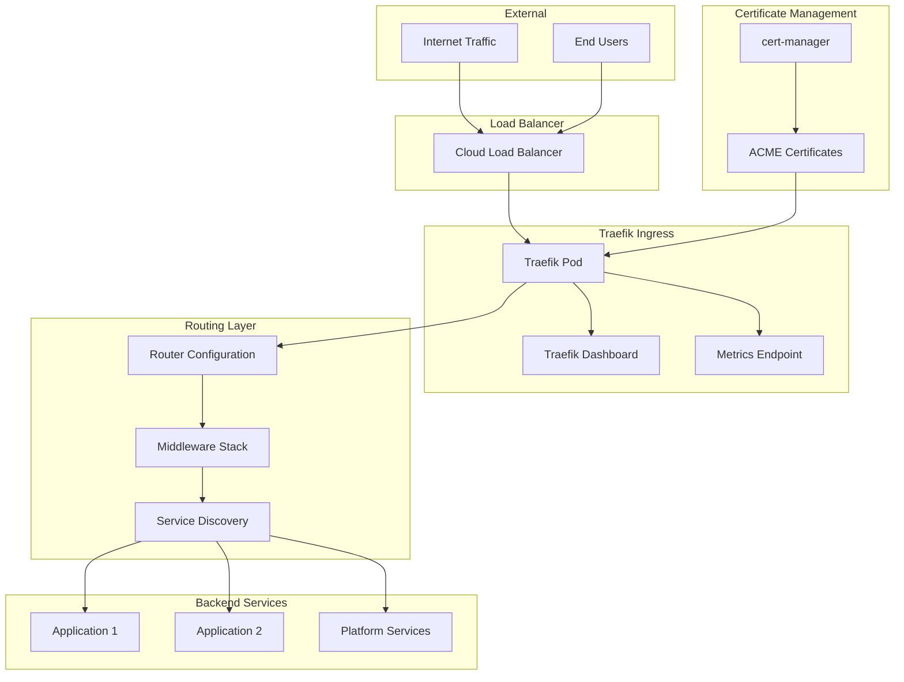
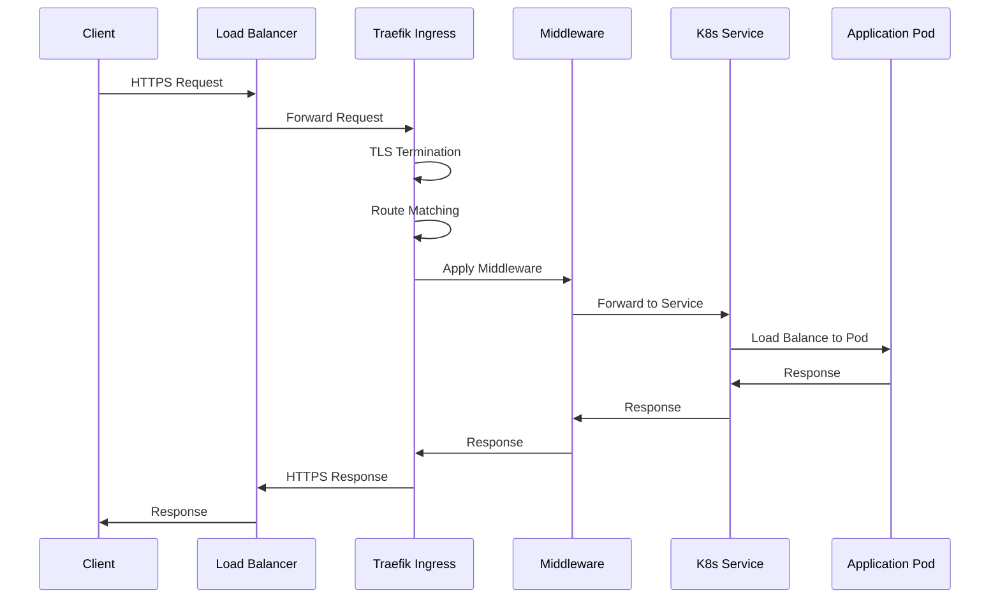

# Ingress & Load Balancing

The WebGrip platform uses **[Traefik](https://traefik.io/)** as the primary ingress controller, providing advanced traffic management, automatic service discovery, and comprehensive observability for HTTP and TCP traffic.

## Traefik Overview

**Technology**: Traefik v3.1
**Configuration**: [`ops/helm/030-ingress-controllers/ingress-traefik/`](../../../../ops/helm/030-ingress-controllers/ingress-traefik/)
**Custom Middleware**: [`ops/helm/030-ingress-controllers/ingress-traefik-custom-middlewares/`](../../../../ops/helm/030-ingress-controllers/ingress-traefik-custom-middlewares/)

Traefik serves as the **edge router** for the platform, providing:

- **🔍 Automatic Service Discovery**: Native Kubernetes integration
- **🔒 TLS Termination**: Integration with cert-manager for automatic certificates
- **⚡ High Performance**: Efficient reverse proxy with minimal overhead
- **📊 Built-in Observability**: Metrics, tracing, and access logging
- **🛡️ Security Features**: Rate limiting, authentication, and access control

## Architecture

### Traefik Components



### Traffic Flow

The request flow through Traefik follows this pattern:



## Configuration

### Helm Chart Configuration

**Chart Location**: [`ops/helm/030-ingress-controllers/ingress-traefik/`](../../../../ops/helm/030-ingress-controllers/ingress-traefik/)

**Key Configuration Areas**:

```yaml
# Example Traefik values configuration
traefik:
  # Enable dashboard and API
  api:
    dashboard: true
    insecure: false  # Secure dashboard access
  
  # Define entrypoints
  ports:
    web:
      port: 8000
      exposedPort: 80
      protocol: TCP
    websecure:
      port: 8443
      exposedPort: 443
      protocol: TCP
      tls:
        enabled: true
    
  # Resource allocation
  resources:
    requests:
      cpu: 100m
      memory: 50Mi
    limits:
      cpu: 300m
      memory: 150Mi
      
  # High availability
  deployment:
    replicas: 2
    
  # Observability
  metrics:
    prometheus:
      enabled: true
  tracing:
    enabled: true
  accessLog:
    enabled: true
```

### Service Configuration

**Kubernetes Service Types**:
- **LoadBalancer**: For external traffic routing
- **ClusterIP**: For internal dashboard access  
- **NodePort**: For debugging and direct access

```yaml
# Example service configuration
apiVersion: v1
kind: Service
metadata:
  name: traefik
  namespace: ingress-traefik
spec:
  type: LoadBalancer
  selector:
    app.kubernetes.io/name: traefik
  ports:
    - name: web
      port: 80
      targetPort: web
    - name: websecure
      port: 443
      targetPort: websecure
```

## Routing Configuration

### IngressRoute Resources

Traefik uses **IngressRoute** CRDs for advanced routing configuration:

```yaml
# Example application routing
apiVersion: traefik.containo.us/v1alpha1
kind: IngressRoute
metadata:
  name: echo-service
  namespace: example-services
spec:
  entryPoints:
    - websecure
  routes:
    - match: Host(`echo.webgrip.example`)
      kind: Rule
      services:
        - name: echo-service
          port: 80
      middlewares:
        - name: default-headers
          namespace: ingress-traefik
        - name: rate-limit
          namespace: ingress-traefik
  tls:
    secretName: echo-tls-cert
```

### Routing Rules

**Match Expressions**:
```yaml
# Host-based routing
match: Host(`api.example.com`)

# Path-based routing  
match: Host(`example.com`) && Path(`/api`)

# Header-based routing
match: Header(`Authorization`, `Bearer *`)

# Method-based routing
match: Method(`POST`) && Path(`/webhook`)

# Complex routing
match: Host(`api.example.com`) && (Path(`/v1`) || Path(`/v2`))
```

**Priority Handling**:
Routes are evaluated by priority (higher numbers first):
```yaml
routes:
  - match: Host(`api.example.com`) && Path(`/health`)
    priority: 100  # Specific route - higher priority
    services:
      - name: health-service
        port: 8080
        
  - match: Host(`api.example.com`)  
    priority: 10   # General route - lower priority
    services:
      - name: api-service
        port: 8080
```

## Middleware

### Custom Middleware

**Configuration**: [`ops/helm/030-ingress-controllers/ingress-traefik-custom-middlewares/`](../../../../ops/helm/030-ingress-controllers/ingress-traefik-custom-middlewares/)

Custom middleware provides platform-wide functionality:

#### Default Headers Middleware
```yaml
apiVersion: traefik.containo.us/v1alpha1
kind: Middleware
metadata:
  name: default-headers
  namespace: ingress-traefik
spec:
  headers:
    customRequestHeaders:
      X-Forwarded-Proto: "https"
    customResponseHeaders:
      X-Frame-Options: "SAMEORIGIN"
      X-Content-Type-Options: "nosniff"
      X-XSS-Protection: "1; mode=block"
      Referrer-Policy: "strict-origin-when-cross-origin"
    contentSecurityPolicy: "default-src 'self'"
```

#### Rate Limiting Middleware
```yaml
apiVersion: traefik.containo.us/v1alpha1
kind: Middleware
metadata:
  name: rate-limit
  namespace: ingress-traefik
spec:
  rateLimit:
    average: 100    # 100 requests per second
    burst: 200      # Allow burst up to 200
    period: 1m      # Time window
```

#### Authentication Middleware
```yaml
apiVersion: traefik.containo.us/v1alpha1
kind: Middleware
metadata:
  name: basic-auth
  namespace: ingress-traefik
spec:
  basicAuth:
    secret: auth-secret  # Contains username:password hash
    realm: "WebGrip Platform"
```

### Middleware Chaining

Middleware can be chained for complex processing:

```yaml
# Apply multiple middleware in order
middlewares:
  - name: rate-limit           # Applied first
    namespace: ingress-traefik
  - name: basic-auth          # Applied second  
    namespace: ingress-traefik
  - name: default-headers     # Applied third
    namespace: ingress-traefik
```

## TLS and Certificate Management

### Integration with cert-manager

**Certificate Automation**: Traefik integrates with [cert-manager](certificate-management.md) for automatic certificate provisioning.

```yaml
# Automatic certificate provisioning
apiVersion: traefik.containo.us/v1alpha1
kind: IngressRoute
metadata:
  name: secure-app
spec:
  entryPoints:
    - websecure
  routes:
    - match: Host(`app.example.com`)
      kind: Rule
      services:
        - name: app-service
          port: 80
  tls:
    # cert-manager will automatically create this secret
    secretName: app-tls-cert
    # Specify the certificate issuer
    certResolver: letsencrypt-prod
```

### TLS Configuration

**TLS Options**:
```yaml
apiVersion: traefik.containo.us/v1alpha1
kind: TLSOption
metadata:
  name: default
  namespace: ingress-traefik
spec:
  minVersion: "VersionTLS12"
  maxVersion: "VersionTLS13"
  cipherSuites:
    - TLS_ECDHE_RSA_WITH_AES_256_GCM_SHA384
    - TLS_ECDHE_RSA_WITH_CHACHA20_POLY1305
    - TLS_ECDHE_RSA_WITH_AES_128_GCM_SHA256
  curvePreferences:
    - secp521r1
    - secp384r1
  sniStrict: true
```

## Load Balancing

### Load Balancing Algorithms

**Available Algorithms**:
- **Round Robin** (default): Distributes requests evenly
- **Least Connections**: Routes to backend with fewest active connections
- **Weighted Round Robin**: Assigns different weights to backends
- **IP Hash**: Routes based on client IP for session persistence

```yaml
# Example weighted load balancing
services:
  - name: app-v1
    port: 80
    weight: 80    # 80% of traffic
  - name: app-v2  
    port: 80
    weight: 20    # 20% of traffic (canary)
```

### Health Checks

**Backend Health Monitoring**:
```yaml
# Health check configuration
services:
  - name: app-service
    port: 80
    healthCheck:
      path: /health
      interval: 30s
      timeout: 5s
      retries: 3
```

**Health Check Behavior**:
- **Healthy**: Backend receives traffic
- **Unhealthy**: Backend removed from load balancing rotation
- **Recovery**: Automatic re-inclusion when health checks pass

## Observability

### Metrics Collection

**Prometheus Integration**: Traefik exposes metrics for Prometheus collection

**Key Metrics Available**:
| Metric | Description | Use Case |
|--------|-------------|----------|
| `traefik_service_requests_total` | Total requests per service | Traffic volume analysis |
| `traefik_service_request_duration_seconds` | Request duration histogram | Latency monitoring |
| `traefik_service_retries_total` | Backend retry attempts | Reliability monitoring |
| `traefik_entrypoint_requests_total` | Requests per entrypoint | Entry point analysis |
| `traefik_config_reloads_total` | Configuration reload count | Configuration stability |

### Dashboard Access

**Traefik Dashboard**: [`make view-traefik`](../../../../Makefile)

The dashboard provides:
- **Real-time Traffic**: Current request flow and routing
- **Service Health**: Backend service status and health checks
- **Route Configuration**: Active routes and middleware chains
- **Metrics Overview**: Request rates, response times, and error rates

**Dashboard Features**:
```bash
# Access dashboard locally
kubectl port-forward -n ingress-traefik svc/traefik-dashboard 9000:9000

# Dashboard available at: http://localhost:9000
```

### Access Logging

**Log Format**: JSON structured logging for easy parsing

```json
{
  "time": "2024-01-15T10:30:00Z",
  "level": "info", 
  "message": "access",
  "downstream_remote_addr": "192.168.1.100",
  "request_method": "GET",
  "request_uri": "/api/users",
  "request_protocol": "HTTP/2.0",
  "request_host": "api.example.com",
  "response_status": 200,
  "response_size": 1024,
  "duration": 45,
  "upstream_addr": "10.244.1.50:8080"
}
```

## Performance Optimization

### Connection Management

**Connection Pooling**:
```yaml
# Optimize backend connections
services:
  - name: app-service
    port: 80
    passHostHeader: true
    responseForwarding:
      flushInterval: 100ms
```

### Caching

**Response Caching**: Configure caching middleware for static content

```yaml
apiVersion: traefik.containo.us/v1alpha1
kind: Middleware
metadata:
  name: cache-control
spec:
  headers:
    customResponseHeaders:
      Cache-Control: "public, max-age=3600"  # 1 hour cache
```

### Compression

**Automatic Compression**: Enable gzip compression for responses

```yaml
# Enable compression middleware
apiVersion: traefik.containo.us/v1alpha1
kind: Middleware
metadata:
  name: compression
spec:
  compress: {}  # Enable with default settings
```

## High Availability

### Deployment Strategy

**Multi-Replica Deployment**:
```yaml
deployment:
  replicas: 2  # Minimum 2 replicas for HA
  
# Pod anti-affinity for node distribution
affinity:
  podAntiAffinity:
    preferredDuringSchedulingIgnoredDuringExecution:
    - weight: 100
      podAffinityTerm:
        labelSelector:
          matchExpressions:
          - key: app.kubernetes.io/name
            operator: In
            values:
            - traefik
        topologyKey: kubernetes.io/hostname
```

### Circuit Breaker

**Automatic Failure Handling**:
```yaml
apiVersion: traefik.containo.us/v1alpha1
kind: Middleware
metadata:
  name: circuit-breaker
spec:
  circuitBreaker:
    expression: "NetworkErrorRatio() > 0.3 || ResponseCodeRatio(500, 600, 0, 600) > 0.3"
    checkPeriod: 3s
    fallbackDuration: 10s
    recoveryDuration: 10s
```

## Troubleshooting

### Common Issues

**1. Service Not Accessible**
```bash
# Check IngressRoute status
kubectl get ingressroute -A

# Verify service endpoints
kubectl get endpoints -n <namespace> <service-name>

# Check Traefik logs
kubectl logs -n ingress-traefik deployment/traefik
```

**2. Certificate Issues**
```bash
# Check certificate status
kubectl get certificates -A

# Check cert-manager logs
kubectl logs -n cert-manager deployment/cert-manager

# Verify TLS secret
kubectl get secret -n <namespace> <tls-secret-name>
```

**3. Routing Problems**
```bash
# Check route configuration
kubectl describe ingressroute -n <namespace> <route-name>

# View Traefik configuration
curl http://localhost:9000/api/http/routers

# Check middleware configuration
kubectl get middleware -A
```

### Debugging Tools

**Built-in Tools**:
- **API Explorer**: Access Traefik API for configuration inspection
- **Debug Logging**: Enable debug mode for detailed request tracing
- **Metrics Endpoint**: Prometheus metrics for performance analysis

**External Tools**:
- **curl**: Test routing and headers
- **kubectl**: Kubernetes resource inspection
- **Prometheus**: Metrics collection and alerting

## Next Steps

Explore related platform components:

<div class="grid cards" markdown>

-   🔒 **[Certificate Management](certificate-management.md)**
    
    Learn about automatic TLS certificate provisioning with cert-manager

-   📊 **[Monitoring & Observability](monitoring-observability.md)**
    
    Understand metrics collection, dashboards, and alerting

-   🌐 **[Network Architecture](../cluster-architecture/network-architecture.md)**
    
    Review the complete network architecture and traffic flow

-   🛡️ **[Security Model](../cluster-architecture/security-model.md)**
    
    Understand security controls and access management

</div>

---

> **⚡ Performance Tuning**: Traefik configuration changes can significantly impact performance. Test changes in staging and monitor metrics before applying to production.