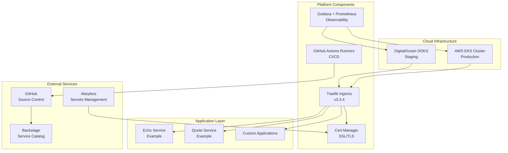
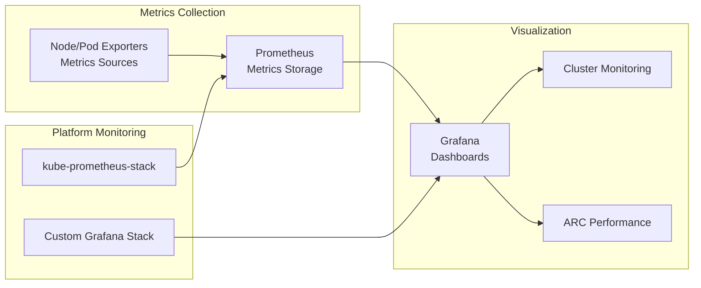
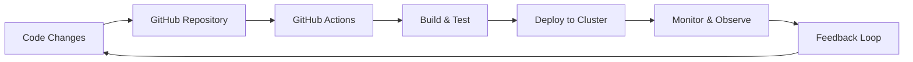

# Infrastructure Overview

This page provides a comprehensive overview of the WebGrip platform infrastructure, including cloud resources, Kubernetes clusters, and core platform services.

## Architecture Principles

The WebGrip platform is built on the following architectural principles:

- **Cloud-Native**: Kubernetes-first approach with container orchestration
- **Infrastructure as Code**: All infrastructure defined and deployed via Helm charts
- **Security by Design**: Age/SOPS encryption, certificate management, and secrets protection
- **Observability First**: Comprehensive monitoring and logging across all components
- **GitOps Workflow**: Automated deployment and configuration management through Git

## High-Level Architecture



## Cloud Infrastructure

### AWS EKS Cluster (Production)

- **Purpose**: Production Kubernetes cluster
- **Region**: `eu-west-1` (Ireland)
- **Cluster Name**: `staging-eks-cluster` 
- **Access**: AWS CLI + kubectl

> **Assumption**: Based on README configuration, this appears to be the primary cluster.
> **Validation**: Verify actual usage patterns and environment designation.

**Configuration Commands**:
```bash
aws configure
aws eks update-kubeconfig --name staging-eks-cluster --region eu-west-1
```

> **Source**: [README.md](../../README.md#L17-L18) - AWS configuration commands.

### DigitalOcean Kubernetes Service (DOKS)

- **Purpose**: Staging/development environment
- **Resource Name**: `staging-doks-cluster`
- **Management**: Defined in Backstage catalog

> **Source**: [staging-doks-cluster.yaml](../../catalog/resources/staging-doks-cluster.yaml) - Resource definition.

## Platform Layer Components

### Core Infrastructure Services

The platform deploys components in a specific order to ensure proper dependencies:

| Order | Component | Purpose | Version |
|-------|-----------|---------|---------|
| 005 | [Tainters](../../ops/helm/005-tainters/) | Node configuration and tainting | - |
| 007 | [Cluster Monitoring](../../ops/helm/007-cluster-monitoring/) | Base monitoring infrastructure | - |
| 010 | [Cert Manager](../../ops/helm/010-cert-manager/) | SSL/TLS certificate automation | - |
| 020 | [Cluster Issuers](../../ops/helm/020-cluster-issuers/) | Certificate issuer configuration | - |
| 030 | [Ingress Controllers](../../ops/helm/030-ingress-controllers/) | Traefik ingress setup | v3.3.4 |
| 040 | [GHA Runners Controller](../../ops/helm/040-gha-runners-controller/) | GitHub Actions infrastructure | v0.10.1 |
| 045 | [GHA Runners](../../ops/helm/045-gha-runners/) | Runner scale sets | - |
| 060 | [Grafana Stack](../../ops/helm/060-grafana-stack/) | Application monitoring | - |
| 950 | [Example Services](../../ops/helm/950-example-services/) | Sample applications | - |

### Ingress & Traffic Management

**Traefik Ingress Controller**
- **Version**: v3.3.4 (as of Chart version 34.4.1)
- **Chart**: [ingress-traefik-chart](../../ops/helm/030-ingress-controllers/ingress-traefik/Chart.yaml)
- **Features**: 
  - HTTP/HTTPS routing
  - Load balancing
  - Custom middleware support
  - Dashboard UI

**Custom Middleware**
- Additional Traefik middleware configurations
- Security headers and rate limiting
- Custom routing behaviors

> **Source**: [030-ingress-controllers](../../ops/helm/030-ingress-controllers/) directory.

### Certificate Management

**Cert Manager**
- Automated SSL/TLS certificate provisioning
- Let's Encrypt integration
- Certificate lifecycle management

**Cluster Issuers**
- Production and staging certificate issuers
- ACME protocol configuration
- DNS validation support

> **Components**: [cert-manager.yaml](../../catalog/components/cert-manager.yaml) - Backstage component definition.

### CI/CD Infrastructure

**GitHub Actions Runner Controller (ARC)**
- **Version**: v0.10.1
- **Purpose**: Self-hosted GitHub Actions runners in Kubernetes
- **Features**:
  - Auto-scaling based on workflow demand
  - Secure runner isolation
  - Cost optimization through dynamic scaling

**Monitoring Integration**
- PodMonitor for Prometheus metrics collection
- Custom Grafana dashboards for runner performance

> **Source**: [gha-runner-scale-set-controller](../../ops/helm/040-gha-runners-controller/gha-runner-scale-set-controller/Chart.yaml) - Controller chart configuration.

> **Dashboards**: [grafana-dashboards/](../../grafana-dashboards/) - ARC monitoring dashboards.

## Security Infrastructure

### Secrets Management

**Age + SOPS Encryption**
- **Public Key**: [age.pubkey](../../age.pubkey) (in repository)
- **Private Key**: Stored securely outside repository
- **Usage**: Encrypt Helm chart values and sensitive configurations

**Makefile Commands**:
```bash
# Encrypt secrets
make encrypt-secrets SECRETS_DIR=./path/to/secrets

# Decrypt secrets  
make decrypt-secrets SECRETS_DIR=./path/to/secrets
```

> **Source**: [Makefile](../../Makefile#L10-L23) - Secrets management targets.

**Akeyless Gateway**
- External secrets management service
- Integration with Kubernetes secrets
- Centralized secrets lifecycle management

### Network Security

- **Namespace Isolation**: Components deployed in dedicated namespaces
- **RBAC**: Kubernetes role-based access control
- **TLS Everywhere**: End-to-end encryption via cert-manager
- **Network Policies**: Traffic segmentation and security policies

## Observability Stack

### Monitoring Architecture



### Grafana Deployments

**Cluster Monitoring (kube-prometheus-stack)**
- **Namespace**: `kube-prometheus-stack`
- **Port**: 3000
- **Access**: `make view-cluster-grafana`
- **Purpose**: Infrastructure and cluster monitoring

**Application Monitoring (grafana-stack)**
- **Namespace**: `grafana-stack`  
- **Port**: 3001
- **Access**: `make view-grafana`
- **Purpose**: Application-specific metrics and dashboards

> **Source**: [Makefile](../../Makefile#L26-L33) - Dashboard access commands.

### Dashboard Management

**Pre-configured Dashboards**:
- [ARC Autoscaling Runner Scale Set Monitoring](../../grafana-dashboards/arc-autoscaling-runner-scale-set-monitoring.json)
- [ARC Performance](../../grafana-dashboards/arc-performance.json)

## Deployment Model

### Helm-Based Infrastructure

All platform components are deployed using Helm charts with the following approach:

1. **Upstream Dependencies**: Use official charts where possible
2. **Value Overrides**: Custom configurations in `values.yaml` files  
3. **Secrets Encryption**: Sensitive values encrypted with SOPS
4. **Version Pinning**: Specific chart versions for reproducibility

### GitOps Workflow



**Workflow Triggers**:
- **Documentation Changes**: [on_docs_change.yml](../../.github/workflows/on_docs_change.yml)
- **Source Changes**: [on_source_change.yml](../../.github/workflows/on_source_change.yml)
- **Manual Triggers**: Application and action creation workflows

## Resource Management

### Compute Resources
- **Node Management**: Automated node provisioning and scaling
- **Resource Quotas**: Namespace-level resource limits
- **HPA/VPA**: Horizontal and vertical pod autoscaling where applicable

### Storage
- **Persistent Volumes**: For stateful applications
- **Backup Strategy**: Regular backups of critical data
- **Storage Classes**: Optimized storage tiers for different workloads

## Next Steps

- **Explore Components**: [Kubernetes Components](kubernetes_components.md)
- **Understand Networking**: [Networking & Ingress](networking_ingress.md)  
- **Review Monitoring**: [Monitoring & Observability](monitoring_observability.md)
- **Deployment Procedures**: [Deployment Guide](../operations/deployment_guide.md)