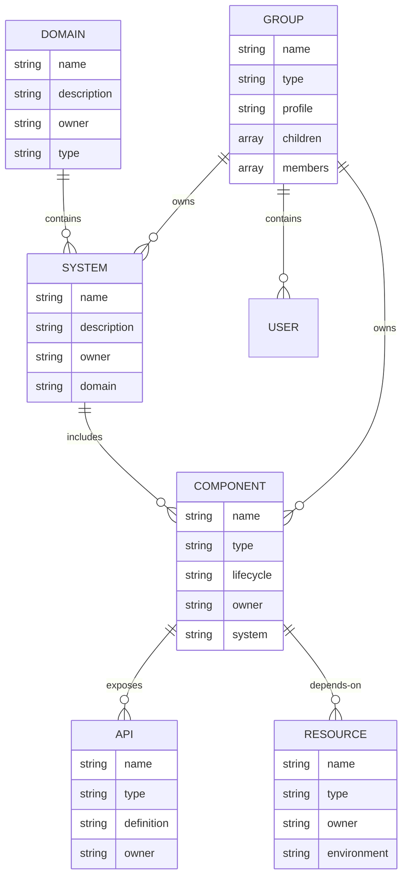
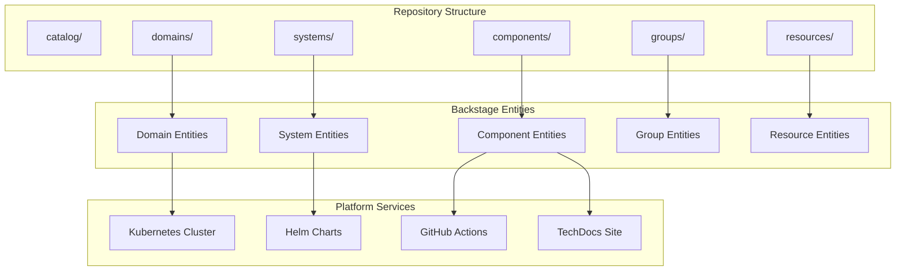
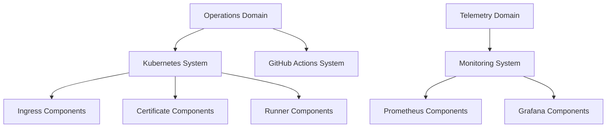
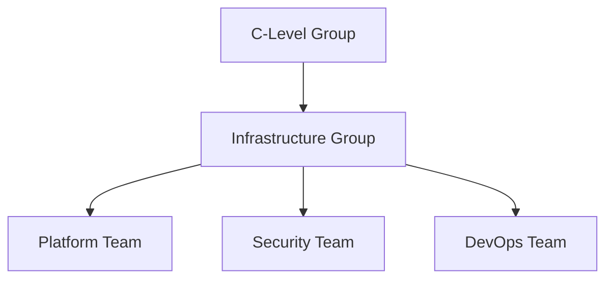
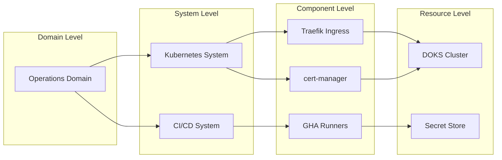
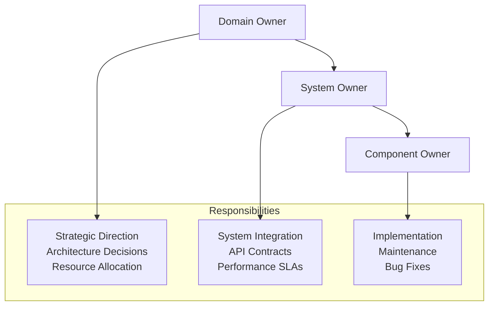
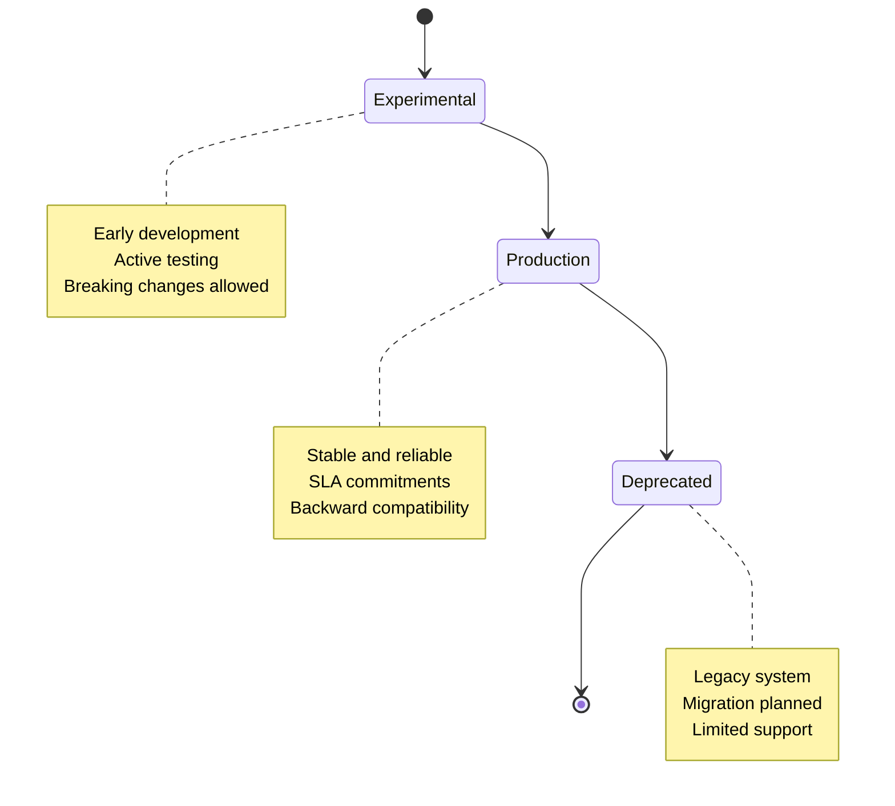
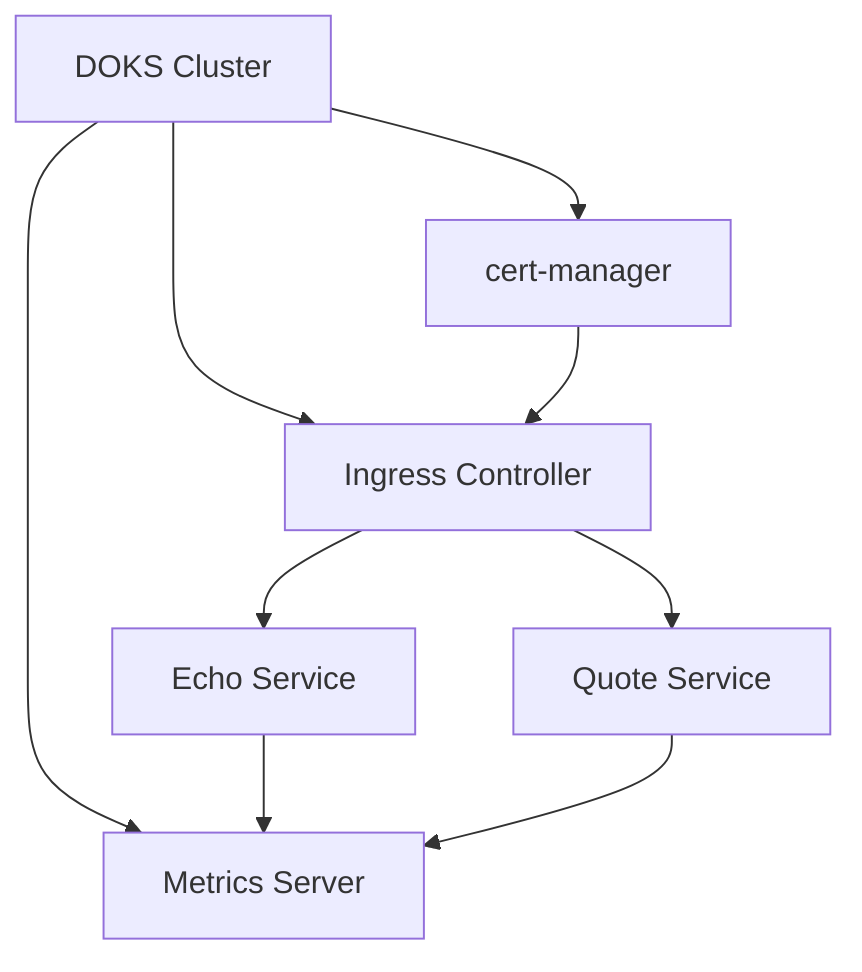

# Backstage Integration

The WebGrip platform leverages **[Backstage](https://backstage.io/)** as the central **service catalog and developer portal**, providing a unified view of all services, APIs, teams, and infrastructure components across the organization.

## Backstage Overview

**Technology**: Backstage (Open Source Developer Portal)
**Entity Definitions**: [`catalog/`](../../../../catalog/)
**TechDocs Integration**: [`backstage.io/techdocs-ref: dir:./docs/techdocs`](../../../../catalog-info.yaml)

Backstage serves as the **organizational brain** of the platform, providing:

- **📋 Service Catalog**: Centralized inventory of all software components
- **👥 Team Directory**: Organization structure and ownership mapping  
- **📚 Documentation Hub**: Integrated TechDocs and API documentation
- **🔍 Service Discovery**: Find services, APIs, and their relationships
- **📊 Platform Overview**: Unified view of the entire software ecosystem

## Architecture

### Backstage Entity Model



### Platform Integration



## Entity Definitions

### Organization Structure

**Location**: [`catalog-info.yaml`](../../../../catalog-info.yaml)

The catalog-info.yaml file serves as the **entry point** for Backstage discovery:

```yaml
# Main catalog locations
apiVersion: backstage.io/v1alpha1
kind: Location
metadata:
  name: webgrip-domains
  namespace: webgrip
  description: A collection of all the domains within the WebGrip organisation
spec:
  targets:
    - ./catalog/domains/operations-domain.yaml
    - ./catalog/domains/telemetry-domain.yaml
```

**Entity Categories**:
- **Domains**: [`catalog/domains/`](../../../../catalog/domains/) - Business domain boundaries
- **Systems**: [`catalog/systems/`](../../../../catalog/systems/) - Technical system groupings
- **Components**: [`catalog/components/`](../../../../catalog/components/) - Individual services and applications
- **Groups**: [`catalog/groups/`](../../../../catalog/groups/) - Team and organizational structure
- **Resources**: [`catalog/resources/`](../../../../catalog/resources/) - Infrastructure resources

### Domain Definitions

**Purpose**: Define business domain boundaries and ownership

**Example**: [`catalog/domains/operations-domain.yaml`](../../../../catalog/domains/operations-domain.yaml)

```yaml
apiVersion: backstage.io/v1alpha1
kind: Domain
metadata:
  name: operations-domain
  namespace: webgrip
  title: Operations
  description: |
    The operations domain is responsible for all things having to do with operations
  labels:
    tier: "2"
  annotations:
    github.com/project-slug: webgrip/operations-domain
    backstage.io/techdocs-ref: dir:.
    simpleicons.org/icon-slug: rotaryinternational
  tags:
    - operations
    - infrastructure
  links:
    - url: http://example.com/domain/operations/
      title: Readme
      icon: book
      type: website
spec:
  owner: group:infrastructure
  type: product-area
```

**Domain Structure**:
| Domain | Purpose | Owner | Components |
|--------|---------|-------|------------|
| **[Operations](../../../../catalog/domains/operations-domain.yaml)** | Infrastructure & platform operations | Infrastructure Team | Kubernetes, Ingress, Monitoring |
| **[Telemetry](../../../../catalog/domains/telemetry-domain.yaml)** | Observability & monitoring | Platform Team | Grafana, Prometheus, Alerting |

### System Definitions

**Purpose**: Group related components into logical technical systems

**Example**: [`catalog/systems/kubernetes.yaml`](../../../../catalog/systems/kubernetes.yaml)

```yaml
apiVersion: backstage.io/v1alpha1
kind: System
metadata:
  name: kubernetes-system
  namespace: webgrip
  title: Kubernetes
  description: |
    Kubernetes is an open-source container-orchestration system for automating 
    application deployment, scaling, and management.
spec:
  owner: group:webgrip/infrastructure
  domain: webgrip/operations-domain
```

**System Hierarchy**:


### Component Definitions

**Purpose**: Catalog individual services, applications, and platform components

**Example**: [`catalog/components/ingress-nginx.yaml`](../../../../catalog/components/ingress-nginx.yaml)

```yaml
apiVersion: backstage.io/v1alpha1
kind: Component
metadata:
  name: ingress-nginx-component
  namespace: webgrip
  title: Ingress Nginx
  description: |
    Ingress Nginx is an Ingress controller for Kubernetes using NGINX as a reverse proxy and load balancer.
  labels:
    tier: "2"
  annotations:
    backstage.io/adr-location: docs/adr
    backstage.io/kubernetes-label-selector: "app.kubernetes.io/instance=ingress-nginx"
    backstage.io/kubernetes-namespace: ingress-nginx
    backstage.io/techdocs-ref: dir:.
    github.com/project-slug: kubernetes/ingress-nginx
    simpleicons.org/icon-slug: nginx
spec:
  type: service
  owner: group:webgrip/infrastructure
  lifecycle: experimental
  system: kubernetes-system
  dependsOn:
    - resource:webgrip/staging-doks-cluster
```

**Component Types**:
- **service**: Running applications and platform services
- **library**: Shared code libraries and packages
- **website**: Static websites and documentation sites

**Lifecycle Stages**:
- **experimental**: Early development and testing
- **production**: Stable, production-ready services
- **deprecated**: Services being phased out

### Group Definitions

**Purpose**: Define team structure and ownership hierarchy

**Example**: [`catalog/groups/c-level-group.yaml`](../../../../catalog/groups/c-level-group.yaml)

```yaml
apiVersion: backstage.io/v1alpha1
kind: Group
metadata:
  name: c-level-group
  namespace: webgrip
  title: C-Level
  description: The C-Level group is responsible for the overall strategy and direction of the company.
  labels:
    tier: "1"
  annotations:
    github.com/project-slug: webgrip/organisation-public
    simpleicons.org/icon-slug: protodotio
spec:
  type: department
  profile:
    displayName: C-Level
    email: ryan@webgrip.nl
    picture: https://api.dicebear.com/7.x/identicon/svg?seed=Fluffy&backgroundColor=ffdfbf
  children: ['group:webgrip/infrastructure']
  members: ['Ryangr0']
```

**Organizational Hierarchy**:


### Resource Definitions

**Purpose**: Catalog infrastructure resources and external dependencies

**Example**: [`catalog/resources/staging-doks-cluster.yaml`](../../../../catalog/resources/staging-doks-cluster.yaml)

```yaml
apiVersion: backstage.io/v1alpha1
kind: Resource
metadata:
  name: staging-doks-cluster
  namespace: webgrip
  title: Staging DOKS Cluster
  description: DigitalOcean Kubernetes cluster for staging workloads
spec:
  type: kubernetes-cluster
  owner: group:webgrip/infrastructure
  environment: staging
```

**Resource Types**:
- **kubernetes-cluster**: Kubernetes clusters and environments
- **database**: Database instances and services  
- **queue**: Message queues and event systems
- **storage**: File systems and object storage

## Annotations and Integrations

### Key Annotations

Backstage entities use annotations to integrate with external systems:

| Annotation | Purpose | Example |
|------------|---------|---------|
| `github.com/project-slug` | Link to GitHub repository | `webgrip/organisation-public` |
| `backstage.io/techdocs-ref` | TechDocs source location | `dir:./docs/techdocs` |
| `backstage.io/kubernetes-label-selector` | Kubernetes resource selector | `app.kubernetes.io/instance=traefik` |
| `backstage.io/kubernetes-namespace` | Kubernetes namespace | `ingress-traefik` |
| `simpleicons.org/icon-slug` | Display icon | `kubernetes` |

### TechDocs Integration

**This Repository**: [`catalog-info.yaml`](../../../../catalog-info.yaml)

```yaml
apiVersion: backstage.io/v1alpha1
kind: Component
metadata:
  name: organisation-public
  namespace: webgrip
  annotations:
    backstage.io/techdocs-ref: dir:./docs/techdocs
spec:
  type: platform
  owner: group:webgrip/infrastructure
```

**TechDocs Features**:
- **Automatic Publishing**: Docs published on every commit to main branch
- **Search Integration**: Full-text search across all documentation
- **Version Control**: Documentation versioned with code
- **Navigation**: Integrated navigation within Backstage interface

### Kubernetes Integration

Components can be linked to Kubernetes resources for real-time status:

```yaml
annotations:
  backstage.io/kubernetes-label-selector: "app.kubernetes.io/name=traefik"
  backstage.io/kubernetes-namespace: ingress-traefik
```

This enables:
- **Real-time Status**: Pod health and deployment status
- **Resource Metrics**: CPU, memory, and network usage
- **Log Access**: Direct access to container logs
- **Scaling Controls**: Scale deployments from Backstage interface

## Service Discovery

### Catalog Navigation

**Entity Relationships**: Backstage automatically maps relationships between entities:



### Search and Discovery

**Search Capabilities**:
- **Full-text Search**: Search across names, descriptions, and documentation
- **Tag-based Filtering**: Filter by technology, team, or environment
- **Owner-based Views**: See all components owned by a specific team
- **Dependency Mapping**: Understand component dependencies and impacts

**Common Search Patterns**:
```
# Find all infrastructure components
tag:infrastructure

# Find components owned by infrastructure team
owner:group:infrastructure

# Find experimental services
lifecycle:experimental

# Find components in specific domain
domain:operations-domain
```

## Ownership and Governance

### Ownership Model

**Ownership Hierarchy**:


**Owner Types**:
- **group:webgrip/infrastructure**: Platform and infrastructure components
- **group:webgrip/security**: Security-related components and policies
- **group:webgrip/c-level**: Strategic and organizational components

### Component Lifecycle

**Lifecycle Management**:


## Platform Components Catalog

### Current Component Inventory

| Component | Type | Owner | System | Status |
|-----------|------|-------|---------|---------|
| **[Ingress Nginx](../../../../catalog/components/ingress-nginx.yaml)** | service | infrastructure | kubernetes-system | experimental |
| **[cert-manager](../../../../catalog/components/cert-manager.yaml)** | service | infrastructure | kubernetes-system | production |
| **[Echo Service](../../../../catalog/components/echo.yaml)** | service | infrastructure | kubernetes-system | experimental |
| **[Quote Service](../../../../catalog/components/quote.yaml)** | service | infrastructure | kubernetes-system | experimental |
| **[Metrics Server](../../../../catalog/components/metrics-server.yaml)** | service | infrastructure | kubernetes-system | production |

### Component Dependencies



## Best Practices

### Entity Definition Guidelines

**1. Descriptive Metadata**:
```yaml
metadata:
  title: "Human-readable title"
  description: |
    Multi-line description explaining:
    - Purpose and functionality
    - Key features
    - Integration points
```

**2. Comprehensive Annotations**:
```yaml
annotations:
  github.com/project-slug: "owner/repository"
  backstage.io/techdocs-ref: "dir:./docs"
  backstage.io/kubernetes-namespace: "namespace"
```

**3. Clear Ownership**:
```yaml
spec:
  owner: "group:webgrip/team-name"  # Always use group references
  lifecycle: "production|experimental|deprecated"
```

**4. Relationship Mapping**:
```yaml
spec:
  system: "parent-system"
  dependsOn:
    - "component:other-service"
    - "resource:database"
```

### Maintenance Guidelines

**Regular Updates**:
- **Quarterly Review**: Verify entity accuracy and relationships
- **Lifecycle Updates**: Promote experimental to production, mark deprecated
- **Ownership Changes**: Update owners when teams reorganize
- **Link Validation**: Ensure all external links remain valid

**Documentation Standards**:
- **TechDocs**: Every component should have linked documentation
- **API Docs**: Services should include OpenAPI specifications
- **Runbooks**: Operational procedures documented and linked

## Next Steps

Explore related service catalog topics:

<div class="grid cards" markdown>

-   🏗️ **[Domains & Systems](domains-systems.md)**
    
    Understand domain boundaries and system organization

-   📋 **[Component Registry](component-registry.md)**
    
    Explore individual service and component details

-   🔌 **[API Contracts](api-contracts.md)**
    
    Review API documentation and service contracts

-   👥 **[Team Structure](../governance-standards/operational-standards.md#team-structure)**
    
    Learn about team organization and responsibilities

</div>

---

> **📋 Catalog Maintenance**: Entity definitions should be updated whenever component ownership, lifecycle, or dependencies change. See [Operational Standards](../governance-standards/operational-standards.md#backstage-maintenance) for maintenance procedures.